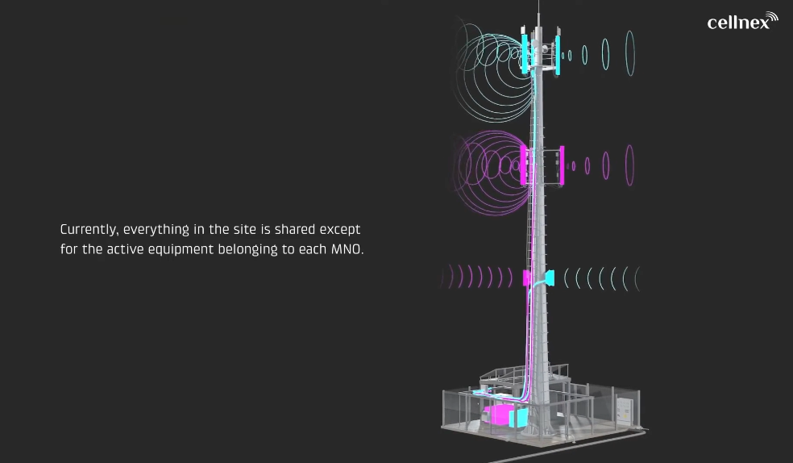
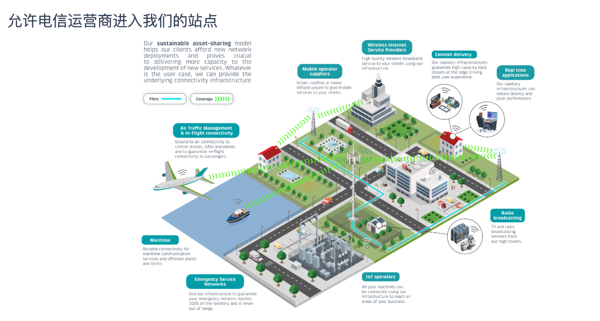

# Cellnex 公司经营、行业供需与商业模式研究

> **资料时点**：2026-08-11
>
> **研究对象**：Cellnex Telecom, S.A.（BME: CLNX）
>
> **资料范围**：Cellnex 2023-2025 年综合年报、2024 年资本市场日材料、H1 2026 业绩材料及官网业务页面；行业证据辅以欧盟委员会、Ericsson 和英国 CMA 的原始材料。
>
> **阅读原则**：文中将公司披露、行业机构预测与分析判断分开。带 `[Sxx]` 的事实可追溯至文末来源；行业机构预测不视为已经发生的事实。
>
> **阅读顺序**：报告先解释行业需求如何形成、有效供给为何受限，以及 Cellnex 如何把站址和合同转化为现金流；在建立这套因果框架后，再回到公司的历史沿革、国家平台和分业务线经营数据。这样可以先理解数字背后的经济含义，再评价收入增长、站点、PoP 和业务组合。

## 结论摘要

Cellnex 不是移动运营商，也不是通信设备制造商。它是一家以欧洲为主要市场的数字基础设施运营商，核心业务是控制和运营通信站址，允许多家移动运营商在同一地点安装各自的天线、射频和基带设备，并按长期合同收取站点服务费。因此，Cellnex 真正出售的不是一座钢塔，而是**在正确位置长期、合法、稳定地安装和运行通信设备的权利，以及与之配套的工程、供电、回传、安防和维护服务**。[S01][S04][S06]

截至2025年末，公司在10个欧洲国家经营113,801个含广播站点、111,752个电信站点和180,856个PoP，拥有2,511名员工。今天的规模主要由2015年上市后多轮跨国并购和BTS建设形成；2024-2025年的经营重点已经从大规模收购转向存量共址、已承诺项目交付、组合处置、资本纪律和股东回报。[S01]

四条业务线中，Towers占2025年ex-pass-through业务线收入约80.7%，决定公司基本盘；Fiber/Connectivity/Housing在2023-2025年收入CAGR约18.4%，是增长最快但规模较小的相邻业务；DAS/Small Cells/RANaaS在2024年增长后于2025年基本持平；Broadcast则保持约2%的稳定增长。公司没有把共享土地、能源、人员、折旧和维护成本分配到四条业务线，因此可以比较部门收入和运营规模，不能据公开年报严谨比较部门利润率或ROIC。[S01][S34][S35]




这种模式产生于移动通信产业的结构性需要。运营商必须长期维持既有网络覆盖，并随着流量和 5G 中频部署扩充网络容量；但土地、塔桅、机房、供电和安防并不构成运营商面向消费者的差异化，而且可以被竞争运营商共享。中立 TowerCo（塔站公司）将这些被动设施集中经营，可以减少重复建设、缩短开站时间，并让运营商把资本优先投向频谱、主动网络和客户竞争。Cellnex 则通过让第二、第三家客户复用同一站点的大部分固定成本，将共享效率转化为经营杠杆。

但是，“流量增长”不能直接推导为“塔数增长”或“Cellnex 收入增长”。用户需求首先要变成运营商的覆盖、容量或 SLA （服务协议）缺口；运营商还可以通过新频谱、软件优化、天线升级或网络共享解决问题。只有当需求最终落到新的站址占用、更多设备、小区密集化、室内系统或回传连接上，Cellnex 才获得可计费的 PoP（网络存在点/客户设备租用点）、工程、BTS（按客户需求新建站点）、DAS（分布式天线系统） 或光纤收入。

从供给端看，市场真正稀缺的不是钢材和塔桅制造能力，而是**在特定搜索区域内，位置正确、权利稳定、许可有效、结构可承载、有电力和回传、能施工且可长期维护的站址**。这使优质存量站点具有强局部壁垒，却不等于 Cellnex 拥有无限定价权：长期合同的调价公式、运营商自建和共享、MNO 合并后去站、地方替代站址以及竞争监管都会约束其经济回报。[S31]

因此，Cellnex 的投资价值不应用“塔越多越好”来概括。商业模式成立的关键，是站址有持续的局部网络需求，锚定合同能覆盖初始资本，后续有第二、第三租户或设备扩容空间，客户调价能够覆盖地租和运维成本，且项目回报高于长期资本成本。这也是公司从历史上的大规模并购转向存量资产复用、选择性 BTS 和自由现金流的底层原因。[S02][S03]

## 一、阅读 Cellnex 前必须理解的概念

| 概念 | 含义 | 投资分析中的作用 |
|---|---|---|
| MNO | 移动网络运营商，如 Vodafone、Orange、Telefónica、Iliad 和 Three | Cellnex Towers 的核心客户；**其资本开支、并购和网络共享直接影响需求** |
| TowerCo | 独立经营通信站址及被动基础设施的公司 | Cellnex 的基本公司属性 |
| Neutral host | 不与 MNO 争夺终端客户，可为多家运营商提供共享基础设施的中立宿主 | 让竞争运营商愿意共用同一平台，是多租户模式的前提 |
| **Active equipment** | 发射、接收和处理无线信号的天线、射频、基带和软件 | 通常由 MNO 投资和控制，非 Cellnex Towers 的核心资产 |
| **Passive infrastructure** | 土地/屋顶权利、塔桅、机房、支架、供电接入、围栏和安防等 | Cellnex 的核心资产和服务边界 |
| Site | 可部署通信设备的一个位置，可以是钢塔、屋顶、烟囱、高杆或交通设施 | 站点是资产单元，但经济价值取决于位置、权利和可共享性 |
| **PoP** | Point of Presence，某一客户在某站点的一个可计费网络存在点 | 一座站可有多个 PoP；PoP 比站点数更接近资产使用情况 |
| **Co-location** | 新客户进入已有站点，广义上也可包括新增可计费设备占用 | 大部分固定成本可复用，是 TowerCo 经营杠杆的核心 |
| Amendment | 原有客户增加天线、频段、机柜、重量或功率 | 可能增加经常性费用和工程收入，也可能需要加固投资 |
| BTS | Build-to-Suit，按锚定客户需求选址并新建站点 | 长合同支持需求，但资本开支先于收入，初期多为单租户 |
| DAS / Small Cell | 分布式天线系统/低功率小型基站 | 用于楼宇、地铁、机场、体育场馆等室内或局部高密度场景 |
| Backhaul / FTTT | 用光纤或微波把无线站点连至汇聚网和核心网；FTTT 为 Fibre to the Tower | 没有回传，站点无法将流量送入更大网络 |
| MSA / MLA | 主服务协议/主租赁协议，统一规定价格、期限、调价、SLA、设备和退出条款 | 决定现金流的可见性、调价能力和 churn 风险 |
| Escalator | 按 CPI/RPI 或固定比例逐年调整合同价格 | 是存量收入增长来源，但 cap/floor 和成本速度决定真实通胀保护 |
| Tenancy ratio | 通常用 PoP 除以站点数表示的平均共享程度 | 可辅助观察资产复用，但需排除处置口径和高额改造 CapEx |
| Churn | 客户移除设备、终止租用或减少可计费 PoP | MNO 合并、RAN sharing 和网络去重带来的核心负面指标 |

**Site，PoP，CoLocation之间的层级关系**
Site（物理站址）
└── PoP（客户在该站址上的可计费网络存在点）
    └── Co-location（在已有 Site 上新增 PoP 的业务行为）


| 概念 | 属于什么 | 与其他概念的关系 |
|---|---|---|
| Site | 物理资产/经营位置 | 一个 Site 可以承载一个或多个 PoP |
| PoP | 客户占用及计费单元 | 表示某客户的网络设备在该 Site 上存在 |
| Co-location | 服务或新增行为 | 客户进入已有 Site，通常会形成一个新增 PoP |

例如：
Cellnex 新建一个 Site
└── Vodafone 作为锚定客户入驻：第 1 个 PoP
    ├── Orange 后来共址：新增第 2 个 PoP
    └── Telefónica 后来共址：新增第 3 个 PoP
此时：
    Site 数量：1
    PoP 数量：3
    后续 Co-location：2 次
    Tenancy ratio：3 ÷ 1 = 3.0x

关键区别是：Co-location 不是 PoP 下一级的设备，而是利用已有 Site 增加 PoP 的过程或服务。

还需要注意两个口径问题：
1. 新建 BTS 后锚定客户形成的第一个 PoP，通常属于 BTS PoP，而不是后续共址增长。
2. 同一运营商增加频段、天线或机柜，可能只是 amendment，也可能按合同形成新增可计费 PoP，不能简单认为“一家运营商在一座站上永远只有一个 PoP”。

因此，最实用的关系是：
- Site 是容器
- PoP 是容器中的可计费客户存在点
- Co-location 是向已有容器增加 PoP 的增长方式

对 Cellnex 而言，最有价值的增长通常不是单纯增加 Site，而是在现有 Site 上通过 Co-location 增加 PoP，因为这样能够复用土地、塔桅、供电、监控和维护等固定投入。

**Tenancy ratio（租户承载率/共址率）**
用来衡量一座通信站点平均承载多少个可计费 PoP。

基本公式是：

```text
Tenancy ratio = PoP 数量 ÷ Site 数量
```

以 Cellnex 2025 年数据为例：

```text
PoP：180,856 个
电信站点：111,752 个

Tenancy ratio ≈ 180,856 ÷ 111,752 ≈ 1.62x
```

直观理解：

| Tenancy ratio | 含义 |
|---:|---|
| 1.0x | 平均每个站点只有一个 PoP |
| 1.5x | 平均每两个站点承载三个 PoP |
| 2.0x | 平均每个站点承载两个 PoP |
| 3.0x | 平均每个站点承载三个 PoP |

Tenancy ratio 对 TowerCo 很重要，是因为第二、第三个 PoP 通常可以复用已经投入的土地、塔桅、安防、监控和部分维护成本。若不需要大规模加固，新增 PoP 的增量利润率和资本回报通常高于新建一座单租户 BTS。

不过，Tenancy ratio 上升不一定代表经营质量改善：

- 出售大量单租户站点，也会让剩余组合的比例被动上升。
- 新 PoP 可能需要昂贵的塔体加固、扩电和机房扩建。
- PoP 不一定等于独立运营商数量。
- 新建大量单租户 BTS 会暂时拉低 Tenancy ratio，但这些站点未来可能获得第二租户。
- 分子、分母必须使用同一业务范围；不能把 Towers PoP 除以包含 Broadcast 或其他口径的站点数。

所以分析 Cellnex 时，Tenancy ratio 应与 **新增共址、Gross PoP、churn、BTS、Expansion CapEx、每站收入和资产处置**一起观察。它衡量的是平均复用程度，不是利润率或资本回报率本身。

## 二、行业需求：从用户流量到 Cellnex 订单

### 2.1 Cellnex 在移动通信产业链中的位置

一张移动网络同时需要频谱、主动无线设备、被动基础设施和传输网络。消费者、企业和政府对视频、云、移动办公、IoT、公共安全和网络可靠性的需求位于上游；政府和监管机构分配频谱、设置覆盖义务并审批建设；MNO 持有频谱、主动 RAN、核心网和终端客户；Cellnex 则主要位于被动基础设施层，并延伸至 DAS、Small Cells、光纤回传、机柜托管和关键通信等相邻业务。[S01][S04][S06][S07]

| 产业层级 | 主要参与者与投入 | 与 Cellnex 的关系 |
|---|---|---|
| 终端需求 | 消费者、企业、政府、云和内容平台 | 不直接向 Cellnex 付费，但决定网络负荷在哪里、何时发生 |
| 频谱与监管 | 政府、频谱管理、规划建设和环境部门 | 决定 MNO 可用频段和覆盖义务，也决定站址能否合法建设和升级 |
| MNO 与主动 RAN | 频谱、天线、射频、基带、软件、核心网和客户获取 | Towers 的核心客户；决定自建、网络共享、租用或去站 |
| 被动基础设施 | 土地、屋顶、塔桅、机房、供电、安防、许可和维护 | Cellnex 的核心业务层 |
| 室内与特殊场景 | DAS、Small Cell、物业、交通运营方和公共安全机构 | Cellnex 提供多运营商室分、交通覆盖和 Mission Critical |
| 传输与计算 | 光纤、微波、批发网络和数据中心运营商 | 是每个无线站可用的必要投入，也是 Cellnex 的相邻服务 |

整个需求传导链条是：

```text
终端流量、覆盖与可靠性要求
  -> MNO 发现覆盖、容量、时延或 SLA 缺口
  -> 在频谱、软件、主动设备、站点密度、室内系统和回传中选择技术方案
  -> 在自建、MNO 共享、其他 TowerCo 和 Cellnex 之间选择供应方
  -> 合同谈判、许可、工程、安装和验收
  -> Cellnex 形成共址、amendment、BTS、DAS、光纤或运维收入
```

这是研究 Cellnex 需求时最重要的逻辑过滤器。技术需求、设备需求、站点需求和 Cellnex 的可计费需求是四个不同层级。上游数据流量快速增长，并不保证最终一定形成新 PoP 或新站。

| 需求层次 | 客户要解决的问题 | 对应的 Cellnex 业务 | 未来定位 |
|---|---|---|---|
| 存量需求底座 | 保持已有覆盖、履行牌照义务、维持网络可用性 | 存量 Site/PoP 服务、合同续约、少量补网 BTS | **防守性基础**：支撑收入下限和现金流可见性，数量增长有限 |
| 核心增长引擎 | 应对流量、峰值和 5G 中频带来的容量缺口 | Co-location、新 PoP、amendment、站点改造、FTTT 和选择性 BTS | **核心增量**：关键在局部流量是否转化为新物理占用 |
| 第二增长曲线 | 解决楼宇、机场、地铁、铁路和其他特殊场景的覆盖与容量 | 中立多运营商 DAS、Small Cells、光纤、RANaaS | **次要增量**：基数较小且项目化，利润率和复制性差异较大 |
| 需求增强因素 | 提高可用性、故障响应、备用能源和灾害恢复能力 | SLA、NOC、能源韧性、冗余回传、Mission Critical | **价值增强**：主要提高续约率、客户黏性和单站服务深度 |
| 需求归属机制 | MNO 在自建、网络共享和外包之间配置资本 | 售后回租、共址、BTS 和长期 MSA/MLA | **份额决定因素**：不创造终端需求，决定需求是否由 Cellnex 承接 |
| 需求抵消因素 | 用更少的物理占用承载相同或更多流量 | 频谱效率、RAN sharing、MNO 合并、去站 | **负面反馈**：可减少新 PoP，并导致 churn |

### 2.2 需求归属机制：MNO 为什么把基础设施需求交给 TowerCo

MNO 并非没有能力自己租地、建塔和维护站点。 **中立 TowerCo 存在的原因，是被动基础设施具有可共享、长寿命、本地许可复杂、与零售差异化关系较弱的特征。** MNO 可以保留频谱、主动设备和核心网，却共用土地、塔桅、供电和运维。

| MNO 的决策因素 | 自建/自持 | 向 Cellnex 等 TowerCo 采购 |
|---|---|---|
| 前期资本 | 自行承担土地、塔桅和配套 CapEx | TowerCo 先投资，MNO 按长期合同付费 |
| 部署速度 | 自行组织选址、许可和施工 | 有合适存量站时可更快共址，也可利用 TowerCo 的本地开发团队 |
| 资产控制 | 对位置、容量和改造有直接控制 | 需受 MSA、施工排期和共享安排约束 |
| 共享效率 | 单一 MNO 承担固定成本，除非自行引入租户 | TowerCo 可让多家 MNO 复用同一站点 |
| 长期成本 | 不支付 TowerCo 服务加价，但承担全生命周期管理和更新 | 支付长期、通常带调价的服务费，减少内部运维负担 |
| 资本配置 | 资本留在被动网络 | 可把资本转向频谱、主动 RAN、IT 和客户获取 |

这不是一个全国性的“自建或外包”二选一。MNO 通常同时保留战略站点、参与网络共享、向 TowerCo 售后回租存量塔站、在第三方站点共址，并对新覆盖区域逐点比较 BTS、自建和其他供给。中立模式是否真正降低全生命周期成本，取决于第二、第三租户是否出现，新租户是否需要高额加固投资，以及 TowerCo 的长期服务价格。

因此，MNO 的资本效率诉求不应被当成一种独立的通信需求。它不会让用户多消费流量，也不会自动创造新站点；它决定的是，既定的覆盖和容量投资由 MNO 自己完成，还是转化为 Cellnex 的共址、BTS 和长期服务合同。售后回租也不是创造“免费资本”：MNO 用一次性资产变现换取长期、通常带调价的服务承诺；Cellnex 则先付出收购或建设资本，再依靠锚定合同、未来共址和运营效率收回投资。[S01][S03]

### 2.3 存量需求底座：覆盖维护、合同续约和选择性补网

对于已经建成覆盖网络的成熟欧洲市场，覆盖需求更多是 Cellnex 收入的**存量底座**，而不是未来站点数量高速增长的主引擎。欧盟委员会披露，截至 2025 年中，欧盟家庭的一般 5G 信号覆盖率已达 96.8%。这意味着未来的网络问题将越来越少是“某地有没有 5G”，而更多是“既有 5G 是否拥有足够容量和质量”。[S28]

这个存量底座首先来自**覆盖网络的持续运行**。MNO 即使不新建网络，仍需要保留关键宏站和屋顶站，以满足牌照覆盖义务、日常网络可用性和客户服务。Cellnex 则持续提供站址访问、土地和屋顶权利、供电、安防、结构安全、NOC 监控和现场维护。只要这些站点仍是 MNO 覆盖网络的必要组成部分，就会按 MSA/MLA 产生基础服务费。这类收入的特征是可见性高、增速不高，增长更多来自 CPI/RPI 或固定 escalator，而非新增大量物理站点。

其次是**合同续约**。续约本身不创造新的网络需求，但它决定 Cellnex 能否将已经形成的覆盖需求继续转化为长期现金流。对投资者来说，续约的关键不只是年限，还包括续约价格、escalator、最低承诺、去站补偿、RAN sharing 约束和退出条款。长合同可以延缓 MNO 网络调整的影响，却不能永久消除合同到期后的 churn 风险。[S01][S03]

最后是**选择性补网**。农村、新开发区、公路和铁路走廊、隧道、边境以及覆盖义务仍会产生局部新站需求。这类需求对网络完整性很重要，但通常项目分散、单站人口密度较低、初期仅有一个锚定客户，后续共址潜力也可能弱于城市热点。因此，覆盖型 BTS 可以提供长合同收入，却必须核对锚定合同是否足以覆盖初始投资，不能仅因站点数量上升就认定其创造了高回报。

**小结：** 覆盖维护和续约支撑 Cellnex 的收入下限和现金流可见性，选择性补网提供少量新增 BTS；但在欧洲广义覆盖已较成熟的背景下，这一部分更应被视为“防守性底座”，而不是核心成长引擎。

### 2.4 核心增长引擎：容量增长、5G 中频部署与网络密集化

对 Cellnex 而言，未来最重要的增量需求不是让更多地区首次获得移动信号，而是让已经完成覆盖的网络承载更多流量、更高峰值和更严格的性能要求。视频、云服务、FWA 和移动应用的增长不会平均分布在每一座站，而会集中在城市、通勤走廊和局部高峰热点。正是这种空间上的不均衡，使现有网络在特定位置更快接近容量上限。

Ericsson 预计全球移动数据流量将从 2025 年约 146 EB/月增至 2031 年 328 EB/月，西欧单部活跃智能手机月均流量将从 25GB 增至 59GB。但该报告同时指出，区域月平均流量不能直接用来估算本地峰值和网络演进，密集城市位置的需求可高达农村位置的约 1,000 倍。[S29] 所以，对 Cellnex 真正有意义的不是欧洲平均流量增幅，而是流量增长是否发生在公司拥有优质、可扩容站点的局部区域。

5G 中频是这一需求中最重要的技术变量之一。低频频谱覆盖范围较大、穿透较强，但可用带宽通常较有限；3.4-3.8 GHz 等中频频谱能够提供更大容量，但覆盖半径和室内穿透通常弱于低频。欧盟委员会披露的 2025 年中 3.4-3.8 GHz 5G 覆盖率为 74.8%，较一般 5G 覆盖率低 22 个百分点。[S28] 这一差距不意味着必须新建同等比例的塔，却说明“看得见 5G 图标”与“具备足够 5G 容量”是两件不同的事。

MNO 面对容量缺口时，一般会按成本和交付速度在多种方案中选择：

```text
软件优化和负载均衡
  -> 增加频谱、更换更高效的主动设备
  -> 在既有站点增加天线、频段、机柜和回传
  -> 在他方既有站点上共址
  -> 加固塔体、扩电或扩建地面空间
  -> 小区分裂、新建宏站或局部小站
```

这条路径说明，容量增长只有在主动设备和频谱优化不足时，才会转化为更多物理占用。对 Cellnex 而言，其中经济质量最高的不一定是新建站点，而是在优质存量 Site 上增加新 PoP，或者以可控的改造投资承接原客户的更多可计费设备。这两种情况能够复用已经存在的土地权利、塔桅、供电、NOC 和维护体系，因此比单租户 BTS 更容易形成高增量回报。

### 2.5 第二增长曲线：室内、交通和特殊场景连接

室内、地下和高密度场所的连接需求并不会随着室外宏站覆盖成熟而消失。宏站可以让某个街区“有信号”，但墙体、玻璃、地下空间、高密度人流和列车移动会让大型办公楼、医院、机场、地铁、隧道、铁路站和体育场馆仍然存在覆盖、容量和连续切换缺口。这些场景通常需要室内 DAS、Small Cells、专用光纤、机房和多运营商信号接入，而不是单纯再建一座室外宏塔。[S07]

Cellnex 以中立宿主身份统一协调物业或交通运营方、多家 MNO、施工商和设备供应商，并将一套室内或沿线网络向多家客户开放。Grand Paris Express、米兰 Malpensa 和 Linate 机场、Tour Alto 办公楼等案例证明公司具备地铁、机场和大型楼宇的方案设计与交付能力。但这些是交付案例，不能单独证明项目的平均利润率、资本回报或大规模可复制性。[S17][S18][S20]

这条业务可以成为 Cellnex 的第二增长曲线，但还不宜与 Towers 的容量增长等量齐观。原因在于：单个项目需要协调多方，付费方可能是物业、交通运营方、MNO 或多方组合；工程高度定制化，施工时间和消防、安全要求复杂；初始 CapEx、最低服务费、运营期限和未来技术升级责任差异很大。因此，室内节点数或项目数不能直接解读为高质量经常性收入，必须同时核对合同久期、多 MNO 参与率、公司承担的 CapEx 和项目级回报。

### 2.6 需求增强因素：韧性、SLA 和关键通信

网络韧性不是一个与覆盖、容量平行的大规模站点数量需求，更准确的定位是**提高既有站址和网络服务价值的需求增强因素**。普通消费者可以容忍短时网络波动，而警务、消防、救护、政府、铁路、机场和医院需要明确的可用性、故障响应、备用电源、冗余传输、灾害恢复和持续监控。Cellnex 通过 24x7 NOC、电池和备用能源、双路由回传、现场维护及 Mission Critical 网络来满足这些要求。[S01][S11][S13]

SLA 是把这类要求转化为商业责任的关键合同工具。它通常规定网络或站点可用性、故障响应时间、修复时限、交付进度、维护标准和未达标赔偿。对 Cellnex 而言，更高 SLA 可能支持更深的运维服务、更强客户黏性和长期续约，但也意味着更多能源、冗余设备、人员和合规支出，以及服务不达标时的赔偿风险。

因此，韧性和关键通信对 Cellnex 的主要价值，不是像容量密集化一样大规模创造新 PoP，而是保护存量合同、扩大单站服务内容、增强续约与客户迁移成本。它对收入质量和合同稳定性很重要，却不应被设定为集团主要数量增长假设。

### 2.7 需求全景表：如何转化为 Cellnex 收入

| 现实需求及 MNO/客户决策 | Cellnex 可能获得的业务 | 收入和资本特征 |
|---|---|---|
| 维持已有宏站和屋顶站覆盖 | 存量站点服务、运维和合同续约 | 经常性强、可见性高，增长主要来自 escalator，续约条款决定长期价值 |
| 农村、交通走廊或新开发区局部覆盖缺口 | 选择性 BTS 或存量站共址 | 新建站先产生资本支出，初期单租户，回报依赖锚定合同和后续共址 |
| 流量增长，但现有频谱和设备仍有余量 | 可能没有新增业务 | Cellnex 不直接按终端流量收费 |
| 原客户在既有站上增加中频设备 | amendment、工程和额外占用费 | 可能增加经常性收入，但未必增加新客户，也可能需要加固 |
| 竞争 MNO 进入 Cellnex 存量站点 | Co-location，新增可计费 PoP | 固定成本复用程度通常较高，是最优质的增长形式之一 |
| 现有站点结构、电力或地面空间不足 | 塔体加固、扩电、机柜和回传扩容 | 收入增长同时产生 Expansion CapEx，需核对增量回报 |
| 局部容量缺口无法依靠既有站解决 | 新建 BTS、屋顶站或 Small Cell | 未来长期收入增加，但建设现金流出先发生，初期多为单租户 |
| 无线容量提高后回传成为瓶颈 | FTTT、光纤或微波回传升级 | 可扩大相邻服务收入，回报取决于存量光纤可达性和批发竞争 |
| 楼宇、机场、地铁、隧道或场馆室内/特殊场景连接缺口 | DAS、Small Cells、专用光纤和长期运维 | 项目化和定制化明显，需核对付费方、多 MNO 参与、CapEx 和合同久期 |
| 客户提高可用性、备电、冗余和故障响应要求 | 高 SLA、能源韧性、NOC、Mission Critical 和维护 | 增强续约和客户黏性，也会增加设备、人员、能源及赔偿风险 |
| MNO 通过 RAN sharing 或合并整合网络 | 部分保留站扩容，部分重复 PoP 被移除 | 单站设备可能增加，但组合净 churn 也可能为负 |

### 2.8 需求抵消因素：频谱效率、RAN sharing、MNO 合并与去站

容量是核心增长来源，但并非无条件地转化为 Cellnex 收入。运营商的目标是以最低总成本满足网络性能，而不是尽可能多地租用站点。因此，任何能让单个站点承载更多流量、让多家 MNO 共用更少设备，或移除重复网络的因素，都会抵消 TowerCo 需求。

| 抵消因素 | 作用机制 | 对 Cellnex 的可能影响 |
|---|---|---|
| 新增频谱与频谱重耕 | 在原有站点上提高可用带宽 | 可延后新站；若需增加天线或设备，仍可产生 amendment |
| Massive MIMO、波束赋形与软件优化 | 提高频谱效率和单站容量 | 流量增长可能不增加 PoP，但设备重量和功率上升也可带来改造需求 |
| RAN sharing | 多家 MNO 共享部分主动网络或设备 | 减少重复 PoP；也可能将更多设备集中到保留的优质 Cellnex 站点 |
| MNO 合并 | 两张重叠网络进行整合和去重 | churn 上升、重复站移除；合并后客户规模变大，续约议价能力也可能增强 |
| 网络合理化与去站 | 拆除低利用率、重复或技术过时的设备 | 直接减少 PoP 和收入，并可能产生拆除、迁移和场地恢复成本 |
| MNO 资本开支收缩 | 延迟中频、扩容、BTS 和室分项目 | 订单和交付放缓，客户在续约和新项目中的议价力提高 |

长期 MSA/MLA、最低承诺、all-or-nothing 续约和去站补偿可以延缓这些变化对当期收入的影响，却无法永久消除合同到期后的网络去重风险。因此，研究时不能只看 Gross PoP 或新增共址，必须同时观察 churn、Net PoP、主要客户的合并/共享计划及合同保护期。[S01][S03]

### 2.9 Starlink 与卫星直连：局部替代覆盖型 BTS，不会全面替代地面蜂窝网络

Starlink 对 Cellnex 构成真实但不对称的长期威胁。需要先区分两种模式：传统 Starlink 宽带依赖用户安装专用天线终端，主要替代偏远地区固定宽带、临时连接和部分回传；Direct-to-Cell/Direct-to-Device 则让卫星承担类似空中基站的功能，使普通移动终端在缺少地面覆盖时连接卫星。3GPP 已把卫星和高空平台纳入 Non-Terrestrial Networks（NTN）标准体系，同时指出低轨卫星存在高速移动、波束移动、多普勒和传播时延变化等区别于地面网络的技术特征。[S39][S40]

因此，问题不是“卫星能否通信”，而是卫星能否以足够低的成本，在容量、室内覆盖、稳定时延、频谱复用和SLA上替代欧洲密集的地面蜂窝网络。当前更合理的判断是：**Starlink可以替代一部分为填补偏远覆盖空白而建设的低密度BTS，却难以替代Cellnex最有价值的城市宏站、容量型共址、室内DAS和高密度光纤连接。**

| Cellnex需求场景 | Starlink替代强度 | 原因与可能影响 |
|---|---|---|
| 偏远农村、山区、海上和交通走廊的基础覆盖 | 中到高 | 卫星可以绕过选址、许可、建塔和地面回传，减少部分单租户、低共址潜力的覆盖型BTS需求 |
| 灾害、临时活动和应急备用通信 | 中 | 卫星部署快且不依赖当地地面网络，可竞争部分临时连接和韧性预算；但关键通信仍需终端、频谱、优先级和SLA保障 |
| 偏远站点回传 | 中，双向影响 | Starlink可替代部分微波/光纤回传；也可能让原本无法经济建设的地面站点获得回传，从而补充塔站供给 |
| 城市宏站和5G中频容量 | 低 | 城市流量需要小区密集、频谱重复使用和高并发容量；卫星覆盖范围大但单位面积容量有限，难以替代密集地面RAN |
| 楼宇、地铁、隧道、机场和场馆DAS | 很低 | 卫星依赖较好的天空可见度，建筑遮挡和室内穿透限制明显；室内高容量仍需DAS、Small Cells和专用回传 |
| 存量MNO PoP和合同续约 | 短期很低 | MNO仍需地面网络提供绝大多数容量和室内体验，Direct-to-Cell通常通过与MNO合作、使用移动频谱补足无覆盖区域，而非绕开MNO |
| Fiber/Connectivity/Housing | 低到中 | 偏远接入和回传存在替代，但核心网、数据中心互联、塔站汇聚和高容量专线仍更适合光纤 |
| Broadcast | 很低的新增影响 | 卫星广播早已存在；Starlink本身不是DTT/FM的直接新替代，OTT迁移才是更重要的长期结构性压力 |

#### 对 Cellnex 的负面传导路径

第一，卫星会压缩“最后几个百分点覆盖”的地面建设需求。偏远地区新建BTS通常初期只有一个锚定客户、许可和回传成本高、后续第二客户概率低，恰好是Cellnex资本效率较弱的项目。若MNO可以用卫星满足牌照覆盖、道路安全或低频使用需求，就可能减少这类BTS订单。对Cellnex而言，这会降低站点数量增长，却未必严重损害价值，因为被替代的往往也是回报较低的项目。

第二，Starlink可竞争偏远地区的光纤和微波回传，以及部分应急、海事、临时场景和企业备份连接。这对Fiber/Connectivity、Mission Critical和韧性服务形成边际价格压力。尤其当客户只需要基础可用性而非确定性容量时，卫星方案可能比建设专用地面基础设施更经济。

第三，卫星增强MNO的议价选择。即使MNO不会大规模移除城市地面网络，只要卫星成为偏远覆盖的可行替代，MNO在BTS采购、覆盖承诺和续约谈判中就多了一种选项，可能压低低密度项目的价格或要求Cellnex承担更多资本责任。

#### 为什么短中期冲击有限

第一，地面蜂窝网络的核心价值是容量而不仅是覆盖。卫星可以让“没有信号”变成“基本可连接”，但欧洲城市和人口密集区需要视频、云应用、企业连接和低时延服务，必须在小范围内重复利用频谱。Cellnex未来最重要的需求来源正是5G中频、设备扩容、第二/第三PoP和室内密集化，而不是广义人口覆盖从零到一。

第二，Direct-to-Cell更可能成为MNO网络的一层，而不是完全绕过MNO。卫星直连需要当地监管许可、适用频谱、运营商合作、终端兼容、网络核心和计费关系。它可以减少MNO在极低密度区域的建站需求，却也增强MNO整体服务覆盖和客户留存；大多数用户流量仍会回到地面网络。

第三，室内、地下和高密度场景是Cellnex相邻业务的主要增长方向，也是卫星最难有效覆盖的环境。DAS、Small Cells、地铁隧道、机场、场馆和关键建筑通常需要稳定的室内射频设计、容量管理和多运营商接入，卫星无法仅凭广域波束解决。

第四，Cellnex拥有长期MSA/MLA和大量既有PoP。即使卫星技术快速改善，客户也不会立即拆除覆盖和容量仍然有用的地面设备；影响更可能先出现在尚未签约的新BTS、偏远站合同续约和长期网络规划中，而不是短期收入骤降。

#### 时间尺度与投资判断

| 时间尺度 | 对Cellnex的总体影响 | 主要观察变量 |
|---|---|---|
| 未来0-2年 | 低度负面 | 欧洲Direct-to-Cell商用范围、监管许可、MNO合作、短信/语音/数据能力、实际价格和终端支持 |
| 未来3-5年 | 低到中度负面 | 卫星单位容量成本、普通手机数据速率、MNO是否减少农村BTS、覆盖义务是否允许卫星替代、偏远回传订单变化 |
| 5年以上 | 中度不确定性 | 卫星容量密度、频谱制度、终端功耗、室内能力、星座经济性以及地面/卫星融合网络架构 |

综合而言，Starlink应被加入Cellnex的长期需求抵消因素，但不应被视为推翻TowerCo商业模式的当前核心风险。它首先削弱的是**低密度、覆盖型、单租户和回传昂贵的新增BTS**；Cellnex最有防御力的资产仍是**人口密集区的稀缺站址、多租户共址、5G容量扩容、室内DAS和高SLA关键网络**。从股东价值角度看，Starlink甚至可能促使管理层放弃低回报覆盖项目、把资本集中到高复用资产；真正的负面证据应是MNO明确削减欧洲农村BTS计划、卫星承接牌照覆盖义务，以及Cellnex相关PoP、BTS订单或偏远回传收入持续下降，而不是Starlink用户数本身增长。

因此，对 Cellnex 的需求判断应使用下列逻辑，而不是将移动流量增速直接填入收入预测：

```text
局部流量和峰值增长
× 频谱和主动设备不足以消化
× 需要新增物理占用、站点或回传
× Cellnex 在目标区域有合格站点或可开发供给
× MNO 选择 Cellnex，而非自建、网络共享或其他 TowerCo
= Cellnex 可实现的增量需求
```

## 三、行业供给：有效站址为什么难以快速复制

### 3.1 供给的本质是“可用位置”，不是“钢塔数量”

对客户而言，TowerCo 供给至少有五种形态：在存量站点上增加 PoP；对存量塔体、机房、电力或回传进行扩容；为锚定客户新建 BTS；在楼宇和交通场景建设 DAS/Small Cell；以及为站点提供光纤、机柜、电力、冗余和 SLA。这些供给的交付速度和资本强度完全不同。

| 供给形态 | 经济特征 | 核心瓶颈 |
|---|---|---|
| 存量站共址 | 通常最快，资本效率最高 | 搜索区域是否匹配，以及结构、空间、供电和合同余量 |
| 存量站改造 | 中等交付时间和 CapEx | 工程设计、停机协调、许可变更、并网和供应链 |
| 新建宏站/BTS | 通常最慢，前期资本强度最高 | 选址、地主、许可、社区、并网、回传和锚定合同 |
| DAS/Small Cell | 项目制，异质性高 | 物业权利、消防和装修施工、施工窗口及多家 MNO 协调 |
| 光纤、机柜与韧性服务 | 取决于已有网络可达性 | 路权、土建、上游光纤/电网、能源与 SLA |

存量站点也不是“把设备挂上去”就能开始收费。Cellnex 需要确认站点是否位于客户 search ring 内，核对 MSA 和地主合同是否允许新设备，评估天线重量和风载，检查机柜、地面空间、供电、制冷和线缆路径，必要时取得新的规划或业主批准，完成加固、安装、测试和验收。因此，共址的边际利润潜力通常高于新建站，却绝不是 100% 毛利。

### 3.2 新建 BTS 的产能是如何形成的

一个 BTS 项目要经过无线规划、商业意向、选址、土地权利、技术勘察、规划许可、设计采购、施工并网、客户设备安装、测试验收和长期运维，以后才有机会引入第二客户。每一步都可能影响时间和回报：地主可能拒绝或要求过高租金，产权可能不清，塔体可能无法承载，规划可能因社区反对延期，电网或光纤可能无法按时接入，客户主动设备亦可能延迟。

这个过程产生两个关键的财务时间差。第一，选址、设计和建设 CapEx 通常在验收和稳定收费之前发生，任何许可或并网延迟都会延长负现金流时间；第二，第二、第三家客户通常在锚定客户之后才出现，所以一座新站的成熟回报可能多年后才能实现。公司没有公开完整的平均开发周期、项目失败率和分年共址曲线，因此不能把签约 BTS 数直接换算成近期 FCF。

### 3.3 供给壁垒、弹性与竞争边界

站址供给同时受四类约束。首先是**位置与权利**：站址必须落在无线规划需要的搜索环内，土地或屋顶租约还必须提供足够剩余期限、转租权、进入权和续约稳定性。其次是**规划与工程**：历史保护、航空、环境、电磁、建筑安全、风载、消防和施工窗口都可能成为限制。再次是**电力与回传**：一座物理钢塔如果没有足够供电、备用能源和光纤/微波连接，就无法形成有效网络容量。最后是**合同、资本和组织**：新站通常需要有信用的锚定客户和能覆盖资本成本的长合同，也需要 TowerCo 具备债务/权益资本、选址团队、结构工程、采购、施工、NOC 和地主管理能力。[S01][S16]

不同供给形态的弹性也不同。现有站点上有现成结构、电力和合同余量的简单共址，短期供给弹性最高；塔体加固、扩电、新增机柜和光纤需要中等时间；新建宏站、屋顶站和 BTS 的供给最缺乏弹性。即使 MNO 愿意支付更高费用，某个搜索环内也可能没有合法屋顶、结构余量或电网接入；价格可以提高地主和投资者的参与意愿，但不能立即消除规划和物理限制。

欧盟《Gigabit Infrastructure Act》自 2025 年 11 月 12 日起一般适用，方向包括促进基础设施共享、协调土建、数字化许可和开放既有设施及计划工程信息，理论上可以提高建设效率。但制度改革的落地仍取决于各成员国和地方机关，而且这些改革同样会便利竞争 TowerCo 和 MNO 自建，并不自动为 Cellnex 创造独占供给。[S27]

更重要的是，Cellnex 的站点数增长不一定代表行业供给增长。收购 MNO 或其他 TowerCo 的既有站点，只是改变资产所有权和公司市场份额；新建 BTS、新屋顶站、Small Cells、DAS、光纤和存量站改造才增加行业物理或有效供给。Cellnex 2015-2022 年的高速增长在很大程度上是收购和整合存量资产；当前更重视共址和选择性 BTS，才更直接检验存量资产的使用效率和新项目回报。[S03]

尽管优质站址有明显局部壁垒，供给竞争仍来自其他独立 TowerCo、MNO 自有站点、网络共享合资企业、室分/光纤专业运营商，以及可供出租的公共杆件、屋顶和交通设施。间接替代则包括更多频谱、更高效的主动设备和偏远地区的卫星接入。英国 CMA 在审查 Cellnex 收购 CK Hutchison 英国被动资产时，认为交易会阻止一个重要替代供应商出现，可能导致 MNO 面临更高价格和更苛刻条款，最终要求出售超过 1,000 个地理重叠站点。这说明监管关注的不是全欧洲抽象的塔数，而是客户在特定区域内是否有现实替代站址。[S31]

## 四、Cellnex 的商业模式：把局部站址稀缺性变成长期现金流

### 4.1 公司拥有什么，又不拥有什么

在一个典型宏站上，土地或屋顶产权可能属于第三方地主，Cellnex 通过租约、使用权或购买来控制这一位置，并投资或运营塔桅、基础、支架、围栏、机房、供电、安防和接入条件。MNO 持有频谱，并通常投资天线、射频、基带、核心网和客户系统；设备商则向 MNO 供应主动设备。Cellnex 承担的主要是位置、土地权利、建设、结构安全、维护和站点利用率风险，而不是频谱、终端 ARPU 和零售用户流失风险。

```text
手机用户
  ↕ 无线信号
MNO A 的天线、射频和基带设备       ← 主动设备
MNO B 的天线、射频和基带设备       ← 第二个 PoP
─────────────────────────────────
塔桅、支架、线缆通道、机房、供电和安防       ← Cellnex 服务
土地/屋顶使用权、规划许可和进入权          ← 站点的法律基础
光纤或微波回传                                  ← 连入通信网络
```

因此，Cellnex 的资产价值不能只看资产负债表上的有形资产。位置、地主租约、客户 MSA、规划许可、进入权、转租权、运维流程和未来共址选择权共同构成站点的经济价值。两座账面建造成本相同的塔，一座在三家 MNO 都需要的城市热点，另一座在只有单一锚定客户的低密度区域，其真实价值会截然不同。

公司的站址组合主要由四种方式形成：收购 MNO 存量塔站并让卖方以长期 MSA/MLA 成为锚定客户；收购其他 TowerCo 或站址组合；按 MNO 要求开发 BTS；以及通过第三方土地或屋顶租赁、长期使用权、租金预付和选择性买地来稳定站址。每种方式都是“现金在前、长期回收在后”，只是初始资本、开发风险和现成客户合同的比例不同。[S01][S03][S16]

### 4.2 新建一座 BTS：建设责任、资金流与资产归属

这里首先要避免一个缩写歧义：Cellnex 披露中的 **BTS 主要指 Build-to-Suit，即按客户需求新建站址**，而不是通信技术中的 Base Transceiver Station。一个 BTS 项目通常由锚定 MNO 提出覆盖或容量需求，Cellnex 据此取得位置权利、建设被动基础设施，MNO 再安装自己的主动通信设备。Cellnex 2025 年报明确表示，公司只会在签署能够确保客户使用并回收投资的合同后开发 BTS；设计、规划、土建、设备采购、工程和投产成本在建设期间资本化，完工后转入使用，收入一般从服务开通时开始确认，并覆盖客户承诺的合同期。[S01]

一座典型 BTS 的权责和资金流可以拆成下表。这里的“付款主体”与“最终经济承担者”必须分开：Cellnex 可能先向地主、电力公司或承包商付款，但根据 MSA 再把部分费用转收给客户。

| 项目 | 通常由谁签约或付款 | 最终经济承担 | 对商业模式的含义 |
|---|---|---|---|
| 土地或屋顶使用权 | Cellnex 与地主签署租约、转租、许可或其他协议 | 通常先由 Cellnex 支付；部分客户合同可转收地租 | Cellnex 控制站址但通常不拥有土地，承担续租和地租上涨风险 |
| 选址、许可、勘察和设计 | 通常由 Cellnex 组织，也可交由 MNO 或第三方执行 | 一般计入 BTS 投资，具体按项目合同结算 | 建设能力不仅是钢塔施工，还包括搜索环内找到可获批位置 |
| 土建、地基、塔桅、围栏、机房及配套 | Cellnex、EPC 承包商或负责实施的 MNO | 原则上由 Cellnex 提供资本并资本化 | 建成后通常形成 Cellnex 控制或拥有的被动基础设施 |
| 供电接入、计量、塔体加固和现场适配 | Cellnex 或承包商 | 可计入 BTS CapEx，也可作为工程服务向客户收费 | 必须区分基础站址投资和客户定制改造 |
| 天线、射频、基带等主动设备 | MNO 采购和安装 | MNO | Cellnex 不承担频谱和无线设备技术迭代风险 |
| 主动设备安装 | MNO、设备商或 Cellnex/第三方服务商 | 通常由提出需求的 MNO 承担 | Cellnex 可以获得独立安装服务收入，但利润率低于核心塔业务 |
| 被动塔体、安防、站址和结构维护 | Cellnex | Cellnex，以长期基础费回收 | 构成站点持续运营成本，具有较强固定成本属性 |
| 主动设备维护 | MNO | MNO；也可另行付费委托 Cellnex | 即使 Cellnex 提供维护，也属于独立附加服务 |
| 电力 | Cellnex 可能统一采购并先行支付 | 经常部分或全部转收客户，但未必 100% 覆盖 | pass-through 可以扩大收入，却通常不产生同等利润 |
| 拆除、恢复和迁站 | 按土地及客户合同约定 | 可能由 Cellnex、MNO 或双方分担 | 需要在项目回报中计入退役义务和残值风险 |

因此，“Cellnex 承担 BTS 资本开支”并不等于“Cellnex 必须亲自施工”。Hivory 与 SFR 的公开项目就是重要例外：协议允许 SFR 要求 Hivory 在法国建设最多 2,500 个新站，最低承诺 1,000 个，预计投资约 EUR 0.9bn；站址搜索和施工由 Hivory 外包给 SFR，Cellnex/Hivory 则预付相应资本开支。相反，Swiss Towers 项目明确约定新增站点的受益所有权归 Swiss Towers，Sunrise 有权按照 MSA 在站点运营自己的无线和附属设备。[S32][S33] 这说明研究每个 BTS 项目时必须分别回答三件事：**谁提供资本、谁执行建设、建成资产归谁控制**。

典型资金链可以概括为：

```text
锚定 MNO 提出覆盖/容量需求并作出长期使用承诺
  -> Cellnex 签地租、取得许可并支付或预付建设资本
  -> EPC 承包商、专业供应商或 MNO 完成站址建设
  -> Cellnex 验收并将 BTS 投资转为在用资产
  -> MNO 安装自己的主动设备，站点开通并开始支付基础服务费
  -> Cellnex 用长期基础费、调价和后续共址收入回收投资并获得回报
```

### 4.3 合同如何把建设项目变成长期收入

Cellnex 在一个站点上提供的不是单一租赁行为，而是站址搜索、产权与许可核查、结构和工程设计、建设或适配、设备安装协调、长期访问、24x7 监控和现场维护，以及未来扩容、设备变更和去站协调。公司将战略描述为从单纯 co-location 向 `site as a service` 演进，即在位置之上叠加绿色能源、网络韧性、高带宽连接和相邻服务。这是公司的战略定位，各服务是否真正提高资本回报，仍需逐项看合同和 CapEx。[S06]

从公开材料可以将商业合同理解为三层。第一层是 **MSA/MLA 框架协议**，统一规定服务范围、计价机制、期限、调价、付款、SLA、违约、续约和退出。第二层是 **BTS 专项协议或建设计划**，约定建设期间、目标区域、技术标准、资产归属、最多或最低建设数量以及总体投资责任。第三层是 **单站订单、站址附件或客户请求**，落实具体地点、设备配置、占用空间、塔体荷载、验收时间、单站费用和工程需求。Cellnex 未公开完整标准合同，第三层名称和组合会因国家及客户而异，但年报对按客户请求实施工程、按项目里程碑开票以及按单项履约义务分配合同金额的披露，与这一结构一致。[S01][S32][S33]

“最多建设若干站”也不等于全部成为不可撤销订单。部分框架协议只约定最大建设量，可能只执行一部分；有的项目另设最低承诺，例如前述 Hivory/SFR 项目为最低 1,000 个、最多 2,500 个站。Cellnex 还披露，部分锚定客户协议允许客户每年单方面退出低个位数比例的站点。因此，分析 BTS backlog 时必须区分最大框架量、最低承诺量、已下达单站订单、在建数量和已验收开通数量。[S01][S33]

收入核心由四部分组成。首先是锚定客户和其他租户按站址、设备、占用空间、重量、地面区域和功率支付的**存量基础服务费**。其次是按 CPI/RPI 或固定比例逐年调整的 **escalator**；2024 年资本市场日的公司口径是约 65% 收入与 CPI 挂钩，约 35% 采用 1%-2% 固定 escalator，多数合同有 0% floor，部分 CPI 条款存在 cap。第三是新客户共址、原客户设备扩容和 5G 升级产生的**新 PoP、amendment 和工程收入**。最后是 **BTS、DAS、回传、机柜、关键通信和运维服务**。[S01][S03]

公开资料没有 Cellnex 的标准站点价目表，因为价格取决于位置、塔型、高度、天线数量、重量、机柜和地面空间、功率、回传、工程难度、合同期限和客户规模。一份 MSA/MLA 中可能同时存在基础服务费、调价公式、新 PoP 费、设备变更费、一次性工程费、能源 pass-through、BTS 最低承诺、去站补偿和 SLA 奖惩。其中转收款可以扩大报告收入，却未必带来同等利润；工程收入也通常比核心长期站点服务更低毛利。[S01]

公司披露锚定客户合同通常有 10-20 年初始不可取消期，并带多次续约；2024 年资本市场日披露 16 个锚定客户含续约的平均合同期约 31 年。H1 2026 的具体事件包括 Vodafone Spain 约 2,000 个现有 PoP 续约十年，以及 Sunrise 新增 300 个 BTS，原 MSA 为 `20+10+10` 年，此后转为无固定期限。[S01][S02][S03] 长合同增加收入可见性，使长期债务融资更可行，却也需要四项核查：名义期限有多少依赖客户可选续约；特定情况下能否提前去站；调价 cap 能否覆盖地租和维护成本；以及合同到期时站址是否仍稀缺。公司宣传的约 `EUR 110bn+ CPI` backlog 依赖续约和合同假设，不应视为与一般不可撤销订单等义。[S01][S03]

### 4.4 第二、第三家 MNO 如何共址和付费

后续客户到来时，通常不是三家 MNO 重新分摊土地和建塔成本，而是**每家客户分别购买 Cellnex 的站址服务**。锚定客户继续按照原 MSA 支付自己的基础费；第二家 MNO 与 Cellnex 签署自己的 MSA、MLA 或站址订单，支付独立基础费和必要的勘察、加固、安装、供电及接入费用；第三家 MNO 再重复这一过程。2025 年报明确把 Towers 收入表述为来自“锚定客户和次级租户的年度基础费”，说明两类租户都是 Cellnex 的直接客户和收入来源。[S01]

锚定客户的作用是让最初建站投资具有合同支持，而不是取得整座站址的转租权。历史 Bouygues MSA 为非排他性协议，Cellnex 负责站址识别、取得和管理、工程建设、升级及新增客户部署；Bouygues 有权安装、维护和调整自己的设备，但明确不得营销或以其他方式商业利用其在 Cellnex 站址占用的空间。[S32] 这为共址资金流提供了直接证据：后续租户原则上向 Cellnex 付费，而不是向锚定 MNO 付费。

#### 4.4.1 同一土地和塔体多次收费，是否属于重复收取建设成本

从经济实质看，同一块土地、同一座塔确实被用于向多个客户收费；但这通常不是将同一笔建设发票向不同客户重复报销，而是**同一项固定资产向多个客户分别提供站址容量和持续服务**。锚定客户一般不购买整座塔，也不是按土地、地基、塔桅和施工发票逐项报销 100% 成本。它购买的是在特定位置获得约定空间、荷载、进入权、供电条件、结构安全、维护和 SLA 保障的长期服务。塔体和土地权利仍由 Cellnex 控制，未被锚定客户占用的容量可以继续商业化。

因此，锚定合同的经济要求不是“客户取得整座塔的所有权”，而是其承诺现金流应当使 Cellnex 在没有第二租户的情况下仍能获得可接受的基础回报：

```text
锚定客户合同现金流现值
  >= BTS 初始投资
  + 土地和站点运营成本现值
  + Cellnex 要求的基础资本回报
```

第二、第三租户是初始投资之上的上行收益。这与写字楼首位租户的租金可能已经支持大楼投资、业主仍可出租其他楼层类似：后续租金并非再次出售整栋建筑，而是出租此前未被占用的容量。若锚定客户确实通过独立工程合同明确报销了某项工程的全部成本，Cellnex 又将同一项工程原样向后续客户再次报销，才可能构成需要进一步核查的重复回收；现有公开披露没有显示这是 Cellnex 的标准做法。

#### 4.4.2 锚定 MNO 为什么接受这一安排

MNO 的决策基准不是 Cellnex 最终在第三个租户到来后赚取多少利润，而是长期服务费的净现值是否低于自行找地、取得许可、建设、融资、维护和退役的总成本，以及外包能否更快完成网络部署。只要共享方案相对自建更经济，且不影响其网络质量，Cellnex 从后续租户获得额外回报并不妨碍锚定合同对 MNO 本身具有经济合理性。

锚定客户通常在签约时就知道服务是非排他的。它获得的是自身设备所需的预留配置和合同权利，而不是站址剩余空间的商业出租权。为了使这种安排可接受，合同需要保护锚定客户已经预留的塔体空间、荷载、电力、进入权、网络连续性和 SLA；新增租户不能侵占这些权利。如果第二家客户需要额外加固、扩电、机柜或安装工程，相关费用原则上应由触发需求的客户通过工程费或 Capex Recovery 承担，而不是默认转嫁给第一家客户。

大型锚定客户还可能依靠规模和长期承诺取得更有利的组合条件，例如批量站点价格、较长的价格确定期、优先建设和交付、预留容量、统一 SLA，以及对地租转收、迁站、加固和退役责任的约定。Cellnex 没有公开完整 MSA，无法确认这些优惠在各合同中的具体形式和力度，但它们构成锚定客户承诺长期使用、Cellnex 保留后续商业化权之间可能的利益平衡。

#### 4.4.3 共址经营杠杆如何形成

以下为纯示意算例，不代表 Cellnex 的实际单站价格。假设一座站点初始投资为 300，每年地租和维护成本为 20；锚定客户 A 每年支付 40。第二客户 B 到来后每年支付 20，同时带来 3 的增量维护、能耗和管理成本：

```text
只有锚定客户 A：
  收入 40 - 站点成本 20 = 运营贡献 20

客户 B 共址后：
  收入 60 - 站点成本 23 = 运营贡献 37
```

B 没有机械地承担一半建塔成本，A 的基础费也不会因此自动下降；Cellnex 是以 3 的增量成本获得 20 的新增收入。同一土地、塔体、NOC、安防和维护体系被再次利用，使新增租户的边际利润和资本回报明显高于新建一座单租户 BTS。这种“固定资产多租户化”不是商业模式的附带结果，而是 TowerCo 相对于工程承包商最重要的价值来源。

这种上行也不是没有边界。塔体空间、风载、电力、机柜和地面区域存在物理上限；新增客户可能需要高额加固或扩容；站址价格还受到其他 TowerCo、MNO 自建、网络共享、监管和客户议价能力约束。理论上，个别合同也可能存在共址收入分成、达到一定租户数后的价格折扣、最惠客户条款、共址技术同意权或受监管的成本导向定价。在现有 Cellnex 年报、融资备忘录和历史 MSA 摘要中，没有发现锚定客户普遍享有后续共址收入分成的证据，因此只能得出“未发现普遍分成条款”，不能据此断言所有合同都不存在特殊安排。[S01][S32][S33]

单一客户在某站点的付款可以拆成：

```text
客户年度付款
  = 基础服务费
  + CPI/RPI 或固定 escalator
  + 工程与安装费，或多年 Capex Recovery
  + 能源、地租等合同约定的转收项目
  - SLA 服务抵扣或其他合同减项
```

基础费不是简单按建塔成本平均分配。Cellnex 披露，年费取决于站址位置、客户设备数量和类型、占用地面空间、站内设备、客户比例及剩余容量。新客户若需要塔体加固、电表、门禁、现场适配、结构计算、联合勘察、天线或远端射频单元安装，相关工作通常构成独立 Engineering Services：可以在项目完成或里程碑时收费，也可以由 Cellnex 先垫付，再通过多年 Capex Recovery 连同一定利润收回。2025 年工程服务收入为 EUR 257m，但利润率趋近中个位数，显著低于集团 Adjusted EBITDA margin，说明这部分收入不能与高毛利的经常性站址费等量看待。[S01]

2025 年报提供了一个可用于理解数量级、但不能视为标准价目表的组合平均：当年交付约 3,700 个 BTS，BTS PoP 平均年费约 EUR 20,000；新增共址 PoP 的平均费用约为 BTS PoP 的一半。若用一个锚定 PoP 和两个后续共址 PoP 作纯示意，年度基础费数量级约为 `20,000 + 10,000 + 10,000 = EUR 40,000`，尚未计入调价、工程费、转收和 SLA 减项。实际单站价格会因国家、位置、设备重量、天线数量、占地、功率、塔高、剩余容量和客户规模而显著不同。[S01]

单站经济可以如下理解：

```text
单站经常性收入
  = 锚定客户基础费
  + 第二/第三客户共址费
  + 可经常性计费的设备扩容
  + 合同调价
  + 其他持续服务费

单站运营贡献（分析概念，非公司披露指标）
  = 单站经常性收入
  - 土地/屋顶租金
  - 维护、安防、税费和不可转嫁能源
  - 其他站点直接运营成本

单站投资回报
  还需扣除初始收购/BTS CapEx、后续加固扩容 CapEx、融资成本和退役成本
```

第一家客户让站点从零收入变成有合同支持的资产；第二家客户可以复用土地、塔桅、NOC 和大量固定成本，是单站回报上升的关键；第三家客户可继续提高复用。但这个边际回报不会无限上升，因为塔体空间、风载、电力、机柜和地面区域都有上限，后续租户可能需要越来越昂贵的加固和扩容。

2025 年报披露公司约有 111,752 个电信站点和 180,856 个 PoP，简单相除约 1.62x；H1 2026 披露 tenancy ratio 为 1.63x。[S01][S02] 这只说明平均每站承载超过一个网络存在点，不表示每座站都有 1.6 家独立 MNO。该指标也可能因公司出售低租户站点而被动上升。分析时必须同时核对新增共址、churn、Tower Expansion CapEx、站点处置和有机收入，不能把 tenancy ratio 单独当成资本回报率。

### 4.5 从收入到自由现金流

Cellnex 的收入比通信设备销售更平滑，因为一旦长期站点服务合同生效，短期终端流量变化并不直接改变基础费。但高毛利的站点收入不等于同量现金。Cellnex 需要支付地租、屋顶租金、人员、维护、电力、税费、利息和设备更新，还需要在现金回收前为 BTS 和扩容支出资本。

这也是为什么研究 Cellnex 必须同时看四层指标：

```text
Adjusted EBITDA
  - ordinary lease instalments
  = EBITDAaL

EBITDAaL
  - 维护资本开支
  - 净现金利息、税费
  - 营运资金和经常性少数股东分配等
  = RLFCF（Recurring Leveraged Free Cash Flow）

RLFCF
  - Expansion CapEx
  - BTS CapEx / Remedies
  = 公司定义的 FCF
```

Adjusted EBITDA 尚未完整反映大量土地和屋顶租赁的现金负担；EBITDAaL 扣除正常租赁付款，更接近站址权利成本后的经营能力；RLFCF 进一步纳入维护、利息、税和营运资金，用于观察存量网络的经常性现金；FCF 再扣除扩容和 BTS 建设，显示增长投资后的剩余现金。[S01][S02]

同一个“增长”对这四层指标的影响差异很大。存量合同年度调价通常几乎不需要同比新增 CapEx；简单共址在验收后增加经常性收入，且可复用大部分固定成本；重大 amendment 可能增加占用费，但也可能需要塔体加固和扩电；新建 BTS 则在建设期先产生现金流出，之后才有锚定收入，而第二客户的高边际回报可能更晚出现。相反，削减 BTS 会快速改善当期 FCF，却可能减少未来可共址的新站点池。

FY2025 数据直观展示了这种张力：公司披露 Revenues ex pass-through 约 EUR 3.995bn，有机增长约 5.8%，Adjusted EBITDA 约 EUR 3.317bn，EBITDAaL margin 为 62.2%，RLFCF 约 EUR 1.913bn，但公司定义的 FCF 仅约 EUR 350m，当年总投资约 EUR 1.031bn。[S01] 这些数字并不矛盾：存量合同、共址和运营效率形成了较高 EBITDAaL 和经常性现金，但土地租赁、利息、税、维护和营运资金先将 EBITDA 转化为更低的 RLFCF，扩容与 BTS/Remedies 投资又继续吸收现金。这也意味着，当 FCF 改善时，必须分清其来自收入和利润率提高，还是仅因为延后了未来增长投资。

至此，行业需求、有效供给和 Cellnex 单站商业模式已经形成完整因果链。下一步再阅读公司的历史扩张和四条业务线数据，关注点就不应只是“收入增长了多少”，而应是增长来自存量调价、共址、BTS、工程、室内系统还是光纤交付，以及这些增长复用了多少既有资产、承担了多少新增技术和资本责任。

## 五、公司基本经营画像与历史沿革

### 5.1 公司是谁：从西班牙广播资产到泛欧洲通信基础设施平台

Cellnex Telecom, S.A. 是一家以欧洲为经营重心的中立通信基础设施运营商。公司不直接向消费者销售移动套餐，也不制造天线、射频和基带设备；其基本经营单元是“可持续控制的站址或网络设施 + 一个或多个客户 PoP + 长期服务合同 + 土地、能源、工程和运维能力”。移动运营商、广播机构、政府和其他连接客户在这些基础设施上部署主动设备或使用网络服务。[S01]

| 项目 | 2025 年末经营画像 |
|---|---|
| 法律名称 | Cellnex Telecom, S.A.；母公司2008年在巴塞罗那设立，2015年更为现名 |
| 上市与指数 | 2015年从Abertis通信业务分拆上市；在西班牙证券交易所交易，为IBEX 35和EuroStoxx 100成分股 |
| 总部与经营范围 | 总部位于西班牙；在法国、意大利、英国、西班牙、波兰、葡萄牙、瑞士、荷兰、瑞典和丹麦共10个欧洲国家经营 |
| 员工 | 2,511人，覆盖工程、NOC、客户、土地、项目、采购和集团职能 |
| 电信站点 | 111,752个；加上广播站点后的站点总数为113,801个 |
| 客户网络存在点 | 180,856个PoP；反映客户对站点的使用，不等于独立客户数量 |
| 相邻基础设施 | 约15,000个室内节点、超过50,000公里光纤、172个DC及Edge DC、2,049个广播站点 |
| 客户 | 16个锚定客户，主要包括欧洲MNO，同时服务广播、政府、公共安全、交通和商业场所客户 |
| 2025业务线收入 | Revenues ex pass-through约EUR 3,995m，其中Towers约占81% |

年报将公司的资产和能力分为三层。第一层是 **Basic TowerCo**，即塔桅、屋顶、土地权利、共址和BTS等被动核心资产；第二层是 **Adjacent Assets**，包括DAS、Small Cells、光纤、回传、数据中心和广播；第三层是 **Active Infrastructure**，主要是波兰RANaaS、关键通信及部分主动网络服务。这个层次比笼统的“数字基础设施”标签更有分析价值：越靠近被动塔站，固定资产复用和长合同属性通常越强；越靠近主动网络和项目服务，技术、交付和运维风险通常越高。[S01]

### 5.2 历史沿革：规模扩张、跨国整合与资本纪律

Cellnex今天的资产版图并非长期自然积累，而是在上市后通过大规模并购、BTS建设和跨国整合形成。历史主线可以分为四个阶段：[S01]

| 阶段 | 主要里程碑 | 对当前经营的影响 |
|---|---|---|
| 2015-2017：独立上市与初步国际化 | 2015年IPO时约21,000个站点；进入意大利、法国、荷兰、瑞士等市场；2017年站点约58,000个，并形成约9,000个BTS计划 | 从西班牙广播和通信资产平台转为独立欧洲TowerCo；长期MSA和锚定客户成为扩张基础 |
| 2019-2021：并购加速 | 站点规模从约61,000个提升至约110,000个；年报概括2015年以来完成25次以上整合，累计M&A交易约EUR 18.8bn；进入英国、葡萄牙、波兰和北欧 | 快速获得站址、客户和国家平台，但也提高整合、租赁管理和资本约束的重要性 |
| 2022-2023：交付与消化 | 站点约113,000个；继续在法国、意大利和波兰交付BTS；引入Iliad、Digi等客户并延长Telefónica等长期合同 | 增长重心逐渐从签署大型收购转向兑现既有建设承诺、增加PoP和整合运营 |
| 2024-2025：组合优化与资本回报 | 获得投资级评级；签署英国Vodafone与VMO2相关协议；处置爱尔兰、奥地利及部分非核心数据中心，引入Stonepeak持有北欧平台49%；2025年执行EUR 1bn回购 | 公司从“买更多塔”转向提高存量利用率、控制资本强度、简化组合和向股东返还资本 |

历史沿革对研究的真正意义，不是证明规模越大越好，而是解释当前经营的三个特征。第一，站点和客户高度依赖历史交易形成的长期合同，新增收入要区分并购带来的组合变化与存量有机增长。第二，十国平台需要统一土地、工程、采购、NOC、数据和客户流程，规模协同不会自动实现。第三，公司当前强调共址、效率和选择性BTS，是前期扩张后的经营阶段变化，而不是对塔站需求逻辑的否定。

### 5.3 十国经营版图：相同的公司，不同的国家业务组合

Cellnex的业务线是财务报告口径，国家平台则是客户合同、站点、员工、许可和供应商的执行口径，两者不是一一对应关系。法国、意大利和英国主要体现大规模Towers平台；西班牙同时承载Towers、Broadcast、DAS、光纤和关键通信；波兰则是集团主动基础设施和RANaaS能力最集中的市场。[S01]

| 国家平台 | 进入/设立年份 | 2025站点数 | 员工 | 基础经营角色 |
|---|---:|---:|---:|---|
| 法国 | 2016 | 26,945 | 322 | 最大站点平台之一，配套约30,000公里光纤；主要客户包括Bouygues、Iliad、Orange和SFR |
| 意大利 | 2015 | 22,763 | 232 | 大型塔站平台，服务Iliad、Fastweb+Vodafone、TIM和WindTre等运营商 |
| 波兰 | 2021 | 17,592 | 398 | 被动塔站、主动基础设施和Network-as-a-Service的主要样板市场 |
| 英国 | 2019 | 13,713 | 262 | 宏站、网络升级、Small Cells和室内覆盖并重 |
| 西班牙 | 2015 | 10,768 | 1,050 | 总部所在国，兼有Broadcast、TETRA关键通信、光纤和DAS |
| 葡萄牙 | 2020 | 6,762 | 52 | 全国塔站、约400个DAS及SIRESP应急通信平台 |
| 瑞士 | 2017 | 5,676 | 50 | 为Salt、Sunrise和Swisscom提供中立承载并执行BTS计划 |
| 荷兰 | 2016 | 4,275 | 101 | 城市和农村塔站，并经营荷兰及法兰德斯的重要广播业务 |
| 瑞典 | 2021 | 3,575 | 25 | 塔站、屋顶站、结构改造和DAS，由北欧少数股权平台参与 |
| 丹麦 | 2020 | 1,732 | 19 | 以Hi3G Denmark为锚定客户，重点为BTS、5G和室内覆盖 |
| **合计** | - | **113,801** | **2,511** | 与年报集团站点及员工总数勾稽一致 |

站点数不能单独代表国家价值。法国站点最多且附带大型光纤网络；西班牙站点较少却拥有Broadcast、关键通信和最多员工；波兰的主动RAN使其资产、技术和客户责任不同于纯被动塔站；荷兰和西班牙的广播业务又具有不同于MNO合同的牌照和公共服务属性。因此，国家收入、站点、PoP和业务线必须结合阅读。

### 5.4 经营组织：如何把长期合同转化为日常服务

Cellnex并非只持有塔站并被动收租。其运营组织需要持续完成土地续约、选址许可、结构设计、建设验收、设备变更、能源管理、网络监控、故障处理和客户SLA。年报披露的主要经营能力包括：[S01]

| 经营能力 | 日常工作 | 对收入和资产价值的作用 |
|---|---|---|
| 土地与站址管理 | 买地、租金预付、租约重谈、进入权和续约管理 | 稳定站址控制权，降低地租上涨和合同期限错配风险 |
| 工程与交付 | 许可、设计、结构承载、建设、供电、安装、调试和验收 | 把MNO的覆盖或容量需求转化为BTS、PoP、DAS或网络升级 |
| NOC与运维 | 24x7监控、预防维护、能源、安全、告警和现场派单 | 履行长期合同的网络可用性和SLA |
| 客户管理 | 联合规划、报价、站址订单、续约、共址和去站协调 | 维持锚定客户关系并获得新增PoP和项目 |
| 采购与供应商 | 集中采购、承包商和现场服务商管理、按塔成本优化 | 将跨国规模转化为成本和交付效率 |
| 数据与Digital Twin | 站点图纸、承载能力、天线位置和现场数据数字化 | 缩短设计与审批时间，减少现场访问，提高可出租容量的透明度 |
| 网络安全与连续性 | CSIRT、业务连续性、备用能源和关键网络保护 | 支撑Broadcast、公共安全和MNO的高可用服务 |

2025年集团约有120万次站点物理访问、超过15.2万次维护活动和约1.6万次成功交付的provision requests。公司披露客户满意度CSAT为8.3、调查参与率71%，但这些是公司调查指标，不等于独立验证的续约率。它们至少说明，Cellnex的经营成本和竞争力同时来自资产规模与服务组织，不能把公司简化为没有运营活动的土地和钢塔组合。[S01]

### 5.5 2025 年末的公司状态

截至2025年末，Cellnex已经完成从单一市场塔站运营商向泛欧洲平台的转型，但经营重点发生了变化：站点总量不再高速增加，增长更多依靠存量共址、合同调价、技术升级、已承诺BTS和光纤交付；非核心国家或资产被处置，北欧平台引入外部资本；管理层将资本配置从大规模并购转向投资级评级、自由现金和股东回报。对后续业务线分析而言，最重要的不是公司拥有多少法律实体，而是四条业务线在十国平台上如何产生收入、占用资本并共享运营资源。

## 六、四条业务线与经营表现

### 6.1 先统一口径：2023 年的三分部不能直接等同于当前四业务线

2023年年报原生披露三个客户导向分部：Telecom Infrastructure Services、Broadcasting Infrastructure和Other Network Services。其中TIS包含当时尚未单列的Towers、DAS/Small Cells、部分Fiber、Edge和工程服务；Other Network Services又包含Connectivity、PPDR、O&M和IoT。因此，2023年原生TIS不能直接当作今天的Towers。[S35]

| 2023年报原生分部（EUR m） | Services (Gross) | Other income | Advances to customers | Operating Income |
|---|---:|---:|---:|---:|
| Telecom Infrastructure Services | 3,439.603 | 245.147 | (3.983) | 3,680.767 |
| Broadcasting Infrastructure | 230.027 | - | - | 230.027 |
| Other Network Services | 138.429 | - | - | 138.429 |
| **合计** | **3,808.059** | **245.147** | **(3.983)** | **4,049.223** |

2024年起，公司改为Towers、DAS/Small Cells/RANaaS、Fiber/Connectivity/Housing和Broadcast四条业务线，并在2024年报中重列2023比较数据。本章观察三年趋势时优先使用这个重列序列，同时保留上表，防止读者误以为2023年原报告已经按四条线披露。[S34][S35]

还需区分三种收入口径：

- **四业务线收入/Services (Gross)**：下文四条线的服务收入；表中不包含集团单列的Utility Fee。
- **Operating Income**：法定分部披露口径，除四业务线收入外还包括Other income、Utility Fee等转收费，并扣除部分客户预付款摊销。
- **Revenues ex pass-through**：剔除能源、公用事业和其他转收费，更接近四条业务线的可比经营规模；2025年约为EUR 3,995m。

最重要的披露边界是：Cellnex明确表示，大部分资产和基础成本由多个业务共同使用，日常管理报告没有把土地、能源、人员、折旧和维护等成本分配给四条业务线。因此公司没有披露四业务线各自的EBITDA、Operating Profit、资产、完整CapEx或利润率。本章只分析可核实的收入和运营数据，不构造虚假的部门利润表。[S01][S34]

### 6.2 业务组合总览：Towers 提供规模，Fiber 增长最快

下表使用2024年报重列的2023数据和2025年报的2024-2025数据。金额为EUR million；2025占比以四条业务线合计EUR 3,995.126m计算。[S01][S34]

| 业务线收入 | 2023重列 | 2024 | 2025 | 2025占比 | 2023-2025 CAGR |
|---|---:|---:|---:|---:|---:|
| Towers | 3,006.069 | 3,208.885 | 3,224.762 | 80.7% | 3.6% |
| DAS、Small Cells、RANaaS | 233.249 | 271.288 | 271.956 | 6.8% | 8.0% |
| Fiber、Connectivity、Housing | 166.891 | 201.420 | 233.916 | 5.9% | 18.4% |
| Broadcast | 252.561 | 259.592 | 264.492 | 6.6% | 2.3% |
| **四业务线合计** | **3,658.770** | **3,941.185** | **3,995.126** | **100.0%** | **4.5%** |

组合结构很清楚：Towers约占五分之四，是公司规模、合同储备和现金流质量的决定因素；Fiber的基数最小但两年复合增速最高；DAS/RANaaS在2024年明显增长后于2025年基本持平；Broadcast保持低个位数稳定增长。四条线不能用同一经营指标评价：Towers看PoP、共址、BTS和ARPT，DAS看节点、场所和多运营商接入，Fiber看路线、连接与交付，Broadcast则看牌照、覆盖和合同续约。

### 6.3 Towers：收入核心从增加资产转向提高资产使用率

Towers向MNO及其他无线网络运营商提供宏站、屋顶和特殊站址的被动基础设施访问。收入主要来自锚定客户和次级租户的基础费、合同调价、新增共址、站点配置变化以及工程和安装服务。其经营动作包括存量共址、按客户要求新建BTS、塔体和供电改造、5G或供应商切换升级，以及MNO合并后的迁移和去站。[S01]

| Towers经营指标 | 2023 | 2024 | 2025 | 阅读说明 |
|---|---:|---:|---:|---|
| 业务线收入（EUR m） | 3,006.069 | 3,208.885 | 3,224.762 | 2023为重列口径；2025报告增速仅0.5% |
| Operating Income（EUR m） | 3,002.341 | 3,205.419 | 3,221.152 | 与业务线收入的差异主要来自advances等项目 |
| ARPT（EUR thousand/站点） | 27.0 | 27.9 | 28.9 | 公司APM；分母与管理报告站点范围并非完全一致 |
| 电信站点 | 111,409 | 112,105 | 111,752 | 受处置、并表、时点和统计范围影响 |
| PoP | 154,795 | 173,024 | 180,856 | 反映客户占用，但不等于独立MNO数量 |
| 新建站点/BTS | 4,639 | 4,384 | 约3,700 | 2025包含street works |
| 技术升级/站点改造 | 超过19,800 | 超过18,954 | 约16,000 | 包括5G、RAN vendor swap、带宽和配置变化 |
| Engineering Services收入（EUR m） | 254 | 287 | 257 | 独立履约义务；利润率显著低于核心站址服务 |

2025年Towers报告收入仅增长约0.5%，但公司披露有机收入增长5.5%。两者并不矛盾：报告增速受到资产处置、经营范围变化和工程收入下降影响，而有机口径更接近存量合同调价、共址、BTS交付和配置升级的表现。PoP从2023年的154,795个增加至2025年的180,856个，而站点总量大体稳定，说明当前经营主线已经从单纯增加站点转向提高组合使用率；但不同年份统计范围变化使其不能被视为严格同口径的自然增长序列。[S01][S34][S35]

工程服务从2024年的EUR 287m下降至2025年的EUR 257m，也影响了报告收入。由于工程服务利润率趋近中个位数，低于集团整体利润率，其下降对收入增速不利，却未必等比例损害经营质量。反过来，若收入增长主要来自工程和pass-through，也不能视为与新增长期PoP同等优质。研究Towers必须把基础费和新增共址、工程服务、BTS以及资产处置分开。

### 6.4 DAS、Small Cells 与 RANaaS：解决宏站覆盖不到的场景

这条业务线服务体育场、机场、医院、购物中心、办公楼、地铁、隧道、地下空间和高密度城区。DAS通过分布式天线形成多运营商室内覆盖；Small Cells以低功率节点补充局部容量；RANaaS则在波兰把主动无线发射和传输服务叠加在被动塔站之上。关键通信、PPDR、部分O&M和IoT也归入这一较宽的业务范围。[S01]

| DAS/Small Cells/RANaaS指标 | 2023 | 2024 | 2025 | 阅读说明 |
|---|---:|---:|---:|---|
| 业务线收入/Operating Income（EUR m） | 233.249 | 271.288 | 271.956 | 2024增长16.3%，2025仅增长0.2% |
| DAS/Small Cells节点 | 约9,678 | 约12,088个antenna nodes；另披露15,810个operational nodes | 约15,509个antenna nodes | 统计对象和范围不同，不能直接计算单位收入 |
| 主要运营模式 | DAS、Small Cells、PPDR、O&M、IoT | 增加波兰主动基础设施/RANaaS | 密集化、室内和关键通信延续 | RANaaS仍以波兰为主要样板 |

这条线的收入在2024年明显上升，但2025年几乎没有增长。节点数量看似持续增加，然而年报在不同年份使用antenna nodes、operational nodes等不同定义，不能据此推导利用率或每节点价格。与Towers相比，DAS项目往往需要协调物业、交通业主和多家MNO，RANaaS还承担主动设备和技术责任；因此“相邻增长”不自动意味着与Towers相同的合同质量和资本回报。

### 6.5 Fiber、Connectivity 与 Housing：增长最快，但资产边界仍在变化

该业务线提供FTTT、backhaul/fronthaul、dark fiber、专线、传输，以及Edge DC和housing。其作用是把塔站、DAS和Small Cells接入核心网络或边缘计算设施；法国Nexloop是重要光纤平台，西班牙和波兰也拥有较大网络。[S01]

| Fiber/Connectivity/Housing指标 | 2023 | 2024 | 2025 | 阅读说明 |
|---|---:|---:|---:|---|
| 业务线收入/Operating Income（EUR m） | 166.891 | 201.420 | 233.916 | 2024增长20.7%，2025增长16.1% |
| 光纤网络 | 超过36,000 km | 超过43,000 km | 超过50,000 km | 资产处置和交付范围会改变统计边界 |
| Data Centers/Edge DC | 114 | 141 | 172 | 法国部分数据中心处置后，不能简单视为完全可比存量 |

Fiber是2023-2025年增长最快的业务线，两年CAGR约18.4%，但其绝对规模仍不足集团业务线收入的6%。增长来自既有承诺网络交付和连接需求，而不是已经证明具有与Towers相同的利润率。公司没有披露每公里收入、利用率、独立EBITDA或业务线CapEx；法国数据中心等资产处置又使公里数和节点数的经济权益边界发生变化。因此，应把收入增长与交付里程、客户连接、处置范围和资本投入同时核对。

### 6.6 Broadcast：成熟、稳定且区域集中的现金流

Broadcast主要在西班牙和荷兰提供DTT电视、FM和DAB/DAB+广播信号的分发传输、发射网络O&M、媒体内容连接和OTT相关服务。它依赖高塔、发射设备、牌照、覆盖义务、供电和高可用运维，客户和合同逻辑不同于MNO塔站。[S01]

| Broadcast指标 | 2023 | 2024 | 2025 | 阅读说明 |
|---|---:|---:|---:|---|
| 业务线收入（EUR m） | 252.561 | 259.592 | 264.492 | 两年CAGR约2.3% |
| Operating Income（EUR m） | 252.306 | 259.337 | 264.397 | 2023为四业务线重列数 |
| 2023年报原生Broadcasting Operating Income | 230.027 | - | - | 原生三分部边界不同，不能直接接入重列序列 |
| 广播站点 | 未按同口径单列 | 未按同口径单列 | 2,049 | 年报总览口径 |

Broadcast的经营特征是低增长、长合同和公共服务属性。2025年西班牙商业DTT许可延长至2040年，商业广播合同续约至2030年；荷兰完成全国DAB+部署。其主要任务不是快速扩张，而是在现有市场维持覆盖、可靠性和效率。传统广播成熟及OTT替代限制长期增长，但牌照、网络覆盖和客户切换难度也提供一定稳定性。

### 6.7 业务如何落在国家平台：2025 收入结构

2025年报按国家和业务线披露Operating Income。下表包含pass-through，因此不能与上一节EUR 3,995m的ex-pass-through业务线收入直接比较；空白表示年报未单列，而不是确认收入为零。[S01]

| 国家/地区（EUR m） | 总Operating Income | Towers | DAS/RANaaS | Fiber/Connectivity/Housing | Broadcast | Pass-through |
|---|---:|---:|---:|---:|---:|---:|
| 西班牙 | 640 | 215 | 101 | 45 | 237 | 43 |
| 意大利 | 884 | 672 | 45 | - | - | 167 |
| 法国 | 937 | 770 | 3 | 120 | - | 43 |
| 英国 | 708 | 647 | 8 | - | - | 53 |
| 波兰 | 597 | 347 | 108 | 63 | - | 80 |
| 其他欧洲 | 653 | 571 | 7 | 6 | 27 | 41 |
| **集团精确合计** | **4,418.346** | **3,221.152** | **271.956** | **233.916** | **264.397** | **426.925** |

国家结构揭示了四条线背后的经营差异。法国、意大利和英国高度依赖Towers；西班牙是最综合的平台，Broadcast和DAS的重要性明显更高；波兰同时承载Towers、RANaaS和Fiber，业务复杂度和主动设备责任更大；“其他欧洲”以Towers为主，但内部包含葡萄牙、瑞士、荷兰和北欧等不同市场。集团层面讨论一条业务线时，不能忽略其收入实际集中在哪些国家、客户和监管环境中。

Towers内部还可以区分共址和工程服务。2025年法国Towers收入EUR 770m中，约EUR 682m来自co-locations、EUR 87m来自Engineering Services；英国EUR 647m中分别约为EUR 543m和EUR 103m；西班牙、意大利和波兰的工程收入分别约为EUR 8m、EUR 14m和EUR 18m。法国和英国的工程占比较高，说明相同的Towers收入并不具有完全相同的经常性和利润属性。[S01]

### 6.8 分部经营结论与披露缺口

| 业务线 | 当前经营定位 | 2023-2025表现 | 主要跟踪指标 | 关键披露缺口 |
|---|---|---|---|---|
| Towers | 绝对核心，决定集团大部分收入质量 | 收入CAGR约3.6%；PoP增长、站点大体稳定，2025工程收入下降 | 净PoP、共址、churn、ARPT、BTS、升级和工程占比 | 独立成本、EBITDA、土地租金、资产和项目IRR |
| DAS/Small Cells/RANaaS | 室内、密集区和主动网络相邻业务 | 2024增长后2025基本持平 | 签约场所、可运营节点、多MNO参与、续约和主动设备责任 | 节点统一口径、单位收入、利润率和CapEx |
| Fiber/Connectivity/Housing | 传输和边缘连接层 | 收入CAGR约18.4%，规模仍较小 | 交付公里、连接数、利用率、客户和处置范围 | 每公里经济性、独立利润和资本回报 |
| Broadcast | 西班牙和荷兰的成熟区域业务 | 收入CAGR约2.3%，稳定低增长 | 牌照、合同续约、覆盖、DAB+和网络效率 | 独立成本、利润率和长期OTT替代影响 |

业务拆解后的核心结论是：Cellnex不是四个拥有完整独立损益表的子公司，而是十国共享站址、土地、NOC、能源、工程和集团职能之上的四类收入。Towers决定基本盘，Fiber提供最快的相邻增长，DAS/RANaaS扩大可服务场景但增加项目和主动设备风险，Broadcast提供区域性稳定收入。由于年报不分配部门成本、资产和利润，现阶段可以判断收入规模、增长和运营活动，不能严谨地比较四条线的利润率或ROIC；这需要管理层补充披露或国家/项目级合同和资本数据。

## 七、基本面与三大报表分析

### 7.1 先给结论：经营现金流改善，但会计盈利和资本负担仍重

2023-2025 年 Cellnex 的基本面呈现出一个容易被单一指标掩盖的结构：收入和经营现金流持续增加，Adjusted EBITDA margin 保持在 82%-83%，扣除正常租赁付款后的 EBITDAaL margin 从 59.0% 提升至 62.2%；但是法定经营利润受减值、处置和控制权变化影响很大，归母净利润连续为负，2025 年归母净亏损 EUR 360.776m。公司真正可以用于资本配置的现金流也不是 EBITDA，而是扣除土地/站点租金、利息、税费、维持性资本开支和营运资本后的 RLFCF，再扣除 Expansion CapEx、BTS CapEx 和 Remedies 后的 FCF。[S01][S24][S25][S26]

因此，Cellnex 当前更像一家“经常性现金流质量正在改善、但仍处于高杠杆和高折旧摊销结构中的基础设施平台”，而不是已经完成盈利释放的成熟公用事业公司。2025 年 FCF 仅比 2024 年增加约 EUR 22.6m，说明经常性现金流的改善大部分被 BTS 和其他扩张项目吸收；资产剥离和回购改善资本结构与股东回报，却不能替代经营层面的有机增长。[S01]

### 7.2 合并损益表：收入增长放缓，法定利润被非经常项目和财务费用压制

下表统一为百万欧元，损益表严格采用三份年报 IFRS 合并损益表的原始 `Services` 科目；负数表示费用或亏损。[S24][S25][S26] 清洁底稿中的“服务收入（总额）”为分析口径，额外包含 Utility Fee（FY23/FY24/FY25 分别为 EUR 3.983m / 3.944m / 3.761m），因此分别高于 IFRS `Services` 同额。两者不能在同一增长序列中混用。IFRS 原表的 `Operating income` 直接等于 `Services + Other operating income`；Utility Fee/Advances 只用于清洁底稿的经营口径重分类，不在本表重复加减。

| 损益项目（EUR m） | 2023 | 2024 | 2025 |
|---|---:|---:|---:|
| Services（IFRS服务收入） | 3,804.076 | 4,070.205 | 4,120.257 |
| Other operating income（其他经营收入） | 245.147 | 282.996 | 298.089 |
| **Operating income（经营收入）** | **4,049.223** | **4,353.201** | **4,418.346** |
| Staff costs（员工成本） | (333.984) | (296.446) | (357.978) |
| Other operating expenses（其他经营费用） | (784.638) | (878.877) | (855.803) |
| Depreciation and amortisation（折旧及摊销） | (2,619.212) | (2,608.337) | (2,672.886) |
| Impairment losses（资产减值损失） | - | (509.001) | (90.502) |
| Results from disposals and others（处置及其他损益） | 66.577 | 122.055 | (42.652) |
| **Operating profit（经营利润）** | **374.072** | **196.817** | **476.052** |
| Net financial loss（净财务损失） | (807.849) | (894.661) | (925.220) |
| Equity-method result（权益法结果） | (2.635) | (3.090) | (2.614) |
| **Loss before tax（税前亏损）** | **(436.412)** | **(700.934)** | **(451.782)** |
| Income tax（所得税收益） | 120.589 | 657.779 | 99.108 |
| **Consolidated net loss（合并净亏损）** | **(315.823)** | **(43.155)** | **(352.674)** |
| **Net loss attributable to parent（归母净亏损）** | **(297.220)** | **(28.043)** | **(360.776)** |

三年收入仍在增长，但增速已经明显放缓：Operating income 2024 年增长约 7.5%，2025 年仅增长约 1.5%；服务收入 2025 年仅增长约 1.2%。这与公司从大规模并购转向存量资产复用、资产处置和资本纪律的战略阶段相一致。2024 年经营利润被 EUR 509.001m 减值拖低，2025 年减值下降并确认 EUR 67.289m 的丧失控制权收益，经营利润率从 4.5% 回升至 10.8%，但这不是单纯的经常性利润跃升。最重要的持续性压力仍是净财务损失，2025 年达到 EUR 925.220m，超过经营利润，因此归母净利润继续为负。[S01][S24]

### 7.3 合并资产负债表：有形网络继续投入，无形资产和权益缓冲下降

| 资产负债项目（EUR m） | 2023 | 2024 | 2025 |
|---|---:|---:|---:|
| PPE（不动产、厂房及设备） | 11,666.875 | 12,451.225 | 12,702.037 |
| Intangible assets（无形资产） | 24,699.687 | 22,916.028 | 21,663.667 |
| Right-of-use assets（使用权资产） | 3,100.817 | 3,456.084 | 3,330.460 |
| Total non-current assets | 40,622.556 | 40,257.964 | 39,065.722 |
| Cash and equivalents | 1,292.439 | 1,082.770 | 1,492.979 |
| Total current assets | 2,480.496 | 2,240.620 | 2,501.032 |
| Assets held for sale | 1,262.192 | 1,169.831 | 496.803 |
| **Total assets** | **44,365.244** | **43,668.415** | **42,063.557** |
| **Total net equity** | **15,146.793** | **15,324.323** | **13,323.801** |
| Bank borrowings and bonds | 18,712.286 | 18,292.251 | 18,919.910 |
| Lease liabilities | 2,814.419 | 3,161.989 | 2,980.720 |
| Current liabilities | 3,237.255 | 3,555.201 | 4,902.252 |

资产总额由 EUR 44.37bn 降至 EUR 42.06bn，主要是无形资产摊销/减值、处置及持有待售资产减少；与此同时 PPE 仍由 EUR 11.67bn 增至 EUR 12.70bn，表明公司仍在建设和改造实体网络。无形资产占比很高，反映历史并购形成的客户关系、商誉及其他长期权利，也意味着减值和摊销会持续压低法定利润。

2025 年净权益降至 EUR 13.32bn，权益率约 31.7%，较 2024 年下降。库存股购买、归母亏损以及处置和汇率等权益变动共同消耗权益缓冲。流动负债升至 EUR 4.90bn，高于流动资产 EUR 2.50bn，流动比率约 0.51x；基础设施公司的长期合同和稳定经营现金流可以缓解这一结构，但仍需结合债券到期、授信和再融资安排判断短期流动性。[S01][S24]

### 7.4 合并现金流量表：经营现金流稳定，投资支出和股东回报决定自由现金流

| 现金流项目（EUR m） | 2023 | 2024 | 2025 |
|---|---:|---:|---:|
| CFO（经营活动现金流） | 2,067.775 | 2,306.573 | 2,286.046 |
| PPE及无形资产购置 | (2,193.778) | (2,030.336) | (1,760.224) |
| 持有待售资产处置回款 | 630.749 | 898.799 | 1,052.900 |
| **CFI（投资活动现金流）** | **(1,592.294)** | **(1,176.683)** | **(749.468)** |
| 新增银行借款 | 2,974.773 | 481.659 | 915.167 |
| 发行债券 | 923.902 | 738.294 | 743.800 |
| 偿还银行借款 | (2,473.622) | (1,048.581) | (538.615) |
| 租赁负债本金偿还 | (650.972) | (658.214) | (625.601) |
| 回购库存股 | - | - | (1,000.355) |
| **CFF（融资活动现金流）** | **(205.585)** | **(1,294.295)** | **(1,113.471)** |
| **现金净增加额** | **254.260** | **(209.669)** | **410.209** |
| 年末现金及现金等价物 | 1,292.439 | 1,082.770 | 1,492.979 |

经营活动现金流三年稳定在 EUR 2.1-2.3bn，说明合同化收入和高折旧摊销结构能够持续产生现金，即使法定净利润为负。2025 年 CFO 略降 EUR 20.5m，贸易应收款释放部分现金，但所得税和其他流动资产/负债占用增加，经营现金转换并未继续显著提升。

法定口径的 `CFO - PPE及无形资产购置` 从 2023 年的 EUR (126.003)m 改善至 2025 年 EUR 525.822m，主要由 CFO 稳定和现金资本开支下降共同推动。但这不是公司定义的 FCF：Cellnex 的 RLFCF 还要扣除租赁、利息、税费、维持性资本开支和营运资本，FCF 还要继续扣除 Expansion CapEx、BTS CapEx 和 Remedies。2025 年公司 FCF 仅 EUR 350.272m，低于 RLFCF EUR 1,912.854m，说明新建和承诺项目仍吸收大量现金。[S01][S24]

现金来源也需要分层看。2023-2025 年资产处置回款合计约 EUR 2.58bn，2025 年库存股回购使用约 EUR 1.00bn；因此现金余额的改善不能全部归因于经营增长。当前资本循环是“经营现金流 + 资产出售 + 适度融资”支持“BTS/扩张投资 + 债务管理 + 回购/分红”，其可持续性取决于未来不再依赖大规模处置来维持股东回报。

### 7.5 衍生指标表：从原始科目到经营质量

| 指标 | 2023 | 2024 | 2025 | 单位 | 解释 |
|---|---:|---:|---:|---|---|
| Operating income growth | - | 7.5 | 1.5 | % | 报表经营收入同比增长 |
| Revenues ex pass-through growth | - | 7.7 | 1.4 | % | 更接近核心业务增长 |
| Operating profit margin | 9.2 | 4.5 | 10.8 | % | 受减值、处置和控制权变化影响 |
| Adjusted EBITDA margin | 82.2 | 82.5 | 83.0 | % | 公司APM/核心收入 |
| EBITDAaL margin | 59.0 | 60.5 | 62.2 | % | 扣正常经营租赁付款后的APM |
| RLFCF | 1,545.381 | 1,796.322 | 1,912.854 | EUR m | 经常性杠杆自由现金流 |
| RLFCF margin | 42.2 | 45.6 | 47.9 | % | RLFCF/核心收入 |
| FCF | 150.289 | 327.648 | 350.272 | EUR m | 扣扩张/BTS/Remedies后的公司APM |
| FCF margin | 4.1 | 8.3 | 8.8 | % | FCF/核心收入 |
| Company Net Financial Debt | 20,618.100 | 20,765.129 | 20,818.042 | EUR m | 公司APM，含租赁并扣特定金融资产 |
| Net debt/Adjusted EBITDA | 6.85 | 6.39 | 6.28 | x | 公司债务口径与Adjusted EBITDA |
| Net debt/EBITDAaL | 9.56 | 8.70 | 8.38 | x | 研究者计算，匹配租赁后经营能力 |
| CFO/核心收入 | 56.5 | 58.5 | 57.2 | % | 现金转换，受营运资本影响 |
| PPE及无形资产购置/核心收入 | 59.9 | 51.5 | 44.1 | % | 法定现金购置强度，不等于维护CapEx |

这些指标共同说明：Cellnex的“经营质量”高于净利润表面，但“资本回报质量”仍取决于资本开支强度和杠杆。Adjusted EBITDA margin 高并不意味着股东现金回报高；真正需要观察的是 EBITDAaL 能否持续转化为 RLFCF，以及扣除 BTS 和扩张资本后 FCF 是否增长。2025 年 RLFCF 增长约 6.5%，而 FCF 增长仅约 6.9%且绝对增量很小，显示增长项目仍吞噬大部分经常性现金。[S36]

### 7.6 财务基本面与业务经营指标的勾连

| 经营驱动 | 财务报表/衍生指标体现 | 2025年观察 |
|---|---|---|
| 合同调价、存量续约 | 核心收入和Operating income | 核心收入仍增长，但增速降至低个位数 |
| 第二、第三租户共址 | PoP、Equivalent/Total tenancy ratio、ARPT | PoP和共址率上升，站点数量基本稳定，符合存量复用逻辑 |
| 新建BTS和客户升级 | Expansion CapEx、BTS CapEx、PPE | PPE继续增加；BTS/Remedies支出达到约EUR 1.12bn |
| 资产处置 | Assets held for sale、处置回款、CFI | 2025处置回款约EUR 1.05bn，待售资产下降 |
| 租地和长期使用权 | Right-of-use assets、lease liabilities、EBITDAaL | EBITDAaL高于Adjusted EBITDA扣租金后的会计表面，租地现金负担仍是核心成本 |
| 资本纪律和回购 | CFF、库存股、净债务/EBITDA | 2025回购约EUR 1bn，净债务只小幅下降，回购与去杠杆存在权衡 |

从基本面研究角度，最重要的不是把某一年的收入增速外推，而是判断增长的来源：如果来自CPI调价和无需大额改造的共址，通常更接近高质量经常性增长；如果来自工程、pass-through或高资本BTS，则收入增长对FCF和ROIC的贡献会明显不同。清洁底稿中的 PoP、站点、ARPT、RLFCF、FCF、净债务和CapEx数据可以互相验证，但必须保持 FY23重列、FY24/FY25范围和Equivalent/Total PoP定义的一致性。[S01][S24][S36]

### 7.7 基本面判断与主要风险

**基本面优势**：第一，Towers占核心收入约81%，长期合同、调价机制和多租户复用形成收入可见性；第二，经营现金流稳定，RLFCF margin持续提高；第三，Fiber、DAS/RANaaS提供5G密集化、室内、交通和关键通信等相邻增长场景；第四，处置非核心资产和回购说明资本配置已从“规模优先”转向“现金回报和杠杆约束”。

**基本面约束**：第一，法定净利润持续为负，净财务费用高于经营利润；第二，净债务约EUR 20.8bn，按Adjusted EBITDA计算仍约6.3x，按扣租赁后的EBITDAaL计算更高；第三，FCF与RLFCF之间差距大，BTS、Expansion CapEx和Remedies对现金有持续吸收；第四，MNO合并、RAN sharing和网络去重可能造成PoP churn；第五，年报不披露业务线成本、资产和项目IRR，无法从公开数据直接确认每条业务线的资本回报。

综合判断，Cellnex已经从“并购驱动的站点数量增长”进入“存量资产复用 + 选择性有机投资 + 资产处置 + 资本回报”阶段。基本面是否继续改善，取决于三件事：存量共址和合同调价能否维持核心收入增长；BTS和相邻业务的项目回报能否高于资本成本；以及公司能否在回购/分红和去杠杆之间保持足够的财务弹性。当前最值得跟踪的组合指标是：有机核心收入增长、净PoP和共址率、ARPT、EBITDAaL margin、RLFCF、FCF、BTS CapEx、净债务/Adjusted EBITDA以及客户churn，而不是单看站点数或会计净利润。

## 八、商业模式的质量、风险与跟踪框架

### 8.1 价值创造的正循环

Cellnex 最理想的经济模式是：先以锚定客户的长合同使优质站址可融资，然后引入第二、第三客户来复用土地、塔桅、NOC 和维护等固定成本，通过合同调价、设备扩容和相邻服务增加单站收入，并通过地主管理、集中采购和运维数字化控制成本；提高的单站现金回报再支持更多符合回报门槛的投资。

```text
优质局部站址
  -> 锚定客户长合同
  -> 第二/第三客户共址
  -> 单站收入上升、固定成本复用
  -> EBITDAaL 和经常性现金回报提高
  -> 为新的高回报投资提供资本
```

这个正循环的理想情形是“存量站点稀缺 + 多客户同时需要 + 新租户不需要大额改造 CapEx”。最差情形则是“偏远单租户 BTS + 昂贵地主租约 + 弱共址潜力 + 高融资成本”。后者即使有很长合同，也可能只产生普通甚至低于资本成本的回报。

### 8.2 资本支出范式：从“建资产”到“提高资产复用率”

Cellnex 的资本支出不能按普通通信设备公司的“收入增长对应设备采购”理解。它的投资对象是具有长期使用权的站址、塔桅、屋顶、机房、供电、回传、室内系统和相关网络能力，现金支出通常先于客户开通和稳定收费。因而同样是 EUR 1m 投资，回报质量取决于它是在保护既有合同、为已签约客户增加可计费 PoP，还是在没有充分承诺的情况下扩大未来供给。

| 资本支出类别 | 典型用途 | 收入/现金流时序 | 经济回报特征 | 主要审查问题 |
|---|---|---|---|---|
| Maintenance CapEx | 安全、供电、可用性、设备更新、站址合规 | 先支出，主要保护既有收入 | 防守性，不应长期削减；未必直接增加收入 | 是否足以维持站址可用性和合同SLA？ |
| Tower Expansion CapEx | 存量塔站加固、扩电、机柜、天线和新租户适配 | 通常先适配，随后形成新PoP或amendment收入 | 若不需重大改造，通常比新建BTS资本效率高 | 新PoP对应的增量收入、加固成本和回收期是多少？ |
| BTS CapEx | 按锚定客户需求新建土地/屋顶站、塔桅和配套 | 建设期现金流出，验收开通后开始长期收费 | 合同可见性较高，但初期通常单租户；第二客户决定成熟回报 | 最低承诺是否足以覆盖投资？第二/第三租户何时出现？ |
| Other Business Expansion | DAS、Small Cells、RANaaS、光纤、回传、数据中心和主动设备 | 项目交付后收入，部分项目需持续技术和运维投入 | 场景增长强，但项目定制和主动设备责任提高资本风险 | 合同期限、多MNO参与率、维护CapEx和项目IRR是否足够？ |
| Efficiency CapEx | 去站、能源优化、土地预付、连接和运维效率 | 前期支出，之后降低租金、能源或现场成本 | 不一定增加收入，但可提高EBITDAaL和RLFCF | 节省是否可量化，回收期是否短于合同剩余期？ |
| Remedies/监管投资 | 竞争监管要求出售、迁移或补建的站址和网络 | 现金支出或处置影响先发生，收入回收取决于替代安排 | 通常不是自由选择的增长投资，应单独剔除 | 是否有补偿、长期合同或资产处置回款？ |

2025 年公司披露总投资约 EUR 1.031bn，低于2024年的约 EUR 1.318bn；与此同时，RLFCF 为 EUR 1.913bn，而公司定义的 FCF 仅 EUR 350m。[S01][S02] 这说明 Cellnex 的资本支出范式存在明显的“现金流分层”：存量合同和共址先形成较高的 EBITDAaL/RLFCF，Expansion、BTS 和 Remedies 再把其中相当部分投入未来资产，因此 EBITDA 增长不能直接等同于股东可分配现金增长。

从资本回收角度，四类投资的优先顺序通常应是：第一，维护既有站址和合同；第二，在有明确客户订单或较高概率共址的存量站进行扩容；第三，在锚定客户长期承诺下建设BTS；第四，投入合同和回报更不透明的主动网络或相邻项目。这个排序不是公司公开的固定政策，而是基于 Cellnex 商业模式的分析框架。管理层实际还要受监管补救、许可窗口、客户交付承诺和供应链约束。

**BTS 与共址的关键差异。** BTS 是“先建供给、后等待复用”，共址是“既有供给增加租户”。BTS 可带来新的长合同和未来共址选择权，但会经历土地、许可、设计、施工、并网和验收的负现金流期；共址通常复用土地、塔桅、NOC、安防和维护体系，若不需要大额加固，新增收入更快转化为增量现金。因此，BTS 数量增长本身不是价值创造证据，必须同时看到合同最低承诺、投产时间、单站CapEx、第二客户转化率和项目级回报。[S01][S03]

**如何阅读 CapEx 指标。** 法定现金流量表中的 PPE/无形资产购置（2025：EUR 1.760bn）包括多个投资和范围项目，不能直接等同于维护CapEx；公司 APM 中的总投资、Tower Expansion、Other Business Expansion、BTS 和 Remedies则用于经营分析，但分类可能随年度和处置范围变化。研究中应始终并列展示法定购置、公司 APM 投资、RLFCF 和 FCF，避免用“CFO减固定资产购置”冒充公司定义的自由现金流。[S01][S24][S36]

### 8.3 增长战略：有机增长优先，但不是停止投资

Cellnex 的增长战略已经从“通过并购快速增加站点和国家”转向“在既有十国平台上提高每站、每个PoP和每欧元资本的产出”。有机增长不是单一项目，而是一组按资本强度和合同确定性排序的增长来源：存量合同调价、共址和amendment是最先发生的增长；5G中频部署和网络密集化是核心需求引擎；选择性BTS建立新的锚定供给；DAS/Small Cells、Fiber/Connectivity/Housing、RANaaS和Mission Critical构成第二增长曲线；运营效率和资产处置则提高现金转换和战略聚焦。[S01][S03]

| 增长层级 | 主要抓手 | 经营机制 | 资本强度 | 当前证据与判断 |
|---|---|---|---|---|
| 存量底座 | CPI/RPI或固定escalator、续约、既有客户amendment | 在不显著增加站点的情况下提高单站和PoP收入 | 低到中 | 约65%收入与CPI挂钩、约35%为固定escalator；是最可见的有机增长底盘，但受cap和地租错配约束[S03] |
| 核心引擎 | 第二/第三客户共址、5G中频、容量扩容和网络密集化 | 复用既有站址和运维固定成本，提高tenancy、ARPT和边际现金回报 | 中 | 2025净PoP增长约4.5%，Towers有机收入增长约5.5%；相比新增站点，更符合存量复用逻辑[S01] |
| 选择性新供给 | BTS、屋顶站、农村/交通走廊补网 | 锚定客户长期合同支持建设，未来共址决定成熟回报 | 高、回收较慢 | 2025交付约3,700个BTS；公司未完整披露项目IRR、回收期和第二客户曲线，必须谨慎评价[S01] |
| 第二增长曲线 | DAS、Small Cells、RANaaS、Fiber、Edge DC、Housing、Mission Critical | 将连接需求延伸至楼宇、交通、园区、关键通信和回传层 | 中到高、项目差异大 | Fiber规模较小但2023-2025增长最快；DAS/RANaaS有场景价值，但不能直接套用Towers利润率[S01][S36] |
| 运营提效 | Tower rationalization、土地重谈、集中采购、自动化、Digital Twin和能源管理 | 降低每站租金、现场访问、维护和故障成本 | 低到中 | 2025 EBITDAaL margin升至62.2%；需区分真实效率与资产处置、投资减少带来的短期改善[S01] |
| 组合与资本回报 | 出售非核心资产、降债、股息和回购 | 提高资产组合质量和每股现金回报 | 负CapEx/资本释放 | 爱尔兰、奥地利和部分数据中心处置，2025回购EUR 1bn；回报不能替代有机经营增长[S01][S03] |

增长战略的底层逻辑可以概括为：**先把现有资产做得更满，再把资本投向有合同和复用潜力的新增供给，最后把释放的现金用于降债和股东回报。** 这是一种“资产复用率优先”的增长，而不是“资产数量优先”的增长。

### 8.3.1 有机增长的四个来源

1. **合同增长。** 年度调价和续约提高存量收入的可见性，通常不需要与收入同比例增加CapEx，是最接近高质量经常性增长的来源。但需要核对CPI cap、固定涨幅、地租涨幅、客户去站权和合同剩余期限。
2. **共址与技术升级。** 第二、第三租户、新频段、更多天线、机柜和功率扩容提高PoP和ARPT。它们可能需要Tower Expansion CapEx，但通常复用已有站址权利和基础运维；因此应优先关注新增共址收入与增量CapEx，而不是只看总PoP。
3. **选择性BTS。** BTS把MNO覆盖或容量缺口转成Cellnex的新站址和长合同，是有机增长中最资本密集的部分。它只有在锚定合同覆盖投资、建设周期可控、客户信用可靠且存在后续共址概率时，才可能形成高回报资产池。
4. **相邻场景。** DAS/Small Cells、Fiber、RANaaS、Edge和关键通信将Cellnex从室外宏站延伸到室内、交通、园区、边缘和公共安全。这些业务扩大可服务市场，但项目定制、主动设备和维护责任会增加资本和执行风险，必须独立核对合同久期、客户数量、资本回收和利润率。

### 8.3.2 增长战略的资本约束

Cellnex 不能同时无限扩大BTS、相邻业务、回购和股息。公司 2024 CMD 的框架是维持投资级评级、把净债务/Adjusted EBITDA控制在约5.0-6.0x，并在产业投资和股东回报之间配置剩余资金。[S03] 这形成三重约束：

- **项目约束：** 每项BTS、扩容或相邻业务投资都必须有风险调整后的回报，而不能只看收入合同金额；
- **现金约束：** RLFCF是存量网络经常性现金，FCF才反映扣除扩张和BTS后的剩余；若两者长期差距过大，增长可能依赖债务或资产出售；
- **资产负债表约束：** 回购和股息会减少去杠杆速度，新增投资会推迟FCF释放，净债务和利息又会反过来压低股权价值。

### 8.3.3 对增长质量的判断

截至2025年，战略方向是可信的：核心收入仍增长、净PoP上升、Towers有机增长显著高于报告收入增长，资产处置减少非核心复杂度，运营效率改善了EBITDAaL margin。但执行结果仍处于“早期验证”阶段：FCF仅EUR 350m，显著低于RLFCF EUR 1.913bn；项目级IRR、BTS第二客户转化率、业务线独立利润和资本回报均未完整披露。[S01][S36]

因此，未来增长最值得肯定的顺序是“调价和续约 > 高复用共址和amendment > 有锚定合同的BTS > 相邻项目和主动网络”。如果公司未来的有机收入主要来自前两项，且BTS资本强度下降，增长质量会提高；如果收入增长主要来自高资本BTS、工程或pass-through，而FCF不随之改善，增长的股东价值就会明显折损。

### 8.4 股东回报策略：从资本消耗转向可持续分配

Cellnex 的股东回报策略必须放在其高杠杆、重租赁和高增长资本支出的背景下理解。公司不是先产生大量无约束现金、再把现金全部分给股东的成熟公用事业公司，而是在“维护资产、投资有机增长、保持投资级评级、降低净债务、回购和分红”之间进行排序。因此，股东回报的质量不只取决于分红或回购金额，还取决于资金是否来自可持续 FCF、资产处置，还是来自新增债务和延后必要投资。

#### 8.4.1 回报政策的演变

Cellnex 上市后的前一阶段优先把资本投入跨国并购、BTS 和平台整合，股东回报主要体现为未来规模和经常性现金流的增长。随着主要并购阶段结束，公司在 2024 CMD 及 2025 年报中把资本配置重心改为：维持投资级评级和约 5.0-6.0x 的杠杆框架；优先维护和高回报有机投资；在剩余资金中安排股息、回购或特别股息。[S01][S03]

公司披露的中期框架是 2026-2030 年至少约 EUR 3bn 的股息承诺，剩余可配置资金可用于回购、特别股息和产业投资；管理层展示的累计资金池超过 EUR 10bn，但其中包含经营现金、资产处置和恢复部分债务容量的综合假设，并不等于已经锁定的自由现金流。[S03] 这一点很重要：公司提供的是资本分配框架，而不是无条件的现金承诺。

#### 8.4.2 分红：提高可见性，但会降低下行期弹性

2026 年公司开始支付总额约 EUR 500m 的股息，并计划在未来按既定政策逐步增长。[S01][S02] 分红的战略作用有三层：

1. 将长期合同和稳定 RLFCF 的一部分显性返还给股东，改变市场对 Cellnex“只增长、不分配”的认知；
2. 建立基础设施平台应有的现金收益属性，扩大长期收益型投资者基础；
3. 迫使管理层在新 BTS、相邻业务与资本回报之间公开排序。

但分红也有刚性。2025 年 RLFCF 为 EUR 1.913bn、FCF 仅 EUR 350m；若以公司定义的 FCF 衡量，EUR 500m 股息高于单年 FCF，意味着早期分红需要依靠期初现金、资产处置、融资安排或未来 FCF 增长来覆盖，不能简单理解为当期自由现金完全覆盖。[S01][S24][S36] 这不必然意味着分红不可持续，因为 RLFCF 是扣除经常性租赁、利息、税和维护后的现金，而 FCF 还扣除了公司主动选择的扩张、BTS 和 Remedies；但它确实说明分红政策与增长投资存在竞争关系。

#### 8.4.3 回购：潜在增厚每股价值，也可能放大杠杆风险

2025 年 Cellnex 执行约 EUR 1.000bn 的库存股回购，2026 年继续安排额外回购。[S01][S02] 回购相对于分红的优势是：在股价低于内在价值时可以减少股本、提高每股 RLFCF 和每股内在价值；在资本需求较高的年份也可以调整节奏，不必像固定股息一样形成同等刚性。

回购能否创造价值取决于三个条件：

| 条件 | 正面情形 | 负面情形 |
|---|---|---|
| 回购价格 | 市场价格显著低于保守内在价值 | 在高估值时回购，向卖方转移价值 |
| 资金来源 | FCF和处置所得覆盖，且不影响维护/高回报投资 | 依靠新增债务或削减增长投资 |
| 资产负债表 | 净债务/EBITDA仍处于目标区间并保留评级缓冲 | 杠杆上升、利息增加、评级缓冲收窄 |

2025 年回购约 EUR 1bn，而公司口径净财务债务仍约 EUR 20.8bn，说明回购并未转化为明显的绝对去杠杆；它更像是处置回款、经营现金和融资共同支持的资本回报动作。[S01][S24] 因此，研究者不能仅因回购规模大就判断管理层发现了低估机会，必须继续追踪回购平均价格、注销股数、回购后净债务和每股 RLFCF 的真实变化。

#### 8.4.4 股东回报的资金来源桥接

| 资金来源/用途（EUR m） | FY2025 | 对股东回报的含义 |
|---|---:|---|
| 经营活动现金流 | 2,286.046 | 合同化收入提供现金底座，但不是全部可分配现金 |
| RLFCF | 1,912.854 | 扣经常性租赁、利息、税、维护和营运资金后的存量现金 |
| FCF | 350.272 | 扣 Expansion、BTS 和 Remedies 后的剩余现金 |
| 资产处置回款 | 1,052.900 | 非经常性资金，不能作为长期分红基础 |
| 库存股回购 | (1,000.355) | 2025 年重大现金回报用途 |
| 2026 年计划股息 | 约 (500) | 固定或半固定的未来现金承诺 |

这张桥接表揭示了资本配置的核心冲突：若 Cellnex 把 RLFCF 全部视为可分配现金，会高估股东回报能力，因为还要先完成维持性投资、已承诺 BTS、扩容和监管补救；若只看当期 FCF，又会把有意投入高回报增长项目误判为现金流恶化。合理的分析方式是同时观察：`RLFCF → FCF` 的转换率、增长CapEx的项目回报、净债务变化以及分红/回购后的每股现金流。

#### 8.4.5 股东回报策略的评价

**积极方面。** 第一，股东回报从口头承诺进入实际执行，2025 年回购和 2026 年分红提高了现金回报可见性；第二，回报政策与“并购结束、提高有机增长和现金转换”的战略转型一致；第三，分红提供基础收益，回购保留了在估值低时加大分配的灵活性；第四，董事会仍将投资级评级和项目回报作为资本配置边界，而不是无条件追求分配规模。[S01][S03]

**主要约束。** 第一，FCF低于RLFCF，增长资本支出仍可能挤压可分配现金；第二，净债务绝对额高，回购若与去杠杆同时进行，可能牺牲评级缓冲；第三，资产处置回款是一次性来源，不能重复计入正常化股东收益；第四，未披露每次回购的内在价值判断、平均成本与项目级资本回报，外部投资者难以验证回购是否优于降债或投资；第五，股东回报指标被纳入短期薪酬后，存在在估值不合适时追求分配目标的激励风险。[S32]

综合判断，Cellnex 的股东回报策略可以概括为：**以经常性现金流为基础、以资产处置和债务容量提供过渡、以分红建立可见性、以回购争取每股增厚，同时受投资级评级和有机投资回报约束。** 这是一套方向合理但仍处于验证期的政策。最重要的验证标准不是未来几年累计分配金额，而是：分红和回购后净债务是否下降或至少稳定、FCF是否持续超过股息、回购是否低于内在价值、以及每股RLFCF是否在不提高风险的情况下增长。

### 8.5 模式的主要失效方式

| 环节 | 价值来源 | 主要失效方式 |
|---|---|---|
| 获取站址 | 取得特定位置的长期经营权和客户合同 | 收购价过高、租约过短、权利或许可不稳定 |
| 锚定现金流 | 长期 MSA/MLA 支持初始投资和融资 | 客户信用恶化、去站条款宽松、续约价格下降 |
| 增加共址 | 复用土地、塔桅和运维固定成本 | 缺乏第二客户，或加固/扩电投资过高 |
| 合同增长 | escalator、amendment、工程和服务升级 | 调价有 cap，地租和维护成本涨得更快 |
| 运营效率 | 集中采购、NOC、数字化、地主和能源管理 | 服务质量下降、故障、供应商或合规成本上升 |
| 再投资 | 选择性 BTS、存量扩容和相邻业务 | 项目 IRR 偏低、建设延期、资本成本和杠杆过高 |
| 资本分配 | 将 FCF 用于降债、高回报再投资、回购和分红 | 过度分配挤压维护、增长投资或投资级评级空间 |

反循环通常从 MNO 合并、网络共享或局部需求不足开始：churn 升高、第二客户不出现，而地租、维护和融资成本仍在，导致单站回报下降，最终需要减值、处置或削减投资，又进一步缩小未来共址资产池。

### 8.6 应该如何跟踪 Cellnex

| 逻辑层级 | 应跟踪的指标/事件 | 需要回答的问题 |
|---|---|---|
| 上游行业 | 各国流量与高峰分布、3.4-3.8 GHz 覆盖、FWA、频谱部署 | 增长是否发生在 Cellnex 拥有优质站的区域，是否真正需要密集化？ |
| MNO 决策 | 主要客户 CapEx、现金流、信用、网络共享、并购和去站计划 | 客户是否有能力和意愿把技术需求变成订单？ |
| 需求转化 | Gross PoP、Net PoP、共址、BTS、churn、续约 | 上游需求有多少真正变成可计费网络存在点？ |
| 资产复用 | Tenancy ratio、每站收入、存量改造量、Expansion CapEx | 新租户是否复用固定成本，还是需要昂贵改造？ |
| 新供给 | BTS 签约与交付、在建量、许可/建设周期、每站 CapEx | 公司能否按时、按预算交付，新站能否获得第二客户？ |
| 站址权利 | 地租现金支出、剩余租期、续租、买地/预付比例 | 站址权利是否稳定，地租速度是否超过客户 escalator？ |
| 资本约束 | 项目税后无杠杆 IRR、债务成本、净债务/EBITDA、评级和流动性 | 技术上可建的项目，在经济上是否值得建？ |
| 最终基本面 | Organic growth、EBITDAaL margin、RLFCF、FCF | 增长来自调价、高回报共址还是高资本 BTS；现金改善是经营提升还是少投资？ |

研究 Cellnex 的核心因果链因此可以浓缩为：

```text
流量、频谱、覆盖义务和 MNO 资本支出
  -> 共址、amendment、BTS、DAS、Fiber、续约与去站订单
  -> Gross PoP - churn = Net PoP；tenancy、交付周期和站点可用性
  -> 基础费 + escalator + 新 PoP + 工程 + pass-through
  -> 扣除地租、维护、人员、能源和其他成本
  -> EBITDAaL -> RLFCF -> 扣 Expansion/BTS CapEx -> FCF
  -> 降债、维持投资级评级、高回报再投资、回购和分红
```

只看任何一个指标都可能得出错误结论：站点数增加可能只是低回报单租户 BTS；收入增长可能是能源 pass-through；EBITDA 增长可能尚未反映租赁现金支出；FCF 增长可能来自削减未来增长投资；tenancy ratio 上升可能来自处置低租户站点。真正优质的基本面，应当同时表现为高回报共址增长、可控 churn、合理的扩容 CapEx、超过资本成本的新项目回报，以及从 EBITDAaL 到 RLFCF 和 FCF 的持续转化。

## 十、估值：以每股 FCF 为核心的股东回报框架

### 10.1 估值口径与结论先行

本章估值日为 **2026-08-11**，采用股价 EUR 27.07、原回购完成并注销后的备考流通股 664.106m 股，股权市值约 EUR 17.97bn；股价为外部市场快照，股本来自公司回购后备考口径。[S37][S38] 由于 Cellnex 法定归母净利润仍为负，本章不使用 P/E，也不把 RLFCF 直接当作可分配现金。核心方法是：**以正常化 FCF/股为盈利载体，以退出 FCF 倍数估计终值，再加上明确披露的现金股息；回购只通过减少股本、提高每股 FCF 体现，不重复计入股东现金收益。**

基准结论：在约 EUR 27 的价格下，Cellnex 未来 2 年和 5 年的基准年化回报分别约 **9.2%** 和 **8.3%**。这支持“保留在组合池、等待更好买点”的判断，不支持在当前价格追价或重仓。基准回报低于高杠杆基础设施股应要求的安全边际；只有 FCF 超预期、净债务下降且退出倍数不压缩，才会进入更具吸引力的回报区间。

### 10.2 为什么用 FCF/股，而不是 P/E 或 RLFCF/EV

Cellnex 2025 年归母净亏损 EUR 360.776m，主要受高额净财务费用、折旧摊销、减值和处置影响，P/E 无法提供稳定的经济含义。RLFCF EUR 1.913bn 反映存量网络扣除经常性租赁、利息、税、维护和营运资金后的现金能力，但尚未扣除 Expansion、BTS 和 Remedies；若直接以 RLFCF 估值，会把必须投入的增长资本误当成股东可分配现金。[S01][S36]

因此，本章将 2027 年 FCF 指引区间 EUR 975m-1,175m 的中值 EUR 1.075bn 作为近端正常化 FCF 锚，并以未来 FCF/股增长体现经营和缩股的共同作用。这个方法更贴近当前“资本开支回落、现金流释放、分红和回购启动”的阶段，但仍需警惕 2027 指引是否包含营运资金时点、资产处置或阶段性 CapEx 下降的影响。[S02][S36]

### 10.3 当前价格与基础指标

| 指标 | 数值 | 说明 |
|---|---:|---|
| 当前股价 | EUR 27.07 | 2026-08-11/12 外部市场锚 |
| 备考流通股 | 664.106m | 原 EUR 500m 回购完成注销后，未计新增 EUR 200m 回购 |
| 备考股权市值 | EUR 17.97bn | 27.07 × 664.106m |
| 2025 RLFCF/股 | EUR 2.88 | RLFCF 约 EUR 1.913bn / 备考股数；不等于 FCF/股 |
| 2025 FCF/股 | EUR 0.53 | FCF 约 EUR 350m / 备考股数 |
| 2027 FCF/股中值 | EUR 1.62 | EUR 1.075bn / 664.106m |
| 当前股价/2027 FCF | 16.7x | 27.07 / 1.62 |

当前价格已经反映部分现金流改善，但没有明显反映“未来数年 FCF/股持续增长 + 净债务显著下降 + 终值倍数扩张”的全部乐观情景。

### 10.4 两年股东回报情景

两年模型以 2027 FCF 为退出年度，使用 16x/19x/22x FCF 退出倍数；假设 2026-2027 年现金股息合计约 EUR 1.50/股。回购不作为额外现金股息计入，而通过备考股本减少提高每股 FCF。目标价公式为：`2027 FCF/股 × 退出倍数`。

| 情景 | 2027 FCF | 2027 FCF/股 | 退出倍数 | 两年目标价 | 两年累计股息 | 两年年化回报 |
|---|---:|---:|---:|---:|---:|---:|
| 悲观 | EUR 0.80bn | EUR 1.20 | 16x | EUR 19.27 | EUR 1.50 | **-12.4%** |
| 基准 | EUR 1.075bn | EUR 1.62 | 19x | EUR 30.76 | EUR 1.50 | **9.2%** |
| 乐观 | EUR 1.25bn | EUR 1.88 | 22x | EUR 41.41 | EUR 1.50 | **25.9%** |

两年基准回报的主要来源不是收入高速增长，而是 2027 FCF 从 2025 年 EUR 350m 进入约 EUR 1bn 以上、BTS CapEx 回落以及回购后股本减少。若 2027 FCF 只有 EUR 800m，当前价格并没有足够安全边际；若 FCF 达到 EUR 1.25bn 且估值倍数扩张，回报才明显具有吸引力。

### 10.5 五年股东回报情景

五年模型从 2027 FCF/股继续推演至 2030 年，分别假设每股 FCF 年增长 3%/6%/9%，退出倍数仍为 16x/19x/22x，并假设五年累计股息约 EUR 3.75/股。该股息假设只是分析框架，不代表公司已经承诺五年每年固定 EUR 0.75/股。[S03]

| 情景 | 2027后每股FCF增速 | 2030 FCF/股 | 2030退出价 | 五年累计股息 | 五年年化回报 |
|---|---:|---:|---:|---:|---:|
| 悲观 | 3% | EUR 1.32 | EUR 21.06 | EUR 3.75 | **-1.7%** |
| 基准 | 6% | EUR 1.93 | EUR 36.63 | EUR 3.75 | **8.3%** |
| 乐观 | 9% | EUR 2.44 | EUR 53.63 | EUR 3.75 | **16.2%** |

五年基准年化回报约 8.3%，低于 15% 的高安全边际要求；要达到 15% 以上，需要至少满足以下条件中的两项：更低买入价格、每股 FCF 增速持续高于 6%、退出倍数保持在 22x 左右，或净债务下降显著高于当前假设。若净债务不降而增长主要依赖回购缩股，表面每股 FCF 会改善，但股权风险并未同比下降。

### 10.6 回报来源、敏感性与跟踪门槛

Cellnex 的股东回报可以拆成四个来源：

`每股 FCF 增长 + 现金股息 + 回购缩股增厚 + 退出估值变化`。

其中最可靠的是合同调价、存量共址和运营效率带来的每股 FCF 增长；最需要验证的是 BTS/Expansion CapEx 回落后 FCF 是否仍能增长；最不确定的是退出倍数，因为高杠杆长久期资产对利率和信用利差极为敏感。[S01][S02]

未来两年应重点验证：2026 年 FCF 是否达到 EUR 600m-700m、2027 年是否达到 EUR 975m-1,175m；净债务绝对额是否开始实质下降；PoP 有机增长是否维持约 4%-5%；新增 BTS 和相邻投资是否产生高于资本成本的回报；以及分红和回购是否逐步由内生 FCF 覆盖。[S02][S36]

### 10.7 估值结论

基于 FCF/股退出倍数法，Cellnex 当前结论为 **中性偏谨慎，保留组合池、等待更好买点**。约 EUR 27.07 的股价已经计入部分现金流释放，但没有留下足够大的基准安全边际：两年基准年化回报约 9.2%，五年基准年化回报约 8.3%；悲观情景分别为 -12.4% 和 -1.7%，乐观情景分别为 25.9% 和 16.2%。

Cellnex 不是没有价值，而是价值兑现依赖严格的资本配置顺序：先保证维护和高回报有机投资，再让净债务下降，最后用剩余现金进行回购和分红。若公司能够证明 FCF 跃升不是暂时降低 BTS CapEx 或营运资金释放，而是可持续的资本开支范式变化，估值可以向乐观情景移动；若净债务继续停留在 EUR 20bn 以上且股东回报长期高于内生 FCF，当前股价则难以提供足够的杠杆安全边际。

## 十一、当前证据还不能回答的问题

1. Cellnex 各经营国家的 3.4-3.8 GHz 覆盖、MNO CapEx、站点密度和竞争供给差异有多大？欧洲平均数无法替代国家和城市级判断。
2. 主要 MSA 中共址、amendment、最低承诺、去站、续约定价和补偿条款究竟如何？名义合同期限不足以判断现金流保护。
3. 存量站点中有多少无需重大加固就能接纳第二或第三客户？现有 tenancy ratio 没有披露结构、电力和地面空间的剩余分布。
4. BTS 从签约到许可、建设和验收的平均周期、失败率和成本超支率如何？
5. 新 BTS 在第 3、5、10 年获得第二客户的比例和项目级税后无杠杆 IRR 是多少？这是判断新供给是否真正创造价值的关键证据缺口。
6. MNO 合并和 RAN sharing 中，有多少 churn 会迁移到 Cellnex 组合内另一座站，又有多少会彻底流失？
7. DAS、Fiber、RANaaS、PPDR 和韧性项目的合同久期、独立 EBITDAaL、维护资本和客户集中度如何？这些相邻业务不能直接套用 Towers 的单站经济和估值逻辑。
8. 有机增长中，escalator、共址、amendment、BTS、工程和一次性项目各贡献多少？当前披露仍不足以完整拆分。

## 十二、主要来源

- **[S01]** Cellnex Integrated Annual Report 2025: <https://www.cellnex.com/app/uploads/2026/03/Informe-Anual-Integrado-2025_EN_Optimized.pdf>；本地：`sources/companies/ES/CLNX-cellnex/official-website/2026-08-04/raw/pdfs/Cellnex-Integrated-Annual-Report-2025.pdf`
- **[S02]** Cellnex H1 2026 Results: <https://www.cellnex.com/news/cellnex-h1-2026-results/>；本地：`sources/companies/ES/CLNX-cellnex/official-website/2026-08-04/text/pages/b9cd28155c6b8d1a6ddc.txt`
- **[S03]** Cellnex Capital Markets Day 2024: <https://www.cellnex.com/app/uploads/2024/03/Cellnex-CMD-vDEF_Presented.pdf>；本地：`sources/companies/ES/CLNX-cellnex/official-website/2026-08-04/raw/pdfs/Cellnex-CMD-2024.pdf`
- **[S04]** Cellnex, What we do: <https://www.cellnex.com/about-cellnex/what-we-do/>；本地：`sources/companies/ES/CLNX-cellnex/official-website/2026-08-04/text/pages/ba1dcd59f9baa9c5a043.txt`
- **[S06]** Cellnex, Telecom Infrastructure Services: <https://www.cellnex.com/technology/tis/>；本地：`sources/companies/ES/CLNX-cellnex/official-website/2026-08-04/text/pages/64b78db1cc3bbc76da17.txt`
- **[S07]** Cellnex, DAS & Small Cells: <https://www.cellnex.com/technology/das-small-cells/>；本地：`sources/companies/ES/CLNX-cellnex/official-website/2026-08-04/text/pages/3731cae360a18f442c92.txt`
- **[S11]** Cellnex, Mission Critical: <https://www.cellnex.com/solutions/mission-critical/>；本地：`sources/companies/ES/CLNX-cellnex/official-website/2026-08-04/text/pages/0fb84140dfbdda9f6adb.txt`
- **[S13]** Cellnex, Sustainability: <https://www.cellnex.com/sustainability/>；本地：`sources/companies/ES/CLNX-cellnex/official-website/2026-08-04/text/pages/fc8ddd6d1e6585b7f59a.txt`
- **[S16]** Cellnex, Landlords: <https://www.cellnex.com/landlords/>；本地：`sources/companies/ES/CLNX-cellnex/official-website/2026-08-04/text/pages/b3cff1686ea23e12d4c8.txt`
- **[S17]** Cellnex, Grand Paris Express use case: <https://www.cellnex.com/use-cases/grand-paris-express-metro-lines-16-17/>；本地：`sources/companies/ES/CLNX-cellnex/official-website/2026-08-04/text/pages/373b42df915ccba9eeba.txt`
- **[S18]** Cellnex, Tour Alto use case: <https://www.cellnex.com/use-cases/seamless-connectivity-for-up-to-4700-daily-users-at-the-tour-alto-building/>；本地：`sources/companies/ES/CLNX-cellnex/official-website/2026-08-04/text/pages/d194172ad8b1a33454f9.txt`
- **[S20]** Cellnex, Malpensa and Linate airports use case: <https://www.cellnex.com/use-cases/malpensa-and-linate-airports/>；本地：`sources/companies/ES/CLNX-cellnex/official-website/2026-08-04/text/pages/3b01911c004013e9d06f.txt`
- **[S27]** European Commission, Gigabit Infrastructure Act entered into effect: <https://digital-strategy.ec.europa.eu/en/news/rules-ease-rollout-better-connectivity-networks-enter-effect>；本地：`sources/companies/ES/CLNX-cellnex/industry-demand-supply/2026-08-07/ec/text/pages/e51b9275e286469c5f9f.txt`
- **[S28]** European Commission, Connectivity Coverage in Europe 2025: <https://digital-strategy.ec.europa.eu/en/library/digital-decade-2026-connectivity-coverage-europe-2025-report>；本地：`sources/companies/ES/CLNX-cellnex/industry-demand-supply/2026-08-07/ec/text/pages/f1cfc680de382839e64c.txt`
- **[S29]** Ericsson Mobility Report, Mobile data traffic outlook: <https://www.ericsson.com/en/reports-and-papers/mobility-report/dataforecasts/mobile-traffic-forecast>；本地：`sources/companies/ES/CLNX-cellnex/industry-demand-supply/2026-08-07/ericsson/text/pages/8f321d146f7c9598818d.txt`
- **[S31]** UK Competition and Markets Authority, Cellnex/CK Hutchison tower-site remedy: <https://www.gov.uk/government/news/tower-site-sale-to-address-concerns-in-telecoms-merger>；本地：`sources/companies/ES/CLNX-cellnex/industry-demand-supply/2026-08-07/cma/text/pages/04ac3899549cc18a13e5.txt`
- **[S32]** Cellnex Registration Document 2017: <https://www.cellnex.com/app/uploads/2017/11/Folleto.pdf>；本地：`sources/companies/ES/CLNX-cellnex/commercial-model-contracts/2026-08-11/Cellnex-Registration-Document-2017.pdf`
- **[S33]** Cellnex Finance ECP Information Memorandum 2024: <https://www.cellnex.com/app/uploads/2024/10/Cellnex-Finance-ECP-Update-2024_Information-Memorandum-3203034222-v24.pdf>；本地：`sources/companies/ES/CLNX-cellnex/commercial-model-contracts/2026-08-11/Cellnex-ECP-Information-Memorandum-2024.pdf`
- **[S34]** Cellnex Integrated Annual Report 2024；本地：`research/companies/ES/CLNX-cellnex/CLNX2024.pdf`
- **[S35]** Cellnex Integrated Annual Report 2023；本地：`research/companies/ES/CLNX-cellnex/CLNX2023.pdf`
- **[S24]** Cellnex Integrated Annual Report 2025，合并财务报表原始页码：损益表第5页、现金流量表第8-9页；本地：`research/companies/ES/CLNX-cellnex/CLNX2025.pdf`
- **[S25]** Cellnex Integrated Annual Report 2024，合并财务报表及比较列；本地：`research/companies/ES/CLNX-cellnex/CLNX2024.pdf`
- **[S26]** Cellnex Integrated Annual Report 2023，合并财务报表及APM；本地：`research/companies/ES/CLNX-cellnex/CLNX2023.pdf`
- **[S36]** Cellnex 清洁研究底稿（六张表）：`research/companies/ES/CLNX-cellnex/Cellnex_clean.xlsx`；用于本报告的口径统一、经营KPI和衍生指标交叉核对，不替代年报原始披露。
- **[S37]** Google Finance, Cellnex Telecom S.A. (BME: CLNX), market snapshot accessed 2026-08-11；原始 URL：<https://www.google.com/finance/quote/CLNX:BME>。股价约 EUR 27.07，市值约 EUR 18.22bn；为外部市场数据快照，非年报披露。
- **[S38]** Cellnex 补充研究底稿：`research/companies/ES/CLNX-cellnex/Cellnex-补充.md`；用于 2026H1/2026-2027 FCF 指引、备考股本、股东回报计划和本章 FCF/股退出倍数框架；其中公司事实仍应回溯至其列示的年报、业绩材料和市场数据来源。
- **[S39]** Starlink, Direct to Cell：<https://starlink.com/direct-to-cell>；访问日期：2026-08-12。用于确认Starlink面向普通移动终端的卫星直连产品方向；具体国家、频谱、运营商伙伴和服务能力需以当地商用公告为准。
- **[S40]** 3GPP, Non-Terrestrial Networks (NTN)：<https://www.3gpp.org/technologies/ntn-overview>；页面更新日期2025-07-04，访问日期2026-08-12。用于NTN定义、卫星轨道及其移动波束、多普勒和传播时延等技术差异。
