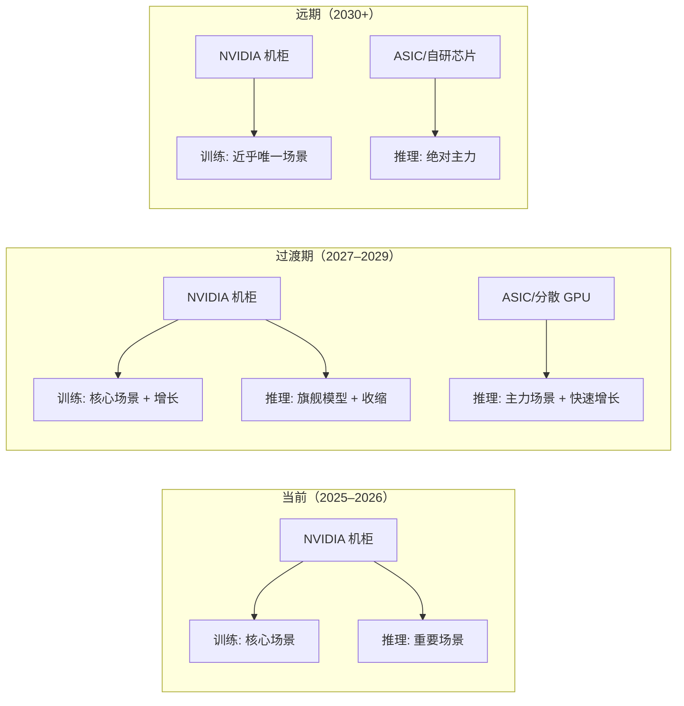
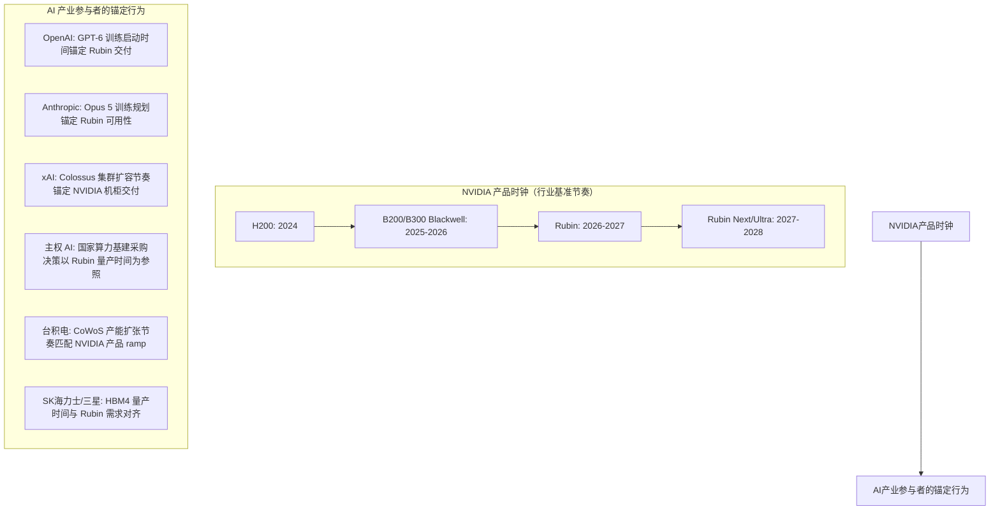

# 推理芯片 —— 产业研究与投资分析

> **研究起始日期**：2026 年 5 月 28 日
> **文档性质**：持续更新的研究笔记。随研究深入逐层扩充。

---

## 零、元问题：推理芯片为何重要 —— Token 成本的经济临界点

> **核心命题**：推理芯片的根本价值，在于它决定了 AI 模型输出 token 的生产成本。Token 成本能否突破经济临界点，是决定 AI 产业从资本投入期切换至规模盈利期的核心变量。本章旨在回答：**临界点位于何处？临界点到来之后产业结构将发生何种变化？**

### 0.1 为什么 Token 成本是 AI 产业的元约束

AI 产业的价值链可以简化为一条链条：

```
算力硬件（推理芯片） → Token 生产成本 → AI 推理服务的单位经济模型 → 应用场景的商业可行性
```

这条链条意味着：无论模型能力多强、用户体验多好，只要单次推理的 token 成本高于该场景能产生的经济价值，该场景就无法实现商业闭环。**Token 成本是横亘在 AI 能力与商业现实之间的核心约束变量。**

当前 AI 产业面临的核心矛盾是：
- **技术侧**：模型智能水平已足以完成大量高价值任务（编码、分析、客服、内容生成）
- **经济侧**：完成这些任务所消耗的 token 成本，往往超过该任务本身的经济产出

因此，"推理芯片为何值得深入研究"这一问题，本质上等价于：**"推理芯片的技术演进与产业竞争，将在何时、以多快的速度，把 token 成本压低到足以释放 AI 全部商业潜力的水平？"**

### 0.2 当前 Token 成本的基准参照

以下为截至 2026 年 5 月，全球主要大模型 API 的实际定价（数据来源：各厂商官方定价页面，已核实）。

#### 0.2.1 旗舰模型

| 模型 | 输入价格（每百万 tokens） | 输出价格（每百万 tokens） | 数据来源 |
|------|:----------------------:|:-----------------------:|---------|
| **OpenAI GPT-5.5** | $5.00 | $30.00 | OpenAI 官方定价页（2026 年 5 月） |
| **Anthropic Claude Opus 4.7** | $5.00 | $25.00 | Anthropic 官方定价页（2026 年 5 月） |
| **Anthropic Claude Opus 4.6 / 4.5** | $5.00 | $25.00 | 同上 |
| **DeepSeek V4-Pro**（促销价，2026.5.31 截止） | $0.435 | $0.87 | DeepSeek API 官方定价页；正常价为 $1.74 / $3.48 |

#### 0.2.2 高性价比 / Mini 模型

| 模型 | 输入价格（每百万 tokens） | 输出价格（每百万 tokens） | 数据来源 |
|------|:----------------------:|:-----------------------:|---------|
| **OpenAI GPT-5.4** | $2.50 | $15.00 | OpenAI 官方定价页 |
| **OpenAI GPT-5.4 mini** | $0.75 | $4.50 | 同上 |
| **Anthropic Claude Sonnet 4.6 / 4.5** | $3.00 | $15.00 | Anthropic 官方定价页 |
| **Anthropic Claude Haiku 4.5** | $1.00 | $5.00 | 同上 |
| **DeepSeek V4-Flash** | $0.14（cache miss） | $0.28 | DeepSeek API 官方定价页 |

#### 0.2.3 典型应用场景的 Token 成本与商业可行性评估

| 应用场景 | 当前单次推理成本（估） | 该场景的合理经济成本上限 | 可行性 | 差距 |
|----------|:-------------------:|:---------------------:|:------:|:----:|
| **代码补全**（Copilot 级，单次补全 100-500 tokens） | ~$0.0003–$0.002（Haiku/Flash 级模型） | $0.005/次 | ✅ 已可行 | — |
| **简单客服问答**（1K–3K tokens，Haiku 级模型） | ~$0.001–$0.015 | $0.05–$0.10/次 | ✅ 已可行 | — |
| **复杂客服协商**（多轮推理，10K–30K tokens，Sonnet 级模型） | ~$0.15–$0.90 | $0.20–$0.50/次 | ⚠️ 边缘可行 | 1–3× |
| **AI 深度研究报告**（检索 50+ 网页 + 综合撰写，50K–200K tokens） | ~$0.75–$6.00（Sonnet 级） | $0.10–$0.50/次 | ❌ 差距较大 | 5–30× |
| **全自主编码 Agent**（多文件、多轮调试，100K–1M tokens） | ~$3–$50（Sonnet/Opus 级） | $1–$5/任务 | ❌ 差距较大 | 5–50× |
| **短视频 AI 生成**（含推理+扩散生成，等效推理消耗极大） | 估算 $5–$50+/条 | $0.10–$1.00/条 | ❌ 差距极大 | 50–500× |
| **游戏 NPC 实时 AI 对话**（每玩家每秒持续推理） | $0.001–$0.01/秒（Haiku 级） | $0.0001/秒 以下 | ❌ 差距极大 | 10–100× |
| **大规模社交媒体 AI 交互**（日活数亿用户） | 单次对话 $0.001–$0.01 | 接近零边际成本 | ❌ 差距极大 | 巨大 |

> **核心发现**：代码补全和简单客服是极少数已经跨过经济临界点的 AI 应用。而 Agent 化工作流、深度研究、内容生成、大规模消费者 AI 等商业前景更广阔的领域，其推理成本仍远高于场景所能承载的经济价值。

### 0.3 Token 成本降本的四大驱动力

Token 成本的持续下降并非来自单一技术进步，而是四条独立降本曲线叠加的结果。

#### 驱动力一：芯片硬件代际演进

每一代新硬件在推理吞吐和能效上均较前代有显著提升（以下吞吐提升倍数为行业基准估算，基于 NVIDIA 官方发布及第三方评测的综合判断）：

| 时间窗口 | 代表产品 | 推理吞吐提升（vs 前代） | 推理能效提升 | 关键架构变量 |
|---------|---------|:-------------------:|:----------:|------------|
| 2024（基准） | NVIDIA H200（Hopper） | 1.0× | 1.0× | FP8 推理主力，HBM3e |
| 2025–2026 | NVIDIA B200 / B300（Blackwell） | **2–4×**（视工作负载） | **2–3×** | FP4 原生支持 × 更大 HBM3e 容量 × NVLink 5 |
| 2026–2027 | NVIDIA Rubin | **~2×（vs Blackwell）** | **~2×** | Vera CPU + 新 GPU 架构 + HBM4 |
| 2027–2028 | NVIDIA Rubin Next/Ultra | **~2×（vs Rubin）** | **~2×** | 架构持续迭代 |
| 2025–2028 | ASIC（Google TPU v6、AWS Inferentia/Trainium3、Groq 等） | 针对特定负载 **3–6× 性价比优势** vs 同期 merchant GPU | **3–6×** | 专用数据流架构，但在通用性上受限 |

> **数据支撑**：AWS 官方披露，基于 Inferentia2 的 Inf2 实例较同等 GPU 实例实现最高 90% 的成本降低（NTT PC 案例），Amazon Search 通过 Inferentia 将 ML 推理成本降低 85%，字节跳动使用 Inferentia 节省 60% 推理成本。AWS Trainium2 较 GPU 实例性价比提升 30%–40%（AWS 官方口径）。Trainium3（3nm，2026 年发布）较 Trainium2 性能再提升 2×。

#### 驱动力二：模型推理算法与软件优化

这是当前成本下降最快的维度，且不依赖于硬件更新周期：

| 技术 | 预期吞吐提升 | 当前部署状态 | 适用范围 |
|------|:----------:|:----------:|---------|
| **量化（FP8 → FP4 → MXFP4）** | 2–4× | FP8 已广泛部署；FP4 随 Blackwell 量产落地（2025–2026）；MXFP4/MXFP6 随 Trainium3 等引入 | 几乎所有模型，极低精度对复杂推理任务质量的影响仍在评估中 |
| **投机解码（Speculative Decoding）** | 1.5–3× | 已广泛部署于主流推理引擎（vLLM、TensorRT-LLM 等） | 通用，低熵场景（如代码生成、翻译）效果更好 |
| **FlashAttention / 高效注意力机制** | 2–5×（vs 朴素注意力实现） | 已标准化，几乎所有推理框架默认集成 | 长上下文场景收益最大 |
| **KV-Cache 优化 / 多查询注意力（MQA/GQA）** | 1.5–3× | 已标准化，主流模型架构默认采用 | 大 batch 在线推理 |
| **MoE（混合专家）架构** | 等效 3–8× 推理成本降低（仅激活部分参数） | 已成为主流架构选择（DeepSeek V4、Mixtral、Gemini 等） | 通用；训练复杂度较高 |
| **连续批处理（Continuous Batching）** | 2–5× 吞吐提升 | 推理引擎已广泛支持 | 在线服务场景 |
| **模型蒸馏 / 小模型专项优化** | 10–100× 成本降低（以能力退化为代价） | 已广泛使用 | 简单到中等复杂度任务 |

> 综合判断：软件+算法层面，2026–2029 年保守估计仍有 **5–15×** 的成本优化空间（在不显著牺牲模型能力的前提下）。

#### 驱动力三：ASIC 专用推理芯片的结构性降本

这是一个结构性、非渐进式的降本变量：

- **AWS Inferentia**：已公开的客户案例显示，相比 GPU 实例可降低推理成本 60%–90%（Finch Computing 80%，NTT PC 90%，Leonardo.ai 80%，Tomofun 83%）
- **Google TPU**：Google 已将大量内部推理从 GPU 迁移至 TPU，在 Transformer 类工作负载上实现了显著更优的每 token 成本
- **Groq LPU**：其 TSP 架构在大语言模型推理的**单 token 延迟**上做到了业界领先水平，为延迟敏感型场景提供了 GPU 之外的选择
- **AWS Trainium3**（2026 年发布）：3nm 制程、2.52 PFLOPs FP8 算力、144GB HBM3e、4.9 TB/s 带宽，AWS 将其定位为"为代理式 AI 和推理优化"的新一代芯片

**ASIC 降本的边界条件**：ASIC 的成本优势高度依赖于工作负载的稳定性。当模型架构或推理范式发生重大变化时，ASIC 可能需要重新设计。因此 ASIC 的降本效益在**稳定、大规模、重复性高的推理场景**中最显著，在前沿、多变的工作负载上相对有限。

#### 驱动力四：市场竞争与定价策略

这是一个非技术但高度有效的降本变量：

- **DeepSeek 效应**：DeepSeek V4-Flash 以 $0.28/百万输出 tokens 的定价，将高性价比推理的成本基准压至 GPT-5.5 的约 1/100。这一价格水平已接近纯硬件推理成本，对行业定价体系形成系统性压力。
- **开源模型能力逼近闭源旗舰**：当开源模型的推理能力接近闭源旗舰时，API 定价将成为零和博弈，所有玩家的利润率将被压缩至接近硬件成本。
- **云厂商以推理引流**：Google、AWS、微软均将自研芯片推理实例作为差异化竞争手段，通过压低推理定价吸引 AI 工作负载上云。

### 0.4 综合推算：Token 成本下降的合理时间线

将上述四条驱动力叠加，以"GPT-5.5 级别输出质量"和"高性价比模型（Haiku/Flash 级别）"两个档位分别推算（**以下为基于当前可获取信息的估算，非确定性预测**）：

| 时间 | 旗舰级模型输出 token 成本（每百万） | 高性价比模型输出 token 成本（每百万） | 累计降幅（高性价比档，vs 2026H1） | 关键驱动组合 |
|------|:-------------------------------:|:----------------------------------:|:------------------------------:|------------|
| **2026H1（当前基准）** | $25–$30（GPT-5.5、Opus 4.7） | $0.28–$5.00（Flash、Haiku、mini） | 1× | — |
| **2027H2** | $8–$18 | $0.08–$2.00 | 2.5–10× | Blackwell 量产 + FP4 普及 + 开源竞争白热化 + 投机解码全面落地 |
| **2028–2029** | $3–$10 | $0.03–$0.50 | 10–50× | Rubin + ASIC（Trainium3、TPU v6）规模化替代 + 量化技术成熟（MXFP4） + MoE 架构普及 |
| **2030+** | $1–$5 | $0.01–$0.15 | 30–200× | Rubin Next + ASIC 在 hyperscaler 内部深度部署 + 先进封装产能不再瓶颈 + 端侧推理分流部分简单任务 |

> **关键假设**：上述推算的前提是（1）先进制程（3nm→2nm）按计划量产；（2）CoWoS/3D-IC 封装产能持续扩张；（3）ASIC 推理芯片的软件生态逐步成熟，降低客户迁移门槛；（4）AI 模型架构不出现根本性范式革命（如完全替代 Transformer），导致所有 ASIC 投资归零。

### 0.5 临界点：分层击穿而非单一时刻

**"Token 成本临界点"不是一个日期，而是一系列经济可行性阈值被逐层击穿的过程。** 每一层阈值的击穿，解锁一批新的应用场景。

```
                        应用场景分层                                  预计跨过经济
                                                                     可行性阈值的时间
                        ────────────                                 ──────────────

  Layer 1  ┌──────────────────────────────────────┐
  已突破   │ 代码补全 · 简单客服 · 邮件摘要        │              ✅ 2025–2026 已突破
           │ · 翻译 · 基础内容审核                │
           └──────────────────────────────────────┘

  Layer 2  ┌──────────────────────────────────────┐
  即将突破 │ 复杂客服（多轮协商）                  │              ⏳ 2026–2028
           │ · AI 深度搜索 / 研究报告             │              （需 3–5× 降本 vs 2026H1
           │ · 初级 Agent 工作流                  │               高性价比模型基准）
           │ · 中等复杂度代码审查                │
           └──────────────────────────────────────┘

  Layer 3  ┌──────────────────────────────────────┐
  关键拐点 │ 全自主编码 Agent                      │              🔑 2028–2030
           │ · 企业级 AI 员工（多步执行）          │              （需 10–30× 降本 vs 2026H1）
           │ · 复杂 Agent 编排与多工具调用         │              ← 这是真正的大爆发临界点
           │ · AI 视频理解 / 实时审核             │
           └──────────────────────────────────────┘

  Layer 4  ┌──────────────────────────────────────┐
  远期爆发 │ 短视频/长视频 AI 生成（实时）         │              🚀 2030–2033
           │ · 游戏 NPC 实时 AI 驱动              │              （需 50–500× 降本）
           │ · 全天候 AI 个人助理/伴侣            │
           │ · AI 原生社交媒体内容流             │
           └──────────────────────────────────────┘
```

**Layer 3 是真正的产业临界点**：当一次全自主编码 Agent 任务（含多文件修改、调试、测试循环）的成本从当前的 $5–$50 降至 $0.30–$1.00，其经济价值将远超成本——一名软件工程师的时薪为 $50–$200，而 $1 的 token 成本可以替代数小时的人工编码工作。**临界点之前，AI 定位于辅助性工具；临界点之后，AI 成为具备颠覆性成本优势的智力劳动替代方案。**

> **值得警惕的反向力量**：Token 成本下降会引发需求弹性——当 token 单价降低时，用户与 Agent 系统倾向于消耗更多 token（更长的上下文、更复杂的推理链、更多的并行调用）。临界点到来时，token 总消耗量可能出现 100 倍以上的增长，总推理支出未必下降。但这正是产业进入规模扩张期的核心特征——**量升价跌，总市场快速扩大**。

### 0.6 投资含义：临界点前后的投资逻辑切换

| 阶段 | 时间窗口 | 核心受益方 | 投资逻辑 |
|------|---------|-----------|---------|
| **临界点前**（当前–2028） | Token 成本仍是核心约束，多数 AI 应用单位经济模型为负 | **硬件/基础设施层**：NVIDIA（GPU 稀缺溢价）、TSMC（产能瓶颈）、Broadcom/Marvell（ASIC 定制需求增长） | 基础设施供应商获取确定性利润；AI 应用层以资本投入换取规模扩张，投资者核心关注技术领先性而非当期盈利 |
| **临界点附近**（2028–2030） | Agent 经济性被击穿，头部应用开始出现正单位经济模型 | **基础设施 + 头部应用双受益**：推理芯片需求加速；AI 应用层出现分化——率先实现正向单位经济模型的公司获得估值重构 | 投资者评估重心从技术能力切换至商业模式的盈利可行性 |
| **临界点后**（2030+） | Token 成本降至"足够低"的水平，AI 算力成为通用基础设施级资源 | **最大受益者为 AI 应用层**：拥有数据壁垒、分发渠道和用户粘性的公司；硬件层增速从爆发期回归稳态 | Token 成本降至临界水平以下 → AI 成为基础资源 → 竞争壁垒从模型能力迁移至数据资产与网络效应 |

> **一句话总结**：推理芯片研究的根本价值，在于它是预判 AI 产业从技术预期驱动切换至盈利验证驱动的核心先行指标。Token 成本的下降曲线，本质上即 AI 商业化进程的倒数曲线。

### 0.7 本文档的研究框架

基于上述元问题逻辑，本文档后续章节将围绕以下问题展开：

1. **谁在生产推理芯片？** 它们的研发模式有何不同？（第一至六章）
2. **不同玩家的竞争地位和护城河如何？**（第七至十一章）
3. **推理芯片市场的空间有多大？增速如何？**（后续扩充）
4. **哪些玩家将在临界点到来时最大受益？**（后续扩充）

本章作为全篇的 investment thesis，为后续所有分析提供坐标系——**每一个厂商分析、每一次竞争对比，最终都要回归到一个问题：这家公司在 token 成本下降的浪潮中，是受益者还是受损者，其护城河能否在降本竞赛中保持甚至增强。**

---

## 一、研究口径与前提

为避免概念混淆，本文对以下术语作统一界定：

| 术语 | 定义 |
|------|------|
| **训练芯片** | 主要用于大模型预训练（pretraining）、后训练（post-training）、强化学习（RL）、知识蒸馏、多模态训练等集群计算场景的 AI 加速器 |
| **推理芯片** | 主要用于在线生成、检索增强、推荐系统、广告排序、搜索引擎、企业 Agent、多模态服务、端侧 AI 等部署场景的 AI 加速器 |
| **ASIC** | 面向特定应用场景或工作负载定制设计的集成电路。在本文语境下，特指 Google TPU、AWS Trainium/Inferentia、Meta MTIA 等数据中心 AI 定制芯片，以及 Broadcom/Marvell 参与设计的定制方案，不含通用 CPU 和手机端 NPU |
| **Merchant GPU** | 以标准产品形式对外销售的通用 GPU 加速器，客户可自由采购、部署并构建软件栈 |

> **说明**：一家企业可能同时涉足推理芯片与训练芯片两个赛道（如 NVIDIA、Google、AWS 等），本文聚焦其在推理芯片研发方面的定位与模式，必要时会提及训练侧背景以保持完整性。

---

## 二、推理芯片研发企业的三维分类框架

推理芯片研发企业的生态位差异较大，单一维度难以准确刻画。本文从三个独立维度进行交叉分类：

1. **芯片来源维度**：芯片由谁设计、如何设计
2. **销售模式维度**：芯片是否对外销售、以何种方式触达终端用户
3. **架构路线维度**：芯片采用何种底层计算架构

三个维度相互独立，一家企业会在每个维度中各有一个定位，三者叠加构成其完整的生态位画像。

---

## 三、维度一：按芯片来源分类

### 3.1 全栈自研型（Fully In-House Design）

**定义**：企业拥有完整的前端架构设计、RTL 编码、物理设计、验证及软件栈开发能力，芯片从架构定义到流片（tape-out）全链条由内部团队主导完成。部分环节（如后端物理设计）可能使用 EDA 工具厂商（Cadence/Synopsys）的标准化工具链，但设计决策权完全掌握在企业内部。

**典型企业及芯片**：

| 企业 | 代表推理芯片 | 应用场景 | 设计能力特征 |
|------|-------------|----------|-------------|
| **Google** | TPU v5p / v6（Trillium） | Google Cloud 推理实例、Gemini 模型服务、内部搜索/推荐推理 | 拥有从 TPU 架构到 XLA 编译器、Pathways 分布式框架的完整自研栈；早期 TPU v1-v4 曾与 Broadcom 合作物理设计，近年逐步内化后端能力 |
| **Amazon (AWS)** | Inferentia 2 / Trainium 2 | AWS SageMaker、Bedrock 推理服务、Alexa/广告/推荐推理 | 通过收购 Annapurna Labs（2015 年）获得芯片设计团队；自研 Neuron SDK 软件栈；Trainium 系列已从纯训练扩展至推理场景 |
| **Meta** | MTIA v2（Meta Training and Inference Accelerator） | Instagram/Facebook 信息流推荐、广告排序、Llama 模型推理 | 完全内部设计团队；MTIA 定位为内部工作负载专用加速器，不对外提供 |
| **Microsoft** | Maia 100 / Maia 200 | Azure OpenAI Service 推理、Copilot 推理、Bing 搜索推理 | 2023 年首次公开自研 AI 芯片；自研 Maia SDK 及配套软件工具链 |
| **华为** | 昇腾（Ascend）910 / 310 系列 | 云推理（ModelArts）、运营商 AI、政企推理部署 | 全栈自研：达芬奇架构 → 昇腾芯片 → CANN 算子库 → MindSpore 框架 → 云服务 |
| **百度** | 昆仑芯 2 / 昆仑芯 3（R 系列） | 百度智能云推理实例、文心大模型推理、搜索/信息流推理 | 百度内部芯片团队，后独立为昆仑芯科技；自研 XPU 架构及配套软件栈 |
| **阿里巴巴** | 平头哥含光 800 | 电商图像搜索/推荐推理、阿里云推理服务 | 2019 年发布；基于平头哥自研架构，主要用于阿里体系内推理场景 |
| **Apple** | A 系列 / M 系列 Neural Engine | iPhone/iPad/Mac 端侧 AI 推理（Face ID、Siri、照片、实时字幕等） | 从 A11 Bionic（2017 年）起集成专用 Neural Engine；完全自研，不对外销售 |

### 3.2 委托定制型（Custom ASIC via Design Service Partners）

**定义**：需求方（通常是云厂商或大型 AI 企业）定义芯片的架构规格、工作负载目标和软件栈需求，将物理设计、IP 集成、封装方案等后端工程外包给专业 ASIC 设计服务商（Design Service Provider），最终获得专属的定制芯片。需求方掌握架构定义权和软件生态主导权，设计服务商提供物理实现能力和成熟 IP 组合。

**典型合作关系**：

| 需求方 | 设计服务合作方 | 代表芯片/项目 | 合作模式特征 |
|--------|--------------|--------------|-------------|
| **Google**（早期 TPU v1-v4） | Broadcom | TPU v1 / v2 / v3 / v4 | Broadcom 提供物理设计、SerDes IP 及封装方案；Google 主导架构定义和软件栈；TPU v5 起 Google 逐步内化更多后端能力 |
| **Amazon (AWS)**（早期阶段） | Marvell / Annapurna | 早期 Inferentia / Trainium | 收购 Annapurna 后芯片设计能力逐步内化，当前主要依靠内部团队；Marvell 在部分 IP 和设计服务上持续参与 |
| **OpenAI** | Broadcom + TSMC（业界传闻） | 自研推理芯片（推进中，尚未正式发布） | 业界广泛报道 OpenAI 正在与 Broadcom 合作开发自有推理芯片，旨在降低推理成本并减少对 NVIDIA 的依赖 |
| **字节跳动** | Broadcom（业界传闻） | 自研 AI 推理芯片（推进中，尚未正式发布） | 与 Broadcom 合作开发面向推荐算法推理场景的定制 ASIC |
| **苹果**（传闻中） | Broadcom | 数据中心 AI 推理芯片（业界传闻，代号"Project ACDC"） | 传闻苹果正与 Broadcom 合作开发用于 Apple Intelligence 云端推理的定制芯片 |

**委托定制模式的核心特点**：

1. **架构定义权归需求方**：芯片面向何种工作负载、采用何种数据流架构、如何平衡算力与带宽，由需求方根据自有业务决定。
2. **物理实现由服务商完成**：RTL 综合、布局布线、时钟树设计、功耗优化、信号完整性验证等后端工作由 Broadcom/Marvell 等专业团队执行。
3. **IP 组合由服务商提供**：SerDes、PCIe、DDR 控制器、HBM PHY 等标准化接口 IP 通常由设计服务商提供成熟方案，大幅降低流片风险。
4. **软件栈由需求方自建**：编译器、算子库、框架适配等软件生态由需求方独立开发和维护，这是区分"真自研"与"贴牌"的关键标志。
5. **流片后的芯片为需求方独享**，不进入公开市场销售。

### 3.3 纯外购型（Merchant Chip Buyer）

**定义**：企业不具备芯片设计能力，不参与任何芯片研发环节，完全通过向 NVIDIA、AMD、Intel 等通用 GPU 供应商采购现成芯片来满足推理算力需求。

此类企业不在"推理芯片研发企业"范畴内，仅为使用方。代表性企业包括：

- **OpenAI**（当前阶段，主要采购 NVIDIA GPU；自研芯片仍在传闻阶段）
- **Anthropic**（主要使用 Google TPU 和 NVIDIA GPU）
- **Midjourney / Runway** 等 AI 应用公司
- 绝大多数 AI 初创企业及传统企业 AI 部署场景

> **说明**：纯外购型不属于本文研究范畴，此处仅作为分类完整性做简要说明。

---

## 四、维度二：按芯片销售模式分类

### 4.1 纯自用型（Captive）

**定义**：芯片完全用于企业自有业务系统，不通过任何形式（裸芯片、加速卡、云实例）对外提供或销售。

| 企业 | 代表芯片 | 自用场景 |
|------|----------|----------|
| **Meta** | MTIA v2 | Instagram/Facebook 信息流推荐排序、广告点击率预估、Llama 大模型内部推理 |
| **Apple** | Neural Engine（A/M 系列集成） | iPhone/iPad/Mac 端侧 AI 推理，完全不对外 |
| **字节跳动**（传闻项目） | 自研 ASIC | 抖音/头条推荐算法推理、豆包大模型推理 |

**生态位特征**：此类企业的芯片不构成公开市场的直接竞争变量，但其自研芯片替代 GPU 采购的规模会间接影响 NVIDIA 等供应商的出货量。

### 4.2 自用 + 云上出租型（Captive + Cloud Rental）

**定义**：芯片主要用于企业自有云平台，通过云实例（Cloud Instances）的形式向外部开发者、企业客户提供算力出租服务，但不销售裸芯片或物理加速卡。客户无法购买该芯片用于自有数据中心，只能在指定云平台上以按需或预留实例的方式使用。

| 企业 | 芯片 | 云平台出租品牌 | 典型实例/服务 |
|------|------|--------------|-------------|
| **Google** | TPU v5p / v6 | Google Cloud TPU | Cloud TPU v5p Pod、TPU v6e 推理实例 |
| **Amazon (AWS)** | Inferentia 2 / Trainium 2 | AWS | inf2 实例（推理）、trn2 实例（训练+推理） |
| **Microsoft** | Maia 100 / 200 | Azure | Azure Maia 实例（主要为 OpenAI/Copilot 推理） |
| **百度** | 昆仑芯 2 / 3 | 百度智能云 | 昆仑芯推理实例、文心大模型推理服务 |
| **阿里巴巴** | 含光 800 | 阿里云 | 图像搜索/推荐推理服务 |

**生态位特征**：
- 核心竞争力是**云平台整体 TCO（Total Cost of Ownership）优化**，而非单一芯片的标称算力。
- 客户不直接采购芯片，芯片的竞争主要发生在**云服务定价**层面。
- 此类芯片与 NVIDIA 的竞争更多体现在"云厂商用自研芯片替代 NVIDIA GPU 部署推理实例"，而非在公开芯片市场上争夺客户。

### 4.3 对外销售通用芯片型（Merchant / Open Market）

**定义**：企业以标准产品形式向市场公开销售推理芯片或加速卡（PCIe 卡、OAM 模组等），任何客户可自由采购并在自有数据中心中部署，同时可自主选择配套软件栈。

| 企业 | 代表推理芯片/加速卡 | 芯片架构 | 销售区域 |
|------|--------------------|---------|----------|
| **NVIDIA** | H200 NVL / B200 / GB200（Grace-Blackwell Superchip）/ RTX 系列 | GPU（CUDA 生态） | 全球 |
| **AMD** | Instinct MI300X / MI350 系列 | GPU（ROCm 生态） | 全球 |
| **Intel** | Gaudi 3 AI 加速器 / Falcon Shores | 自研架构（OneAPI 生态） | 全球 |
| **华为** | 昇腾（Ascend）910B / 310P 加速卡 | 达芬奇架构 | 中国为主 |
| **寒武纪** | 思元（Siyuan）590 / 370 加速卡 | 自研 MLU 架构 | 中国 |
| **海光信息** | 深算（Deep Computing）系列 GPGPU | x86 兼容架构 | 中国 |
| **Groq** | LPU（Language Processing Unit）推理加速卡 | 自研 TSP 架构 | 全球（面向低延迟推理） |
| **Cerebras** | WSE-3（Wafer Scale Engine）晶圆级推理系统 | 晶圆级芯片 | 全球（面向超大规模模型；2026 年 1 月起与 OpenAI 合作提供高速推理服务） |
| **d-Matrix** | Corsair 推理加速卡 | 自研 DIMC（Digital In-Memory Compute）架构 | 全球（面向生成式 AI 推理） |

**生态位特征**：
- 竞争核心是**芯片标称性能 + 软件生态成熟度 + 供应链稳定性**的综合比拼。
- NVIDIA 在此类市场占据绝对主导地位（2030E 预计仍维持在 60%-75% 的 merchant 推理市场份额）。
- 软件生态（CUDA vs ROCm vs OneAPI vs CANN）的成熟度是决定客户从"试用"到"规模化部署"转化率的关键变量。

---

## 五、维度三：按芯片架构路线分类

### 5.1 GPU 通用计算路线

**定义**：以通用可编程性为核心设计目标，基于大规模并行计算架构（SIMD/SIMT），支持广泛的 AI 框架、算子类型和工作负载。优势在于生态成熟度高、开发者工具链完善、能灵活适应模型架构的快速迭代。

| 企业 | 代表推理产品线 | 关键软件生态 | 推理端定位 |
|------|--------------|-------------|-----------|
| **NVIDIA** | H200 / B200 / GB200 → Rubin 系列 | CUDA、cuDNN、TensorRT-LLM、NVIDIA NIM、Triton Inference Server | 全场景推理平台（从云端到边缘），高复杂度推理首选 |
| **AMD** | Instinct MI300X / MI350 系列 | ROCm、MIGraphX、VLLM 适配 | 追赶 NVIDIA，推理性价比路线 |
| **Intel** | Gaudi 3 / Falcon Shores | OneAPI、OpenVINO | 面向企业数据中心推理，强调开放标准 |
| **海光信息** | 深算系列 GPGPU | ROCm 兼容（部分） | 中国市场的 GPU 替代方案 |

**关键特征**：
- 面对模型架构快速演进（如 MoE、Mamba、多模态融合等新范式），GPU 的通用性具有天然优势，无需重新流片即可适配新架构。
- 软件生态的锁定效应显著——客户在 CUDA 上的工程投入越大，迁移意愿越低。
- 推理端的核心优化方向是**低精度计算（FP8/FP4）+ 显存带宽提升 + 推理引擎优化**。

### 5.2 ASIC 专用架构路线

**定义**：面向特定工作负载（如 Transformer 推理、推荐系统推理、大语言模型服务等）进行深度架构定制，在目标场景下实现显著优于通用 GPU 的性能功耗比和每 token 成本。代价是灵活性受限，当模型架构或推理范式发生重大变化时，可能需要重新设计芯片。

| 企业 | 代表推理芯片 | 架构特征 | 核心优化方向 |
|------|-------------|---------|-------------|
| **Google** | TPU v5p / v6 | 脉动阵列（Systolic Array）架构，针对 Transformer 注意力机制和矩阵乘法深度优化 | TensorCore 密度 × 高带宽内存 × XLA 编译优化 |
| **AWS** | Inferentia 2 | NeuronCore v2 架构，内置加速器引擎专门处理 Attention 等关键算子 | 云上生成式 AI 推理性价比（每 token 成本） |
| **Meta** | MTIA v2 | 面向推荐模型的稀疏运算加速架构 | 推荐系统 Embedding 查找 × 稀疏矩阵运算 |
| **Groq** | LPU（Language Processing Unit） | TSP（Tensor Streaming Processor）架构，软件定义的数据流调度，无传统缓存层次 | 大语言模型超低延迟推理（单 token 延迟优化到极致） |
| **Cerebras** | WSE-3 | 晶圆级芯片（整片晶圆为一个芯片），片上内存带宽极高，免除芯片间互联瓶颈 | 超大规模模型的全参数推理（免分布式切分）+ 代码模型超低延迟推理；2026 年起为 OpenAI 的 GPT-5.3-Codex-Spark 和 GPT-OSS 提供高速推理（3,000 tokens/秒） |
| **d-Matrix** | Corsair | 数字存内计算（DIMC）架构，将计算单元与 SRAM 紧密耦合 | 生成式 AI 推理的能效比和延迟优化 |
| **寒武纪** | 思元 590 / 370 | 自研 MLU 架构，面向 AI 加速的专用指令集 | 中国市场的 ASIC 推理替代方案 |
| **百度昆仑芯** | 昆仑芯 2 / 3 | 自研 XPU-R 架构，兼顾通用性与专用性 | 百度 AI 生态内的推理部署 |

**关键特征**：
- ASIC 在推理端的渗透逻辑强于训练端，因为**推理工作负载相对稳定、重复性高**，适合做针对性架构固化。
- 核心价值主张是**每 token 成本**和**能效比**，而非绝对峰值算力。
- 主要风险在于模型架构的重大变化——如果 Transformer 被新架构替代，ASIC 的经济寿命将显著缩短。
- 目前 ASIC 主要部署在 hyperscaler 自有基础设施中，在公开市场上的独立竞争力仍在验证阶段。

### 5.3 端侧推理芯片路线

**定义**：面向智能手机、个人电脑、物联网设备、智能汽车等终端设备的低功耗 AI 推理芯片。核心设计约束是功耗（通常在毫瓦到数瓦级别）和面积，而非绝对算力。通常以 NPU（Neural Processing Unit）或 AI 引擎的形式集成在 SoC 中。

| 企业 | 代表推理芯片/IP | 搭载平台 | 应用场景 |
|------|----------------|---------|----------|
| **Apple** | Neural Engine（A18 / M5 系列集成） | iPhone / iPad / Mac | 端侧 Siri、Face ID、实况文本、图像生成、本地大模型推理 |
| **高通（Qualcomm）** | Hexagon NPU（Snapdragon 8 Elite / X Elite 集成） | 安卓旗舰手机 / AI PC | 端侧大模型推理、实时翻译、图像生成 |
| **联发科（MediaTek）** | APU（Dimensity 9400 集成） | 安卓手机 | 端侧 AI 影像、语音助手 |
| **Intel** | NPU（Meteor Lake / Lunar Lake 集成） | AI PC（Windows 笔记本） | Windows Copilot 本地推理、视频会议 AI 增强 |
| **AMD** | Ryzen AI（XDNA NPU） | AI PC（Ryzen 处理器集成） | 端侧 AI 推理加速 |

**关键特征**：
- 端侧推理芯片不参与数据中心推理市场的直接竞争，但构成了推理芯片产业的**长尾市场**。
- 与数据中心推理的核心技术路线不同：端侧追求**功耗效率**，数据中心追求**算力密度与带宽**。
- 随着端侧大模型（On-Device LLM）的兴起（如 Apple Intelligence、高通 AI Hub），端侧推理芯片的重要性在快速上升。
- 端侧芯片几乎全部为系统厂商自用或集成销售，不存在独立的端侧推理芯片 merchant 市场。

---

## 六、生态位全景图

以下从两个维度刻画主要推理芯片研发企业的生态位：

- **横轴**：芯片的「开放性」——从纯自用（封闭）到开放市场销售（开放）
- **纵轴**：芯片的「通用性」——从专用 ASIC（面向特定工作负载）到通用 GPU（面向广泛工作负载）

```
                        通用性高 / GPU 路线
                              ▲
                              │
                 ┌────────────┼────────────┐
                 │            │            │
                 │   NVIDIA   │   AMD      │
                 │   (开放)    │   (开放)    │
                 │            │            │
                 │   Intel    │  海光信息   │
                 │   (开放)    │   (中国开放) │
                 │            │            │
     ────────────┼────────────┼────────────┼────────────▶ 开放性高
                 │            │            │      (对外销售)
                 │  Groq      │            │
                 │  (开放)    │            │
                 │            │            │
                 │ Cerebras   │ 华为昇腾    │
                 │ (开放)     │ (中国开放)  │
                 │            │            │
                 │ d-Matrix   │ 寒武纪      │
                 │ (开放)     │ (中国开放)  │
                 ├────────────┼────────────┤
                 │            │            │
                 │ Google TPU │            │
                 │ (云出租)   │            │
                 │            │            │
                 │ AWS Inf2   │ 百度昆仑芯  │
                 │ (云出租)   │ (云出租+    │
                 │            │  中国开放)  │
                 │ 微软 Maia  │            │
                 │ (云出租)   │            │
                 ├────────────┤            │
                 │            │            │
                 │ Meta MTIA  │            │
                 │ (纯自用)   │            │
                 │            │            │
      自用/封闭  │ Apple NE   │            │
                 │ (纯自用)   │            │
                              │
                        专用性高 / ASIC 路线
```

> **注**：端侧推理芯片厂商（Apple Neural Engine、高通 Hexagon、联发科 APU 等）因不参与数据中心推理市场直接竞争，未在上图中标注。它们构成独立的端侧推理生态。

---

## 七、关键判断与投资含义

### 7.1 关于 NVIDIA 的生态位

NVIDIA 是当前全球唯一同时满足以下三个条件的企业：

1. **全场景覆盖**：从云端超大规模推理集群到企业级部署到边缘推理，产品线覆盖完整
2. **开放生态平台**：任何客户可自由采购、自主部署，不受限于特定云平台
3. **平台级系统能力**：并非仅销售芯片，而是提供 GPU + 网络（InfiniBand/Spectrum-X）+ 软件（CUDA/TensorRT-LLM/NIM）+ 参考架构的完整解决方案

这一生态位使得 NVIDIA 在高复杂度推理场景中几乎不存在对等竞争对手。其推理端护城河的核心并非"单卡峰值算力最高"，而是**整体平台的确定性与成熟度最高**。

### 7.2 关于 Hyperscaler ASIC 的生态位

Google（TPU）、AWS（Inferentia/Trainium）、Meta（MTIA）、微软（Maia）的自研芯片战略有以下共性：

1. **首要目标不是"卖芯片"，而是降低自有工作负载的 TCO（Total Cost of Ownership）**
2. **通过云平台间接变现**，而非在芯片公开市场上与 NVIDIA 正面竞争
3. **短期难以形成 NVIDIA 级别的开放软件生态**——其 SDK 和工具链主要面向自有云平台优化，独立部署的可用性有限
4. **在稳定、大规模、重复性高的工作负载**（搜索、推荐、广告、基础模型 API 服务）中最先实现经济替代

> Hyperscaler ASIC 对 NVIDIA 推理市场份额的侵蚀，更多体现在**增量预算的分流**（云厂商将新增推理预算分配给自研芯片而非采购 GPU），而非存量替换。

### 7.3 关于 Broadcom 和 Marvell 的角色

Broadcom 和 Marvell 不直接参与推理芯片的最终用户竞争，但其作为 ASIC 生态的关键基础设施供应商具有重要地位：

- 为 hyperscaler 和大型 AI 企业提供芯片物理设计、成熟 IP 组合和封装方案
- 帮助没有完整芯片后端能力的企业完成从架构定义到量产芯片的工程闭环
- ASIC 渗透率每提升一个百分点，Broadcom/Marvell 的定制芯片业务就多一分增长空间

### 7.4 关于中国推理芯片赛道的特殊性

中国的推理芯片市场是一个**受地缘政治深刻影响的平行市场**：

- 美国出口管制（2022 年 10 月、2023 年 10 月两轮强化）限制了 NVIDIA 高端 GPU 对华出口，人为制造了国产替代窗口
- 华为昇腾、寒武纪、海光信息、百度昆仑芯等国产芯片厂商的竞争逻辑，本质上不同于全球市场的"GPU vs ASIC"之争，而是**"在美国技术封锁下的有限选择"**
- 中国推理芯片赛道的长期竞争将主要围绕**国产制程工艺可获得性、自主软件生态成熟度**和**头部客户迁移意愿**展开

---

## 八、专题：ASIC 设计服务商的护城河分析

> **研究日期**：2026 年 5 月 28 日
> **研究目的**：厘清 ASIC 设计服务赛道的主要厂商、商业模式本质、护城河维度及竞争格局。

### 8.1 赛道定义与纳入标准

**ASIC 设计服务商（ASIC Design Service Provider）**：指为不具备完整芯片后端能力的企业（通常为 hyperscaler、大型 AI 公司等需求方）提供定制芯片设计服务的厂商。其核心交付物包括但不限于：

- 芯片物理设计（RTL 综合、布局布线、时钟树设计、功耗优化、可测试性设计 DFT 等）
- 成熟 IP 组合授权（SerDes、HBM PHY、PCIe 控制器、Die-to-Die 互联等高速接口 IP）
- 先进封装方案设计（CoWoS/InFO/3D-IC 下的信号完整性、热管理与应力分析）
- 流片管理与量产协调（与台积电等代工厂的工程对接、良率爬坡支持）

**不与以下角色混淆**：

| 角色 | 代表企业 | 与 ASIC 设计服务商的区别 |
|------|---------|------------------------|
| **EDA 工具厂商** | Cadence、Synopsys | 提供设计工具和部分 IP，不承接整芯片的定制设计工程 |
| **晶圆代工厂** | 台积电、三星、Intel Foundry | 负责制造，不参与芯片的前端架构与后端物理设计 |
| **全栈自研芯片企业** | Google、AWS、华为 | 自行设计芯片用于自有业务，不向第三方提供芯片设计服务 |

### 8.2 赛道主要厂商概览

当前全球 AI ASIC 设计服务赛道呈现**双寡头 + 区域梯队**的竞争格局。

#### 第一梯队：全球双寡头

| 厂商 | 总部 | AI ASIC 主要客户 | 代表合作项目 | AI ASIC 相关营收估算（2024E） |
|------|------|-----------------|-------------|---------------------------|
| **Broadcom（博通）** | 美国 | Google、Meta、OpenAI（传闻）、字节跳动（传闻）、苹果数据中心（传闻） | Google TPU v1-v6 物理设计/IP；Meta MTIA 后端设计 | ~80–110 亿美元 |
| **Marvell（迈威尔）** | 美国 | AWS、微软（部分） | AWS Trainium/Inferentia 物理设计与 IP；微软 Maia 后端支持 | ~25–40 亿美元 |

#### 第二梯队：区域重要玩家

| 厂商 | 总部 | 核心定位 | AI ASIC 相关特征 |
|------|------|---------|-----------------|
| **世芯-KY（Alchip）** | 中国台湾 | 台积电生态系内的先进制程 ASIC 设计服务商 | 在 7nm/5nm/3nm 节点有大量设计服务经验；客户包括北美和亚洲 AI 企业；营收高度依赖台积电产能生态 |
| **创意电子（GUC / Global Unichip）** | 中国台湾 | 台积电间接持股的 ASIC 设计服务商 | 与台积电深度绑定，尤其在 CoWoS/InFO 先进封装设计方面有差异化能力；AI 相关营收占比快速提升 |
| **芯原股份（VeriSilicon）** | 中国大陆 | 中国本土 ASIC 设计服务龙头 | 覆盖从 IP 授权到芯片设计的一站式服务；受益于中国国产替代需求；先进制程受限于地缘政治约束 |
| **Socionext** | 日本 | 日系 ASIC 设计服务龙头 | 在定制 SoC 领域有长期积累；AI ASIC 是其战略扩展方向，目前体量较小 |
| **Faraday Technology（智原科技）** | 中国台湾 | 联电生态系内的 ASIC 设计服务商 | 成熟制程 ASIC 经验丰富，先进制程 AI ASIC 能力仍在建设中 |
| **eSilicon**（已被 Inphi/Marvell 整合） | 美国 | 已退出独立竞争 | 2020 年前为独立 ASIC 设计服务商，后被收购整合 |

#### 相邻赛道：EDA/IP 厂商的延伸角色

| 厂商 | 定位 | AI ASIC 相关性 |
|------|------|---------------|
| **Cadence（楷登）** | EDA 工具 + 部分 IP | 提供 AI 芯片设计所需的全流程 EDA 工具和接口 IP（PCIe、DDR 等），但不承接整芯片定制设计 |
| **Synopsys（新思科技）** | EDA 工具 + 部分 IP | 与 Cadence 类似；在 HBM PHY 和 Die-to-Die IP 方面有一定竞争性；通过收购 Ansys 补强仿真能力 |
| **Alphawave Semi** | 高速 SerDes IP 专业厂商 | 112G/224G SerDes IP 在部分 AI ASIC 项目中替代 Broadcom IP |

> **注**：Cadence 和 Synopsys 是工具供应商，不是严格意义上的 ASIC 设计服务商，但它们在某些 IP 领域与 Broadcom/Marvell 有局部竞争关系。本文后续分析聚焦于承接整芯片定制设计的服务商，即第一、第二梯队。

### 8.3 商业模式分析

ASIC 设计服务商的核心商业模式可以概括为：**以技术稀缺性换取非经常性工程收入（NRE）+ 以 IP 锁定换取持续性量产抽成**。

#### 8.3.1 收入结构

一个典型的 AI ASIC 设计服务项目的收入由三部分构成：

| 收入来源 | 占比（估） | 计入时点 | 利润率特征 |
|---------|:--------:|---------|-----------|
| **NRE（Non-Recurring Engineering）**——一次性设计服务费 | 30%-40% | 项目启动至流片，分期确认 | 人力密集型，利润率中等（30%-40%） |
| **IP 授权费（License + Royalty）**——SerDes/HBM PHY/PCIe 等 IP 授权 | 20%-30% | 授权签约 + 按芯片出货量抽成 | 极高利润率（70%+），边际成本趋近于零 |
| **量产服务费（Production Service）**——流片管理、良率爬坡、工程协调 | 30%-40% | 芯片量产后按出货量或以固定周期收取 | 利润率中等偏高（40%-50%），与代工产能协调能力挂钩 |

#### 8.3.2 商业模式的本质：工程能力 + IP 组合的双重变现

```
需求方痛点                               ASIC 设计服务商的解决方案
──────────────────────────              ──────────────────────────────

企业希望开发自研芯片，                     →  提供物理设计工程服务（NRE），
但缺乏后端设计团队                            覆盖从 RTL 签核到 GDSII 交付的全流程

企业希望避免从零开始                      →  提供成熟 IP 组合授权，
开发高速接口                                  包括 112G/224G SerDes、HBM PHY、
                                              PCIe Gen6/7 控制器等已验证方案

企业无法承受流片失败                      →  提供量产管理及良率工程服务，
的风险和时间成本                              依托数十次乃至上百次流片经验
                                              构建风险管控体系
```

**这一模式的底层逻辑是**：芯片物理设计（尤其是 3nm/2nm 先进制程下的后端设计）属于高度专业化、经验曲线极陡峭的领域。即便 hyperscaler 拥有顶尖的架构师和软件工程师团队，短期内组建一支具备可靠流片能力的后端设计团队仍极为困难。ASIC 设计服务商提供的核心价值并非人力外包，而是**工程确定性**——确保芯片按规格完成设计、按期流片、按预期良率进入量产。

### 8.4 护城河分析

ASIC 设计服务商的护城河由以下五个维度叠加构成。这五个维度之间存在显著的**正反馈循环**（已有成功案例 → 吸引更多客户 → 积累更多经验 → 提升成功率 → 强化护城河），形成极强的"时间积累壁垒"。

#### 8.4.1 先进制程物理设计经验

| 护城河要素 | 具体内涵 | 壁垒强度 |
|-----------|---------|:--------:|
| **多节点设计经验** | 7nm → 5nm → 3nm → 2nm 各代工艺的物理设计方法学，包括布局布线策略、时钟树综合、IR Drop 管理、信号完整性优化 | ⭐⭐⭐⭐⭐ |
| **先进封装设计** | CoWoS-S/R/L、InFO、SoIC、3D-IC 堆叠的热-力-电多物理场联合仿真与优化 | ⭐⭐⭐⭐⭐ |
| **流片成功 track record** | 每位客户的首次流片成功概率，取决于设计团队对特定制程工艺窗口的理解深度 | ⭐⭐⭐⭐⭐ |
| **DFT/DFM 工程** | 可测试性设计（DFT）与可制造性设计（DFM），直接决定良率爬坡速度 | ⭐⭐⭐⭐ |

**关键判断**：先进制程的物理设计难度随节点演进呈非线性增长。台积电 N2（2nm GAA）时代，物理设计的工程复杂度较 N5 预计提升 4 倍以上。这意味着 ASIC 设计服务商的**经验价值在上升而非下降**——每一代新工艺的物理设计挑战，都是一次护城河加深的契机。

#### 8.4.2 高速接口 IP 组合

这是 Broadcom 和 Marvell 最深的单点护城河，也是拉开与第二梯队差距的核心要素。

| IP 类别 | AI 芯片中的关键作用 | 全球主要供应商 | 壁垒强度 |
|---------|-------------------|--------------|:--------:|
| **SerDes 112G/224G PAM4** | 芯片间互联（NVLink 等效功能）、网络接口、PCIe 物理层 | Broadcom、Alphawave、Cadence、Synopsys | ⭐⭐⭐⭐⭐ |
| **HBM PHY（HBM3/HBM4）** | 连接 GPU/ASIC 核心与 HBM 堆叠内存的物理层接口，HBM4 的 2048-bit 接口宽度使 PHY 设计成为最大瓶颈之一 | Broadcom、Synopsys、Rambus、三星 | ⭐⭐⭐⭐⭐ |
| **PCIe Gen6/Gen7 控制器 + PHY** | 主机接口、存储互联 | Broadcom、Synopsys、Cadence | ⭐⭐⭐ |
| **Die-to-Die Interconnect（UCIe/BoW）** | Chiplet 架构下的裸片间超高带宽互联 | Broadcom、Synopsys、Alphawave | ⭐⭐⭐⭐ |

**为什么 IP 是护城河而不仅是收入来源**：

1. **自研替代的经济账不划算**——一个 SerDes 224G IP 的研发投入以数亿美元计，且需要经过多次流片验证才能在先进制程上可靠工作。大厂为自己的芯片单独开发 SerDes IP 在经济上极不理性。
2. **IP 的切换成本高**——一旦某家客户的芯片设计围绕 Broadcom 的 SerDes/HBM PHY IP 完成，下一颗芯片迁移到另一家 IP 供应商的工程成本极高（需重新设计整个 PHY 子系统和板级方案）。
3. **IP 生态的网络效应**——Broadcom 的 SerDes IP 被最广泛验证和部署，意味着更少的兼容性问题、更成熟的设计参考和更快的 bring-up 周期。

#### 8.4.3 大客户关系的深度绑定

| 护城河要素 | 具体内涵 | 壁垒强度 |
|-----------|---------|:--------:|
| **长期合作信任** | Broadcom 与 Google 的 TPU 合作始于 2015 年，跨越四代芯片 | ⭐⭐⭐⭐⭐ |
| **项目迁移成本** | 更换 ASIC 设计服务商意味着需将全部物理设计方法学、IP 适配、封装方案重新验证——对一个 AI 芯片项目而言，这至少增加 12-18 个月的 delay | ⭐⭐⭐⭐⭐ |
| **信息壁垒** | 深度合作过程中，设计服务商对大客户的工作负载特征、数据流模式、性能瓶颈的理解是其他竞争者无法获取的 | ⭐⭐⭐⭐ |
| **多项目绑定** | 一个 hyperscaler 通常同时推进多个 ASIC 项目（训练、推理、推荐等），已合作的设计服务商天然获得后续项目的信息优势和信任优势 | ⭐⭐⭐⭐ |

#### 8.4.4 与代工厂的产能协同能力

| 护城河要素 | 具体内涵 | 壁垒强度 |
|-----------|---------|:--------:|
| **先进封装产能获取** | CoWoS 产能是当前 AI 芯片的物理瓶颈。Broadcom/Marvell 作为台积电的长期大客户，在先进封装产能分配上拥有优先权，这是其客户选择它们的重要隐性原因 | ⭐⭐⭐⭐⭐ |
| **工艺协同优化** | 设计服务商与台积电工程团队之间的长期技术对话，使得它们在定义芯片规格时就能准确预判工艺窗口，减少设计迭代次数 | ⭐⭐⭐⭐ |
| **多项目产能聚合谈判** | Broadcom 可以聚合多个客户的芯片项目向台积电统一谈判产能，单个客户独立谈判的地位远不及此 | ⭐⭐⭐⭐ |

> **关键认知**：hyperscaler 选择 Broadcom 或 Marvell 提供设计服务，不仅是采购设计能力，也是在间接获取**与台积电的产能通道**。在 CoWoS 产能持续紧张的产业背景下，这一隐性价值的重要性甚至可能超过显性的 NRE 服务费和 IP 授权费。

#### 8.4.5 完整方法论与工程流程的体系化

| 护城河要素 | 具体内涵 | 壁垒强度 |
|-----------|---------|:--------:|
| **设计流程标准化** | 经过数十个项目验证的、覆盖从 RTL 签核到 GDSII 交付的全流程设计方法学，包含针对不同制程节点、不同工作负载类型的优化模板 | ⭐⭐⭐⭐ |
| **多物理场联合仿真能力** | 3D-IC 时代的芯片设计需要同时处理电气、热、机械应力三类物理场，具备多物理场联合仿真体系的团队极为稀缺 | ⭐⭐⭐⭐⭐ |
| **失败案例知识库** | 每一次流片失败、良率异常、信号完整性问题的根因分析和解决方案，构成了隐性知识壁垒。新进入者即使拥有同等人才，也无法缩短这个经验积累过程 | ⭐⭐⭐⭐⭐ |

---

### 8.5 护城河强度总结矩阵

| 护城河维度 | Broadcom | Marvell | 世芯-KY | 创意电子 | 芯原股份 | 新进入者 |
|-----------|:--------:|:-------:|:------:|:------:|:------:|:--------:|
| 先进制程物理设计经验 | ★★★★★ | ★★★★ | ★★★★ | ★★★ | ★★ | ★ |
| 高速接口 IP 组合（SerDes/HBM PHY） | ★★★★★ | ★★★★ | ★★ | ★★ | ★ | ★ |
| 大客户关系深度 | ★★★★★ | ★★★★ | ★★★ | ★★ | ★★ | ★ |
| 与台积电产能协同 | ★★★★★ | ★★★★ | ★★★★ | ★★★★ | ★★ | ★ |
| 方法论与工程流程体系化 | ★★★★★ | ★★★★ | ★★★ | ★★★ | ★★ | ★ |
| **综合护城河强度** | **极强** | **很强** | **中等** | **中等** | **较弱** | **极弱** |

---

### 8.6 厂商间对比分析

#### 8.6.1 Broadcom vs Marvell：双寡头的差异化竞争

两者虽然在 ASIC 设计服务赛道上直接竞争，但在竞争策略上存在显著差异：

| 对比维度 | Broadcom | Marvell |
|---------|----------|---------|
| **AI ASIC 营收规模** | ~80–110 亿美元（2024E） | ~25–40 亿美元（2024E） |
| **核心大客户** | Google（TPU，长期深度绑定）、Meta（MTIA）、OpenAI/字节/苹果（传闻新增） | AWS（通过 Annapurna Labs 关系）、微软（部分项目） |
| **最核心的差异化能力** | **SerDes 全栈能力**——从 112G 到 224G PAM4 的全系列 SerDes IP，且在以太网交换芯片领域近乎垄断（Tomahawk/Jericho 系列） | **数据基础设施全栈**——在存储控制器、网络芯片、光电互联等领域的能力使其能为客户提供更完整的系统级定制方案 |
| **商业模式差异** | 强调 IP 复用的规模经济——同一个 SerDes IP 可授权给多个客户，边际利润率极高 | 强调数据中心全栈定制能力——从芯片到交换机到存储加速的全链路优化 |
| **客户结构特征** | 客户数量相对集中，但单个客户的项目规模和持续性极强（Google TPU 已合作近十年） | 客户覆盖面更广，AWS 是第一大客户但并非唯一支柱 |
| **增长策略** | 利用 SerDes IP 的绝对优势和丰富的先进制程经验，吸引新进入自研赛道的大企业（OpenAI、字节跳动等纯增量客户） | 利用 AWS 的成功案例作为标杆，向其他云厂商和 AI 企业拓展定制 ASIC 业务 |
| **主要风险** | 客户集中度——Google 占 AI ASIC 业务比重较高；地缘政治——中国客户可能受出口管制限制 | 对 AWS 单一客户依赖度较高；在 SerDes IP 的领先性上逊于 Broadcom |

#### 8.6.2 第一梯队 vs 第二梯队的核心差距

第二梯队厂商（世芯-KY、创意电子、芯原等）与 Broadcom/Marvell 之间的差距，主要体现在三个不可短时间弥补的维度上：

**A. 高速接口 IP 的缺失**

| IP 能力 | Broadcom/Marvell | 世芯-KY | 创意电子 | 芯原股份 |
|---------|:---------------:|:------:|:------:|:------:|
| 自研 SerDes 224G IP | ✅ | ❌（需外购） | ❌（需外购） | ❌（需外购） |
| 自研 HBM PHY IP | ✅（Broadcom） | ❌ | ❌ | ❌ |
| 自研 PCIe Gen6/7 IP | ✅ | 部分 | 部分 | 部分 |

第二梯队厂商在高速接口 IP 上主要依赖从 Cadence/Synopsys/Alphawave 外购，这意味着：
- 芯片的整体利润率受 IP 授权费侵蚀
- 客户方案的差异化程度受限（所有外购同一 IP 的厂商方案趋同）
- 缺乏 IP 销售带来的高利润持续性收入

**B. 与 hyperscaler 的大规模深度合作经验**

迄今为止，AI ASIC 领域最大体量的项目（Google TPU、AWS Trainium/Inferentia）全部由 Broadcom 和 Marvell 承接。第二梯队厂商更多服务于**中体量客户**（如区域性云厂商、企业定制 SoC），在 hyperscaler 级别的芯片复杂度、团队规模和项目交付节奏上缺乏等效经验。

**C. 先进封装生态的整合深度**

创意电子因台积电间接持股关系，在 CoWoS/InFO 设计服务上有一定差异化优势。但整体而言，第二梯队厂商在整合台积电先进封装产能方面的话语权明显弱于 Broadcom 和 Marvell。

#### 8.6.3 中国市场特殊格局

在中国大陆市场，受美国出口管制限制，Broadcom 和 Marvell 的服务可获得性面临不确定性（尤其涉及先进制程和先进封装）。这导致中国市场呈现**双层格局**：

| 市场层级 | 主要服务商 | 服务于何种客户 | 制程范围 |
|---------|-----------|--------------|---------|
| **全球市场** | Broadcom、Marvell、世芯-KY、创意电子 | hyperscaler、大型 AI 企业 | 3nm–5nm 先进制程 |
| **中国市场（受限）** | 芯原股份、部分本土设计服务团队 | 中国云厂商、AI 企业、政企客户 | 7nm 及以上（受限条件下） |

中国市场 ASIC 设计服务的关键约束与全球市场不同：

- **全球市场的约束是工程能力**（谁能做好 3nm/2nm 的物理设计）
- **中国市场的约束是制程可获得性**（谁能在中国可触及的制程节点上做出可用的 ASIC）

因此，芯原股份等中国设计服务商的护城河逻辑不同于 Broadcom/Marvell——它们的价值更多体现在**在受限条件下帮助中国客户最大化可用制程的芯片性能**，本质上是地缘政治约束下的替代性方案。

---

### 8.7 核心结论

1. **ASIC 设计服务赛道的护城河极深**，五个护城河维度（先进制程设计经验、高速 IP 组合、大客户关系、产能协同、工程体系）之间存在显著的正反馈循环，新进入者几乎不可能在 5 年内达到 Broadcom 或 Marvell 的综合能力水平。

2. **Broadcom 是赛道的绝对领先者**，其 SerDes IP 的全面性和与 Google 的十年合作所形成的经验壁垒，是其他任何竞争者都无法在中期内复制的。

3. **Marvell 是唯一有能力全面挑战 Broadcom 的对手**，其差异化在于数据中心全栈能力（芯片 + 网络 + 存储），但在 SerDes IP 深度和客户关系广度上仍有差距。

4. **第二梯队厂商的机会不在于"替代 Broadcom/Marvell"**，而在于：（a）服务 Broadcom/Marvell 无暇顾及的中体量客户；（b）在台积电生态系内提供更灵活的封装设计服务；（c）在中国等受地缘政治影响的区域市场填补空白。

5. **Broadcom 最大的长期风险不是 Marvell 或第二梯队厂商的竞争**，而是：

   - **技术路线风险**：如果台积电推出足够成熟的"类 turnkey"ASIC 设计平台（标准 Chiplet 方案 + 封装设计自动化），大厂可能绕过 ASIC 设计服务商直接对接代工厂；
   - **客户内化风险**：Google/AWS 等最头部客户持续内化物理设计能力，降低对外部服务商的依赖；
   - **地缘政治风险**：出口管制进一步收紧，限制 Broadcom 服务中国及部分非美国客户。

   但上述三种风险在当前时点看，至少是 5 年以上维度的慢变量，不会在未来 2–3 年内实质性侵蚀 Broadcom 的护城河。

---

## 九、专题：Merchant GPU 双雄对比 —— NVIDIA vs AMD

> **研究日期**：2026 年 5 月 28 日
> **核心问题**：NVIDIA 与 AMD 作为 merchant GPU 市场的唯二实质玩家，它们的竞争格局、差距本质和未来走向是什么？

### 9.1 比较范畴

NVIDIA 与 AMD 是全球 merchant AI 加速器市场中仅有的两家通用型 GPU 供应商。二者均基于 SIMT（单指令多线程）大规模并行计算架构，源自图形渲染管线，兼具图形处理与通用计算能力。本章聚焦二者在 AI 推理芯片领域的竞争格局。

### 9.2 硬件竞争力对比

| 对比指标 | NVIDIA Blackwell（B200/B300） | AMD Instinct MI350 系列 |
|---------|------------------------------|--------------------------|
| **制程** | TSMC 4NP（Blackwell 定制工艺） | TSMC 4nm（推测，AMD 未公开确切节点） |
| **晶体管数** | 2080 亿（单 GPU） | 未公开 |
| **HBM 规格** | HBM3e（B200：192GB） | HBM3e（MI355X：288GB，在容量上领先） |
| **内存带宽** | 8 TB/s（B200） | ~6 TB/s（MI355X，基于 AMD 公开信息估算） |
| **关键推理精度** | FP4 原生（第二代 Transformer Engine） | MXFP4 / MXFP6（CDNA 4 架构原生支持） |
| **芯片间互联** | NVLink 5（1.8 TB/s/GPU）+ NVSwitch（130 TB/s NVL72 域内总带宽） | Infinity Fabric（具体带宽未公开） |
| **最大系统规模** | GB300 NVL72（72 GPU 单机架，液冷） | 8 GPU UBB 通用基板 |
| **当前主力推理产品** | B200/B300、GB200/GB300 NVL | MI355X（OAM）、MI350P（PCIe） |

> **数据来源**：NVIDIA 数据来自 NVIDIA Blackwell 架构官方页面（2026 年 5 月核实）；AMD 数据来自 AMD Instinct 官方产品页面（2026 年 5 月核实）。

**硬件层面的关键判断**：

1. **AMD 的绝对推理性能并不高于 NVIDIA**。在单芯片算力（FLOPS）和内存带宽两项核心指标上，MI355X 均未超越同期 B200。AMD 在 HBM 容量（288GB vs 192GB）上实现了反超，这有利于超大模型（如 MoE 架构）的单卡部署，但并不转化为绝对性能优势。
2. **单芯片硬件规格正在趋近**：双方均采用台积电先进制程节点，推理精度均进入 4-bit 时代（FP4 / MXFP4 / MXFP6）。单芯片层面的技术代差已从前两代（H100 vs MI250）的碾压级差距缩小至可比范围。
3. **系统级差距仍然显著**：NVIDIA 的 NVLink + NVSwitch 互联体系（72 GPU 单机架）是 AMD 目前完全不具备的能力。这在大规模推理集群（如数千 GPU 协同推理超大 MoE 模型）中构成实质性壁垒。AMD 仅支持 8 GPU 通用基板，在集群层面的扩展效率和单位算力密度上远不及 NVIDIA。
4. **AMD 的竞争基础不在于性能超越，而在于性价比替代**。其核心逻辑是：以 NVIDIA 70%–85% 的单卡性能 × 50%–70% 的采购价格 = 120%–170% 的每美元 token 产出。在推理场景（客户对 token 成本高度敏感、工作负载相对标准化）中，这一经济性优势是 AMD 获得市场份额的核心驱动力。

### 9.3 软件生态成熟度对比

这是 NVIDIA 与 AMD 之间**差距最大、最难以短期弥补、也最决定长期竞争结果的维度**。

| 对比指标 | NVIDIA（CUDA 生态） | AMD（ROCm 生态） |
|---------|-------------------|-----------------|
| **核心编程模型** | CUDA（行业事实标准，2006 年至今 19 年积累） | ROCm（HIP 兼容层 + 原生 ROCm 库） |
| **推理引擎成熟度** | TensorRT-LLM（业界标杆，生产级成熟度，多轮迭代优化） | MIGraphX + vLLM ROCm 适配（快速改善中，但集成深度和优化程度不及 TensorRT-LLM） |
| **主流框架覆盖率** | 100%——所有框架的默认首选目标，CI/CD 中 NVIDIA GPU 是必测项 | ~70%——PyTorch/TensorFlow/JAX 均支持，但存在延迟支持（新版本通常先适配 CUDA） |
| **开发者社区规模** | 数百万开发者，数十万开源项目，Stack Overflow 上数十万问答 | 数万开发者，快速增长但量级差距在两个数量级以上 |
| **模型"开箱即用"成熟度** | 几乎全部主流模型有 NVIDIA 官方或社区优化版本，零配置运行 | 主流模型（Llama、GPT、Falcon、Mistral 等）有 AMD 优化版本，但数量约为 NVIDIA 的 20%–30%，部分模型需额外配置 |
| **云平台可用性** | 所有主流云平台（AWS、Azure、GCP、OCI、CoreWeave 等）第一梯队支持 | Azure、Oracle Cloud、Vultr、TensorWave 等已提供，但较 NVIDIA 覆盖范围仍有明显差距 |
| **企业级工具链** | NVIDIA AI Enterprise（NGC Catalog、NIM 微服务、NeMo 框架、Triton Inference Server 全套成熟方案） | AMD Enterprise AI Suite（2025 年推出，Kubernetes + ROCm + 开源框架集成，处于早期阶段） |

**软件生态差距的本质**：

CUDA 的 19 年积累形成了强大的正反馈循环：

```
开发者越多 → 框架越多 → 新模型越先适配 CUDA → 新开发者更倾向选 CUDA
```

ROCm 正在努力打破这个循环——最重要的变量是 **PyTorch 对 ROCm 的原生支持**和 **vLLM/SGLang 等推理框架的 AMD GPU 适配进度**。如果主流开源工具链对两种 GPU 实现"无差别支持"，CUDA 的锁定效应将边际减弱。

### 9.4 市场地位对比

| 对比指标 | NVIDIA | AMD |
|---------|--------|-----|
| **AI 加速器市场份额（2025E，按营收）** | ~80%–85% | ~8%–12% |
| **推理芯片市场份额（2025E，merchant 市场）** | ~75%–80% | ~10%–15% |
| **主要推理客户** | 全部 hyperscaler + 全部 AI 公司 + 企业客户 | Microsoft、Oracle、Meta（部分推理场景）、TensorWave、Vultr、LiquidMetal AI 等 |
| **定价策略** | 溢价定价（平台溢价 + 稀缺溢价 + 生态溢价） | 性价比路线——通常可比同等定位的 NVIDIA 产品降低 30%–50% 的采购成本 |
| **供应链控制力** | 极强——与台积电的 CoWoS/HBM 分配有优先谈判权 | 中等——与台积电合作关系良好，但在产能紧张时分配话语权远逊 NVIDIA |
| **商业模式** | 全栈平台（芯片 + NVLink 网络 + CUDA 软件 + DGX 参考架构 + DGX Cloud 云服务） | 芯片 + 开源软件 + 合作伙伴交付系统 |

### 9.5 推理端的特殊竞争逻辑

在推理芯片市场，竞争逻辑与训练市场存在重要差异：

| 训练市场 | 推理市场 |
|---------|---------|
| CUDA 锁定极强——客户不会为训练集群冒险换硬件 | CUDA 锁定**边际减弱**——推理框架（vLLM、SGLang、TGI 等）对多硬件的支持在持续改善 |
| 客户最看重**绝对性能**和交付速度 | 客户最看重 **token 成本**和经济性 |
| NVIDIA 的平台溢价在训练端最强、最可持续 | NVIDIA 的平台溢价在推理端面临更显著的挑战（来自 AMD 性价比 + ASIC 专用优化） |
| AMD 很难在训练端获得大规模采用 | **推理市场是 AMD 缩小差距的核心战场** |

#### 9.5.1 AMD 的竞争策略：性价比替代

AMD 在推理市场的竞争策略并非"性能超越 NVIDIA"，而是**以可接受的性能折让换取显著的采购成本优势**。这一策略建立在以下逻辑链上：

```
AMD 硬件单卡性能 ≈ NVIDIA 的 70%–85%
AMD 硬件采购价格 ≈ NVIDIA 的 50%–70%
→ AMD 每美元 token 产出 ≈ NVIDIA 的 120%–170%
```

对于推理场景而言，token 成本是客户的核心决策变量。当推理框架（vLLM、SGLang 等）在两种硬件上都能运行时，客户从 NVIDIA 切换到 AMD 的阻力主要来自软件迁移成本和运维复杂度，而非硬件能力不足。

#### 9.5.2 推理市场的结构性特征有利于 AMD

推理与训练的本质区别在于**风险承受度**：

- **训练**是高冒险任务——一次大规模训练可能消耗数百万美元算力，客户不会为了节省 30% 的芯片采购成本而承担训练失败或交付延迟的风险。CUDA 的锁定效应在此场景下最为牢固。
- **推理**是可以渐进迁移的任务——客户可以先在推理端小规模试用 AMD 硬件，验证 token 质量和吞吐，跑通后再逐步扩大规模。推理工作负载相对标准化（模型架构确定、batch 模式固定），硬件迁移的工程风险远低于训练场景。

此外，推理框架的多硬件支持趋势正在边际削弱 CUDA 的锁定效应。vLLM 和 SGLang 等主流开源推理引擎已将对 AMD GPU 的支持列为重要发展方向，PyTorch 对 ROCm 的原生支持也在持续改善。这降低了客户在推理端从 NVIDIA 迁移至 AMD 的软件工程成本。

#### 9.5.3 已有客户验证

AMD 的性价比叙事在 2025–2026 年获得了一定程度的市场验证：

- TensorWave（AMD Instinct GPU 云服务商）公开报告 MI325X 相比竞品带来 40%–60% 的成本节省
- LiquidMetal AI 报告通过 Vultr 上的 MI325X 实现规模化推理部署
- Maincode 宣布使用 MI355X GPU 建设 $30M 的 AI 推理工厂

#### 9.5.4 规模化采用的核心障碍

尽管性价比叙事有客户验证支撑，AMD 在推理端的规模化采用仍面临两个关键障碍：

1. **训练-推理生态的捆绑效应**：企业客户的推理部署往往与训练使用同一基础设施生态（训练用 NVIDIA → 推理也用 NVIDIA），单独为推理引入 AMD 硬件意味着同时维护 CUDA 和 ROCm 两套软件栈，运维复杂度显著上升。只有当客户认为推理端的成本节省足以覆盖运维双栈的额外投入时，才会做出迁移决策。
2. **云平台可用性有限**：AMD 推理实例目前主要在 Azure、Oracle Cloud 等特定平台提供，AWS 和 GCP 尚未大规模上线 AMD 推理实例。对于依赖 AWS/GCP 的客户而言，AMD 硬件在当前阶段并不构成实际可选方案。

### 9.6 竞争格局总结

```
                    软件生态成熟度
                         ▲
                         │
          NVIDIA ────────┤  ★★★★★ CUDA 生态（行业标准，19 年积累）
          (平台领导者)    │  份额：~80%+
                         │  护城河：全栈平台（芯片+网络+软件+云）
                         │
          ───────────────┼──────────────────────────▶ 硬件竞争力
                         │
          AMD ───────────┤  ★★★ ROCm 生态（追赶中，开源社区助力）
          (性价比替代者)  │  份额：~10%
                         │  护城河：GPU 硬件竞争力 + 开源生态战略
                         │
                         ▼
```

**两家厂商的生存逻辑截然不同**：

| 厂商 | 生存逻辑 | 核心客户价值主张 |
|------|---------|----------------|
| **NVIDIA** | 平台垄断红利——在高端 AI 训练和复杂推理市场几乎不存在对等替代方案 | "确定性最高"——最成熟的软件、最快的部署速度、最完善的文档和社区 |
| **AMD** | 性价比替代——对价格敏感且愿意承担软件迁移成本的客户 | "开源 + 性价比"——ROCm 开源、无许可费，每美元算力可接近甚至超过 NVIDIA |

### 9.7 核心结论

1. **NVIDIA 与 AMD 是 merchant GPU 市场仅有的两家具备实质性竞争规模的参与者**，二者之间的竞争属于"平台领导者与性价比替代者"的非对称竞争格局。

2. **硬件差距在缩小，软件差距是核心**。MI350 系列在 HBM 容量上甚至反超 NVIDIA，但 ROCm 生态与 CUDA 的量级差距（开发者数量、框架覆盖率、企业级工具成熟度）短期内难以弥合。

3. **推理端是 AMD 最现实的机会窗口**。推理框架对多硬件的支持趋势（vLLM、SGLang 等）正边际削弱 CUDA 锁定效应；客户在推理端更关注 token 成本而非绝对性能。如果 ROCm 在 2027–2028 年实现"主流推理框架零配置运行 NVIDIA 同等模型"的成熟度水平，AMD 有望将推理端份额从 10%–15% 提升至 20%–25%。

4. **关键跟踪指标**：
   - vLLM/SGLang 对 ROCm 的一等公民支持何时实现
   - AMD 推理实例在 AWS、GCP 等主流云平台的可用性（目前主要在 Azure、Oracle Cloud 等特定平台提供）
   - 是否出现一家 hyperscaler 将 AMD 作为推理主力的大规模部署案例
   - PyTorch 社区对 ROCm 的 CI/CD 测试覆盖率是否达到与 CUDA 同等水平

5. **长期来看，AMD 更可能扮演的角色不是"替代 NVIDIA"，而是"成为 NVIDIA 之外的可信第二选择"**——在推理端为价格敏感客户提供一个可行的替代方案，迫使 NVIDIA 至少在推理定价上有所克制。这对整个 AI 产业的健康发展是有益的。

---

## 十、专题：Hyperscaler 自研 ASIC 深度拆解 —— Google TPU、AWS Trainium/Inferentia、Microsoft Maia

> **研究日期**：2026 年 5 月 28 日
> **研究目的**：对 Google、AWS、微软三家 hyperscaler 的自研 AI 芯片进行逐家技术拆解与横向对比，厘清其产品演进路线、架构特征、软件生态、战略意图及竞争定位。

### 10.1 概述：Hyperscaler 进入芯片自研的战略逻辑

Google、AWS、微软三家 hyperscaler 相继进入 AI 芯片自研领域，其共同驱动力可归纳为四个层面：

| 驱动因素 | 具体内涵 |
|---------|---------|
| **降低 TCO** | 自研芯片免除了 merchant GPU 的供应商利润和平台溢价，直接降低内部工作负载的算力成本。AWS 官方数据表明 Inferentia 推理成本较 GPU 实例降低 60%–90%。 |
| **供应链安全** | 减少对单一供应商（NVIDIA）的依赖，避免产能瓶颈和定价权完全受制于外部。NVIDIA GPU 的交货周期和配额分配在 2023–2025 年曾是 hyperscaler 的核心焦虑。 |
| **工作负载定制化** | 自有业务（搜索、推荐、广告、大模型服务）的工作负载特征高度稳定且可预测，适合通过芯片架构定制获取远超通用 GPU 的性能功耗比。 |
| **云平台差异化** | 自研芯片推理实例构成云平台间的差异化竞争手段。Google Cloud TPU、AWS Trainium/Inferentia、Azure Maia 各自形成封闭但完整的垂直技术栈。 |

三家 hyperscaler 在芯片自研的深度、广度和市场策略上存在显著差异，下文逐家拆解。

---

### 10.2 Google Cloud TPU

#### 10.2.1 产品演进

Google TPU 是全球 hyperscaler 中启动最早、迭代最持续、技术积累最深厚的自研 AI 芯片项目。自 2015 年首次内部部署以来，已跨越十年、历经八代产品。

| 代际 | 产品代号 | 主要定位 | 关键特征 |
|:----:|---------|---------|---------|
| Gen 1–3 | TPU v1 / v2 / v3 | 推理（v1）→ 训练 + 推理（v2/v3） | 奠定脉动阵列架构基础；与 Broadcom 合作物理设计 |
| Gen 4 | TPU v4 | 训练 + 推理 | 首代大规模对外提供 Cloud TPU 实例 |
| Gen 5 | TPU v5e / v5p | 训练 + 推理 | v5e 面向性价比，v5p 面向高性能 |
| **Gen 6** | **Trillium** | 训练 + 推理（2025 年全面上线） | 较 v5e 能效提升 67%，单芯片峰值算力提升 4.7× |
| **Gen 7** | **Ironwood** | 大规模训练 + 推理 + 推理后优化（2026 年正式发布） | 每 Pod 9,216 液冷芯片，42.5 exaflops，单芯片性能为 Trillium 的 4× |
| **Gen 8** | **TPU 8i / 8t**（即将发布） | 8i：训练后 + 推理；8t：大规模预训练 | 8i：片上 SRAM 扩展，KV Cache 完全托管于芯片上，性价比提升 80%；8t：单 Superpod 9,600 芯片，训练性价比为 Ironwood 的 2.7× |

> **数据来源**：Google Cloud TPU 官方产品页面（2026 年 5 月核实）。

#### 10.2.2 架构特征

Google TPU 的核心架构思想是**脉动阵列（Systolic Array）+ 专用加速引擎**：

| 架构组件 | 功能描述 |
|---------|---------|
| **MXU（Matrix Multiply Unit）** | 脉动阵列架构的矩阵乘法核心，针对 Transformer 的注意力机制和 FFN 层深度优化。TPU 的核心竞争力在于矩阵乘法的吞吐密度远高于通用 GPU 的 Tensor Core。 |
| **SparseCore** | 专用稀疏计算引擎，将嵌入表查找等通信密集型任务从主计算核心中分流，减少核心空闲等待时间。在推荐系统和 MoE 模型推理中收益显著。 |
| **SC-CAE（SparseCore-Collectives Acceleration Engine）** | TPU 8i 引入的新组件，将全局通信任务分流至专用引擎，使主计算核心专注于低延迟 token 生成。 |
| **片上 SRAM** | TPU 8i 大幅扩展片上 SRAM，将大规模 KV Cache 完全托管于芯片内部，打破了传统 GPU 推理中因 KV Cache 溢出至 HBM 导致的"内存壁垒"。 |
| **光路交换（OCS）** | TPU Pod 内部采用光路交换而非传统电交换，实现芯片间高带宽、低延迟互联，且支持动态拓扑重构。 |

**关键判断**：Google TPU 已经超越了"替代 GPU 做推理"的阶段，进入了"针对特定 AI 工作负载（如 Gemini 级别大模型推理、大规模 MoE 推理）进行架构级创新"的深水区。TPU 8i 的片上 KV Cache 方案是当前业界最激进的推理架构优化之一。

#### 10.2.3 软件生态

| 软件组件 | 描述 |
|---------|------|
| **XLA 编译器** | Google 自研的线性代数编译器，将模型计算图编译为 TPU 可执行指令。XLA 是 TPU 软件栈的核心，也是 CUDA 之外最具工程成熟度的 AI 编译器之一。 |
| **PyTorch/XLA** | 通过 `torch_xla` 包实现对 PyTorch 的 TPU 后端支持，Google 内部已在 TPU 上大规模运行 PyTorch 工作负载。 |
| **JAX** | Google 开发的数值计算框架，天然支持 TPU 后端，是前沿 AI 研究（如 Gemini、AlphaFold）的首选框架。 |
| **JetStream** | Google 开源的 LLM 推理引擎，针对 TPU 的高吞吐和内存架构进行了专门优化。 |
| **vLLM on TPU** | Google Cloud 已提供 vLLM 在 TPU 上的部署指南，降低了开源模型从 GPU 向 TPU 迁移的工程成本。 |
| **MaxText / MaxDiffusion** | Google 开源的参考实现，展示在 TPU 上高效运行大语言模型和扩散模型的最佳实践。 |

**软件生态评估**：Google TPU 的软件生态处于 **"半开放"状态**——对 Google Cloud 客户而言，PyTorch/JAX + vLLM 的支持已相当完备，开发者体验显著优于 AMD ROCm 和 AWS Neuron。但 TPU 的软件栈深度绑定 Google Cloud 生态，客户无法在自己的数据中心中部署 TPU，这是与 CUDA 生态的根本性差异。

#### 10.2.4 商业化模式

- **完全通过 Google Cloud 提供**：不销售裸芯片或硬件设备，客户以云实例（Cloud TPU VM）或托管服务（Vertex AI）的形式使用。
- **服务超过 20 亿用户**：Google 搜索、Google 相册、Google 地图等面向消费者的产品均运行于 TPU 之上。
- **Anthropic 是重要外部客户**：Claude 大模型在 Google Cloud TPU 上进行训练和推理。
- **定价策略**：TPU 实例通常以预留模式销售，价格较同等 NVIDIA GPU 实例有一定优势，但 Google 未公开具体的每 token 成本对比数据。

---

### 10.3 AWS Trainium 与 Inferentia

#### 10.3.1 产品演进

AWS 的 AI 芯片策略是**双轨并行**：Inferentia 专注推理，Trainium 专注训练（但 Trainium2/3 已扩展至推理场景）。

| 产品线 | 代际 | 发布年份 | 代表实例 | 关键性能指标 |
|--------|:---:|:------:|---------|------------|
| **Inferentia** | 1 代 | 2019 | Inf1 | 较同等 GPU 实例吞吐提升 2.3×，推理成本降低最高 70% |
| **Inferentia** | 2 代 | 2023 | Inf2 | 较 Inferentia1 吞吐提升 4×，延迟降至 1/10；首个支持分布式推理的 AWS 推理优化实例 |
| **Trainium** | 1 代 | 2022 | Trn1 | 训练成本较同等 GPU 实例降低最高 50% |
| **Trainium** | 2 代 | 2024 | Trn2 / Trn2 UltraServer | 性能为 T1 的 4×；较 GPU 实例（P5e/P5en）性价比提升 30%–40%；Trn2 支持最多 16 芯片、UltraServer 支持最多 64 芯片，通过 NeuronLink 互联 |
| **Trainium** | 3 代 | 2026 | Trn3 UltraServer | **3nm 制程**；2.52 PFLOPs FP8；144GB HBM3e；4.9 TB/s 带宽；较 Trn2 UltraServer 性能提升 4.4×、能效提升 4×+；支持 MXFP8/MXFP4 精度 |

> **数据来源**：AWS Trainium 及 Inferentia 官方产品页面（2026 年 5 月核实）。

#### 10.3.2 架构特征

| 架构组件 | 描述 |
|---------|------|
| **NeuronCore** | Inferentia/Trainium 的基本计算单元。Inferentia2 采用 NeuronCore v2，内置专门加速 Attention 算子的硬件引擎，与传统 GPU 依赖通用矩阵乘法实现 Attention 有本质区别。 |
| **NeuronLink** | Trainium2/3 的芯片间高带宽私有互联技术，支持最多 64 芯片（UltraServer）的统一内存访问，是 AWS 对 NVIDIA NVLink 的替代方案。 |
| **MXFP4/MXFP8 原生支持** | Trainium3 首批支持 Microscale 格式的 AI 芯片之一，4-bit 推理精度下可望实现远优于 FP16 的吞吐/功耗比。 |
| **异构计算** | Trainium 系列并非单纯的矩阵乘法加速器，而是包含通用计算引擎（对标 GPU 的 CUDA Core 功能），具备一定的可编程性以应对模型架构演进。 |

**关键判断**：AWS 的芯片架构策略最接近 NVIDIA——Trainium 强调"既能训练又能推理"的通用性，并构建了 NeuronLink 对标 NVLink。Trainium3 在制程（3nm）上甚至领先同期 NVIDIA Blackwell（4NP），但软件生态仍是核心短板。

#### 10.3.3 软件生态

| 软件组件 | 描述 |
|---------|------|
| **AWS Neuron SDK** | 包含编译器、运行时、调试器和性能分析工具，是 Inferentia/Trainium 的核心软件栈。 |
| **PyTorch 原生集成** | Neuron SDK 通过 `torch-neuronx` 实现对 PyTorch 的原生支持。AWS 宣称"无需修改代码即可训练和部署"。 |
| **JAX on Trainium** | 已提供对 JAX 的支持，覆盖部分研究和前沿训练场景。 |
| **vLLM / TGI 适配** | 主流开源推理框架对 Neuron 后端的支持仍处于早期阶段，成熟度远不及 CUDA。 |
| **Anthropic Claude on Trainium2** | Anthropic 已在 Trainium2 上部署 Claude Haiku 推理，AWS 官方报告推理速度提升 60%。 |

**软件生态评估**：AWS Neuron 的成熟度介于 Google XLA 和 AMD ROCm 之间。AWS 的策略是**通过深度绑定大客户（如 Anthropic）快速积累生产级经验**，然后逐步扩展到更广泛的开发者社区。其在主流开源工具链中的存在感目前仍较弱。

#### 10.3.4 商业化模式

- **完全通过 AWS 云实例提供**：不销售硬件。客户通过 EC2 Inf/Trn 实例或 SageMaker 托管服务使用。
- **已验证的客户成果**：
  - Amazon Search：推理成本降低 85%（Inferentia）
  - 字节跳动：推理成本节省 60%（Inferentia）
  - Anthropic Claude Haiku：推理速度提升 60%（Trainium2）
  - Finch Computing / NTT PC / Leonardo.ai 等均报告 80%–90% 的推理成本降低
- **定价策略**：较同等 NVIDIA GPU 实例有显著的按需价格优势，同时提供预留实例折扣。

---

### 10.4 Microsoft Azure Maia

#### 10.4.1 产品演进

微软是三大 hyperscaler 中最晚启动自研 AI 芯片的玩家，其产品线尚处于早期阶段。

| 代际 | 产品 | 发布时间 | 关键特征 |
|:---:|------|:------:|---------|
| 1 代 | **Maia 100** | 2023 年 11 月发布，2024 年量产 | 5nm 制程，TSMC 制造；专为 Azure 云 AI 工作负载设计；首个实现 MX（Microscaling）数据格式的芯片 |
| 2 代 | **Maia 200**（推测） | 未正式公布 | 业界普遍预期正在开发中，细节未披露 |

> **数据来源**：Microsoft Azure 官方博客（2024 年 4 月技术深度文章，截至 2026 年 5 月为最新公开信息）。

#### 10.4.2 架构特征

| 架构组件 | 描述 |
|---------|------|
| **5nm 制程** | TSMC 5nm，微软称 Maia 100 为"该节点上最大的处理器之一"。 |
| **定制以太网互联** | 每加速器 4.8 Tbps 总带宽，采用微软自有的 Ethernet 协议（非 InfiniBand），强调与 Azure 现有数据中心网络的兼容性。 |
| **MX 数据格式** | Maia 100 是**业界首个实现 MX（Microscaling）格式**的商用芯片。MX 是微软与 AMD、ARM、Intel、Meta、NVIDIA、Qualcomm 联合推动的 OCP 标准，旨在在 4-bit 精度下实现更高的数值稳定性。 |
| **机架级液冷** | Maia 100 服务器配备定制"sidekick"液冷系统，对加速器和主机 CPU 同时进行闭环液冷，优化数据中心密度和能效。 |
| **动态功耗管理** | 定制的机架级电源分配和管理系统，与 Azure 基础设施集成，实现动态功耗优化。 |

**关键判断**：Maia 100 在硬件架构上体现了微软的差异化思路——强调**网络兼容性**（Ethernet 而非私有互联）和**行业标准化**（MX 格式的推动者）。但就原始芯片规格而言，Maia 100 较同期 Google Ironwood 和 AWS Trainium3 存在明显代差（5nm vs 3nm/4nm）。

#### 10.4.3 软件生态

| 软件组件 | 描述 |
|---------|------|
| **PyTorch 集成** | Maia 软件栈与 PyTorch 深度整合，微软强调"无缝开发体验"。 |
| **ONNX Runtime** | 作为微软自家的推理运行时，支持 Maia 后端的优化部署。 |
| **Triton（OpenAI）** | 微软将 OpenAI 开源的 Triton 编程语言集成至 Maia 平台，利用 Triton 的硬件抽象能力简化 Maia 的内核开发，并实现不同 AI 加速器间的代码可移植性。 |
| **开源优先** | 微软对 Maia 的软件策略强调开源和社区协作，与 Google/AWS 的"自有生态优先"策略形成对比。 |

**软件生态评估**：Maia 的软件栈尚处早期阶段。其依赖 Triton 实现内核可移植性的策略在理念上先进，但实际工程成熟度远不及 CUDA 和 XLA。Maia 软件生态的核心变量是 **OpenAI 是否会将大量推理工作负载从 NVIDIA GPU 迁移至 Azure Maia 实例**。

#### 10.4.4 商业化模式

- **完全通过 Azure 云平台提供**：主要服务于 Microsoft Copilot 和 Azure OpenAI Service 的推理需求。
- **未公开第三方客户使用案例**：截至 2026 年 5 月，Maia 的对外商业化程度显著低于 Google TPU 和 AWS Inferentia/Trainium。
- **战略定位**：Maia 的首要目标是**支撑微软自身的 AI 服务（Copilot + Azure OpenAI）**，降低对 NVIDIA GPU 的采购依赖。对外商业化是次要目标。

---

### 10.5 三家横向对比

#### 10.5.1 产品代际与成熟度

| 维度 | Google TPU | AWS Trainium/Inferentia | Microsoft Maia |
|------|-----------|------------------------|---------------|
| 启动年份 | 2015 | 2018（收购 Annapurna 后加速） | 2023 |
| 已量产代数 | 7 代（至 Ironwood），第 8 代即将发布 | 3 代（Trainium3 为最新） | 1 代（Maia 100） |
| 当前最新制程 | Ironwood（未公开） | Trainium3：3nm | Maia 100：5nm |
| 外部客户采用程度 | **较高**——Anthropic、Nuro 等 | **中等**——Anthropic、字节跳动、Leonardo.ai 等 | **很低**——主要为内部 Azure 服务 |
| 产品成熟度评级 | ★★★★★（业界最成熟 hyperscaler ASIC） | ★★★★（已建立完整产品线） | ★★（早期阶段，待验证） |

#### 10.5.2 架构路线对比

| 维度 | Google TPU | AWS Trainium/Inferentia | Microsoft Maia |
|------|-----------|------------------------|---------------|
| **核心架构** | 脉动阵列 + SparseCore 专用引擎 | NeuronCore（专用 AI 核心）+ 通用计算能力 | 定制 AI 加速器（架构细节未充分公开） |
| **互联方案** | 光路交换（OCS），Pod 级统一系统 | NeuronLink 私有互联（对标 NVLink） | 定制 Ethernet 协议（强调与 Azure 网络兼容） |
| **推理优化方向** | 片上 KV Cache（打破内存壁垒） | Attention 硬件引擎 + MXFP4 精度 | MX 格式标准化 + Triton 可移植性 |
| **最大系统规模** | 9,600 芯片 Superpod（8t） | 64 芯片 UltraServer（Trn3） | 未公开 |
| **架构哲学** | 极致的专用化——为 Transformer 负载逐层定制 | 实用主义的通用化——兼顾训练与推理，对标 NVIDIA | 网络优先 + 标准化——在保持兼容性的前提下渐进优化 |

#### 10.5.3 软件栈对比

| 维度 | Google | AWS | Microsoft |
|------|--------|-----|-----------|
| **核心编译器** | XLA（成熟度最高） | Neuron Compiler | Triton（依赖 OpenAI 生态） |
| **PyTorch 支持** | ✅ 原生（torch_xla） | ✅ 原生（torch-neuronx） | ✅ 集成的 |
| **JAX 支持** | ✅ 首选框架 | ⚠️ 有限支持 | ❌ 未见公布 |
| **推理框架** | JetStream + vLLM 适配 | vLLM/TGI 早期适配 | ONNX Runtime |
| **开源程度** | 中等（XLA/JAX/JetStream 开源） | 较低（Neuron SDK 有开源组件） | 较高（Triton/MX 标准均为开源） |
| **软件成熟度评级** | ★★★★ | ★★★ | ★★ |

#### 10.5.4 战略定位对比

| 维度 | Google TPU | AWS Trainium/Inferentia | Microsoft Maia |
|------|-----------|------------------------|---------------|
| **首要战略目标** | 支撑 Google 自身 AI 领先地位（Gemini/搜索），同时通过 Cloud TPU 服务外部客户 | 降低 AWS 平台 AI 服务的 TCO，将自研芯片作为云平台的竞争壁垒 | 支撑 Microsoft Copilot 和 Azure OpenAI Service，降低对 NVIDIA 依赖 |
| **外部商业化程度** | 较高——Cloud TPU 是 GCP 的核心差异化产品 | 中等——Inferentia/Trainium 在 AWS 客户中渗透率不断提升 | 很低——当前几乎完全自用 |
| **是否可能开放授权/销售** | ❌ 否——完全限定于 GCP 生态 | ❌ 否——完全限定于 AWS 生态 | ❌ 否——完全限定于 Azure 生态 |
| **对 NVIDIA 的替代程度** | 内部工作负载已大规模替代 | 推理端正在显著替代 | 目前主要是增量补充，大规模替代尚早 |

---

### 10.6 核心结论

1. **三家 hyperscaler 的自研 ASIC 均已从概念验证阶段进入规模化部署阶段**，其中 Google TPU 的技术成熟度和部署规模遥遥领先（10 年积累、7 代量产芯片），AWS 正在快速追赶（Trainium3 在制程上已领先行业），微软处于早期但战略方向明确。

2. **三家 ASIC 均无法在通用性和软件生态上替代 NVIDIA GPU**，但在各自 hyperscaler 的稳定、大规模、重复性高的推理工作负载（搜索、推荐、广告、大模型 API 服务）上，已实现对 NVIDIA GPU 的经济性替代——AWS 公开案例中推理成本降幅达 60%–90%。

3. **hyperscaler ASIC 的核心制约并非芯片硬件性能，而是软件生态的封闭性**。与 CUDA 的开放生态不同，TPU/Neuron/Maia 的软件栈深度绑定各自云平台。第三方客户无法在自己的数据中心部署这些芯片，也不存在跨云的可移植性。这决定了 hyperscaler ASIC 的渗透边界——**它们主要在各自云平台内部替代 NVIDIA，而非在公开市场上与 NVIDIA 正面竞争**。

4. **对 NVIDIA 推理市场份额的影响路径是"增量预算分流"而非"存量替换"**。云厂商将新增推理算力预算优先分配给自研 ASIC 而非采购更多 NVIDIA GPU。但随着推理市场总量快速增长（参见第零章），NVIDIA 的绝对出货量未必下降，但其在 hyperscaler 推理预算中的份额占比将持续走低。

5. **三家之间存在间接竞争**。Google TPU 通过 Cloud TPU 出租、AWS Inferentia/Trainium 通过 EC2 实例、Azure Maia 通过 Azure 实例——三者都在争夺外部 AI 客户。当前 Google 在外部客户覆盖上领先（Anthropic 是标杆客户），AWS 的客户证言最丰富但多为中型客户，微软尚未实质性进入外部 ASIC 商业化阶段。

6. **未来关键跟踪变量**：
   - Google TPU 8i 是否能在 Gemini 级别大模型推理中证明片上 KV Cache 架构的颠覆性优势
   - AWS Trainium3 能否在训练端大规模吸引外部客户（目前 AWS ASIC 的核心优势仍在推理端）
   - Microsoft Maia 200 的发布时间和规格，以及 OpenAI 是否将大量推理工作负载迁移至 Maia
   - 是否有 hyperscaler 率先将自己的 ASIC 软件栈部分开源或标准化，以吸引更广泛的开发者生态

---

## 十一、专题：顶尖 AI 模型厂商的算力策略对比 —— OpenAI vs Anthropic

> **研究日期**：2026 年 5 月 28 日
> **研究目的**：以 OpenAI 和 Anthropic 两家全球最具代表性的闭源大模型厂商为对象，拆解其训练与推理的硬件基础设施选择、供应商关系及战略逻辑，为理解"模型厂商如何使用推理芯片"提供微观层面的参考基准。

### 11.1 为什么比较 OpenAI 和 Anthropic

OpenAI 与 Anthropic 是全球大模型赛道最具对称性的两个比较对象：

| 维度 | OpenAI | Anthropic |
|------|--------|-----------|
| **模型能力层级** | 全球顶级（GPT-5.5） | 全球顶级（Claude Opus 4.7） |
| **商业模式** | API + 订阅（ChatGPT）+ 企业授权 | API + 订阅（Claude）+ 企业授权 |
| **云平台绑定** | **Azure（独家）** | **AWS（主）+ Google Cloud（辅）** |
| **首要算力供应商** | NVIDIA GPU | AWS Trainium/Inferentia + Google TPU + GPU（间接） |
| **自研芯片动向** | 与 Broadcom 合作开发（传闻中） | 无自研计划——深度使用云平台 ASIC |

两者在算力策略上的分化，本质上反映了两条竞争路径：**"merchant GPU 为主 + 外部 ASIC 多元探索 + 未来可能自研"（OpenAI）vs "深度绑定云平台 ASIC 生态"（Anthropic）**。这种分化对推理芯片市场的竞争格局具有重要的信号意义。

---

### 11.2 OpenAI：NVIDIA GPU 为主、推理端多元探索的算力策略

#### 11.2.1 当前硬件组合

| 环节 | 硬件 | 获取方式 | 依赖度 |
|------|------|---------|:------:|
| **旗舰模型预训练**（GPT-5.5 级别） | NVIDIA H200 / B200 GPU | 通过 Azure 云实例采购 | ★★★★★ 几乎完全依赖 |
| **中大规模训练 + 后训练** | NVIDIA GPU | 同上 | ★★★★★ |
| **主流在线推理**（ChatGPT / API） | NVIDIA GPU + Azure Maia（增量） | 通过 Azure 部署 | ★★★★ GPU 为主，Maia 初期补充 |
| **代码模型高速推理**（Codex-Spark / GPT-OSS） | **Cerebras WSE-3** | Cerebras 云服务（2026 年 1 月起） | ★★★ 专用场景主力 |
| **研究实验 + 小模型训练** | NVIDIA GPU | 通过 Azure | ★★★★★ |

**OpenAI 的训练端对 NVIDIA GPU 的依赖程度在全球顶级 AI 公司中最高**。其旗舰模型预训练和后训练的基础设施几乎完全建立在 NVIDIA GPU 之上，这一依赖的根源是历史路径——OpenAI 从 GPT-1 时代起就使用 NVIDIA GPU，在 CUDA 生态中积累了深度工程经验，迁移成本极高。

但在推理端，OpenAI 已开始探索多元化路径：2026 年 1 月与 Cerebras 建立合作伙伴关系，将代码模型和开源模型的推理部署于 Cerebras WSE-3 晶圆级芯片，利用其极高的单 token 生成速度（3,000 tokens/秒）服务延迟敏感型代码场景。这一合作标志着 OpenAI 的推理硬件策略从"NVIDIA 独占"向"GPU 为主 + 专用加速器补充"的渐进转变。

#### 11.2.2 与 Microsoft Azure 的深度绑定

OpenAI 与微软的合作关系是理解其算力策略的关键：

- 微软已向 OpenAI 累计投资约 **$130 亿**（2023 年 $100 亿 + 后续追加），是 OpenAI 最大的战略投资方
- OpenAI 将 Azure 指定为**独家云服务提供商**——所有训练和推理工作负载必须运行于 Azure 基础设施
- 微软为 OpenAI 构建了专用的超大规模训练集群（单个集群包含数万 NVIDIA GPU）
- **Azure Maia 的研发方向直接受 OpenAI 的需求影响**——Maia 100 的 MX 格式就是与 OpenAI 合作的成果

这意味着 OpenAI 的硬件选择不完全自主——微软作为云平台提供商和投资方，对 OpenAI 的算力供给有决定性的影响力。这也是 Maia 为何将 Triton（OpenAI 开源的编程语言）作为核心软件栈的原因——微软需要在 Maia 上跑 OpenAI 的工作负载。

#### 11.2.3 自研芯片动向：传闻中的 OpenAI ASIC

业界广泛报道 OpenAI 正在与 **Broadcom + TSMC** 合作开发自研推理芯片。这一动向的战略逻辑是清晰的：

| 驱动因素 | 说明 |
|---------|------|
| **降低推理成本** | ChatGPT 的推理算力消耗金额在数十亿美元量级。将推理从 NVIDIA GPU 迁移至自研 ASIC，可削减 60%–90% 的推理成本（参照 AWS Inferentia 的已验证数据）。 |
| **减少对 NVIDIA 的单点依赖** | 在 2023–2025 年的 GPU 短缺期间，OpenAI 是最直接承受 NVIDIA 供给瓶颈的受害者。自研芯片是解除这一约束的唯一长期方案。 |
| **为最极端规模做架构定制** | ChatGPT 是全球推理调用量最大的 AI 服务。通用 GPU 的设计目标是"广泛适用"，而 OpenAI 的工作负载特征（Transformer 解码 + 极大规模连续批处理）高度稳定且可预测——自研 ASIC 可以削除 GPU 中所有与 ChatGPT 推理无关的架构组件，实现极致的每 token 能效。 |

**但自研芯片面临的核心障碍是时间**：

- 从芯片架构定义到量产，通常需要 2–4 年
- 即使 OpenAI 在 2025 年启动项目，量产时间最早也在 **2028–2029 年**
- 在此期间，OpenAI 的训练端仍将完全依赖 NVIDIA GPU；推理端将通过 NVIDIA GPU + Azure Maia + Cerebras 的组合逐步实现多元化，降低单一供应商集中度

#### 11.2.4 算力结构估算

| 硬件类型 | 在 OpenAI 算力中的估测占比 | 趋势 |
|---------|:--------------------------:|:----:|
| **NVIDIA GPU（Azure）** | 80%–90% | → 短期仍占绝对主导 |
| **Azure Maia** | 5%–15%（推理端增量） | ↑ 上升——微软正加速 Maia 部署 |
| **Cerebras WSE-3** | <5%（代码模型推理等专用场景） | ↑ 上升——2026 年 1 月合作启动，处于早期扩展阶段 |
| **自研 ASIC（Broadcom）** | 0%（尚在开发中） | ↑ 2028–2029 年起可能成为重要变量 |

#### 11.2.5 推理硬件多元化的关键一步：Cerebras 合作伙伴关系

2026 年 1 月 14 日，OpenAI 与 Cerebras 正式宣布建立合作伙伴关系，将 Cerebras WSE-3 晶圆级推理芯片引入 OpenAI 的推理基础设施。这是 OpenAI 首次在 NVIDIA GPU 和 Azure Maia 之外引入第三方 AI 加速器用于生产级推理服务。

**合作内容与已验证成果**：

| 合作层面 | 具体内容 |
|---------|---------|
| **代码模型推理** | GPT-5.3-Codex-Spark（2026 年 2 月发布）完全由 Cerebras WSE-3 提供推理算力 |
| **开源模型推理** | GPT-OSS-120B 在 Cerebras 上以 3,000 tokens/秒的速度运行，Cerebras 官方基准测试显示其在 Blackwell GPU 对比中具有延迟优势 |
| **部署方式** | 通过 Cerebras 云服务提供，且 Cerebras 于 2026 年 3 月宣布登陆 AWS，未来可能通过 AWS 生态触达更广泛的推理工作负载 |

**合作的战略含义**：

1. **OpenAI 不满足于"NVIDIA + Maia"的双供应商格局**。Cerebras 的加入使 OpenAI 的推理硬件组合扩展至三种架构（GPU + Maia ASIC + 晶圆级芯片），进一步分散供应链风险。
2. **Cerebras 在特定利基（代码模型超低延迟推理）上提供了 GPU 难以匹敌的性能特征**。WSE-3 的片上内存架构消除了 GPU 集群推理中因芯片间通信导致的延迟开销，在代码补全等对延迟极度敏感的场景中具有天然架构优势。
3. **合作仍处于早期阶段**。当前 Cerebras 仅覆盖代码模型和开源模型推理，尚未扩展至 GPT-5.5 旗舰模型的 ChatGPT 推理。旗舰推理仍由 NVIDIA GPU + Azure Maia 承担。Cerebras 能否从"利基供应商"升级为"主力推理平台之一"，取决于其后续代际产品（WSE-4 等）的性能提升和产能扩张节奏。
4. **对 NVIDIA 而言，信号意义大于实质威胁**。Cerebras 当前在 OpenAI 推理算力中的占比估测不到 5%，且主要覆盖 NVIDIA GPU 本就非最优的利基场景（代码模型超低延迟推理）。但这一合作验证了一个重要趋势：**即使是全球最大的 NVIDIA GPU 客户，也在积极寻找 GPU 之外的推理硬件选项**。

---

### 11.3 Anthropic：云平台 ASIC 生态的深度使用者

#### 11.3.1 当前硬件组合与分层策略

与 OpenAI 以 NVIDIA GPU 为绝对主力的策略不同，Anthropic 在 ASIC 采用上更为激进，已形成**分层的多供应商策略**：

| 训练/推理层级 | 模型级别 | 主力硬件 | 供应商 |
|:------------:|---------|---------|--------|
| **旗舰预训练** | Claude Opus 级 | **NVIDIA GPU**（通过云实例） | AWS / Google Cloud |
| **中档训练 + 后训练** | Claude Sonnet 级 | GPU + AWS Trainium2 / Google TPU 混合 | AWS / Google Cloud |
| **小模型训练** | Claude Haiku 级 | **AWS Trainium2 / Google TPU 为主** | AWS / Google Cloud |
| **旗舰推理** | Opus / Sonnet | GPU + Trainium/TPU 混合 | AWS / Google Cloud |
| **大规模在线推理** | Haiku / Sonnet API | **AWS Inferentia2 / Trainium2 + Google TPU 为主** | AWS / Google Cloud |

**关键判断**：Anthropic 的算力策略不是"不用 GPU"，而是**"按风险分层"**——
- 最高风险（旗舰预训练）→ GPU，因为不能承受 CUDA 之外的任何不确定性
- 中等风险（中档训练、后训练）→ GPU + ASIC 混合，在实践中验证 ASIC 的训练可用性
- 低风险（小模型训练、大规模推理）→ ASIC 为主，充分享受自研芯片的性价比优势

#### 11.3.2 双供应商格局：AWS 为主，Google Cloud 为辅

Anthropic 是唯一同时被 AWS 和 Google 深度绑定的顶级 AI 公司：

| 云平台 | 投资金额 | 硬件供给 | 在 Anthropic 算力中估测占比 |
|--------|:------:|---------|:--------------------------:|
| **AWS** | ~$80 亿（2023–2024） | Trainium2/Inferentia2 + NVIDIA GPU 实例 | **50%–60%**（首要平台） |
| **Google Cloud** | ~$20 亿+（2023） | TPU v5p/Trillium + NVIDIA GPU 实例 | **25%–35%**（重要补充） |
| 其他（含自建） | — | NVIDIA GPU 直接采购（少量） | **5%–15%** |

**双供应商策略的战略优势**：

1. **供应链安全**：不将全部算力供给押注于单一云平台，避免被 AWS 或 Google 任何一方锁死
2. **价格博弈能力**：两个云平台为争夺 Anthropic 的工作负载而竞争，Anthropic 在定价和产能分配上获得更大的话语权
3. **跨 ASIC 经验积累**：同时使用 Trainium 和 TPU 两类 ASIC，Anthropic 在模型-硬件的适配工程上积累了同行业最丰富的经验

**双供应商策略的成本**：需要维护两套云基础设施和至少三套 AI 软件栈（CUDA、Neuron SDK、XLA），工程复杂度显著高于 OpenAI 以 NVIDIA GPU 为主的路线。但 OpenAI 近年也在通过引入 Cerebras 和 Azure Maia 逐步增加推理硬件多样性，二者的策略正在从两极分化向中间收敛。

#### 11.3.3 Anthropic 在 AWS ASIC 战略中的角色

Anthropic 对 AWS Trainium/Inferentia 的价值远超一个普通客户：

- **生产级验证者**：Claude Haiku 是首个在 Trainium2 上完成全部训练和推理部署的顶级闭源模型，证明了 Trainium 的生产级可行性
- **软件栈推动者**：Anthropic 在 Neuron SDK 上的深度使用推动了 AWS 对 PyTorch 集成、调试工具和性能分析能力的快速迭代
- **标杆效应**：Anthropic 的成功案例正在吸引其他 AI 公司考虑 AWS ASIC。AWS 官方将 Anthropic 作为 Trainium 的核心 reference customer

#### 11.3.4 算力结构估算

| 硬件类型 | 在 Anthropic 算力中的估测占比 | 趋势 |
|---------|:--------------------------:|:----:|
| **AWS Trainium/Inferentia** | 35%–45% | ↑ 上升——深度绑定 AWS，旗舰训练也在逐步试用 |
| **Google Cloud TPU** | 20%–30% | → 稳定——作为多供应商策略的不可或缺组成部分 |
| **NVIDIA GPU（通过云 + 少量直采）** | 25%–40% | ↓ 下降——旗舰训练保留，其他场景被 ASIC 替代 |

---

### 11.4 两家对比：训练与推理的算力策略分化

#### 11.4.1 训练端对比

| 维度 | OpenAI | Anthropic |
|------|--------|-----------|
| **旗舰预训练硬件** | **NVIDIA GPU 独占** | **NVIDIA GPU 为主**，ASIC 在探索中 |
| **非旗舰训练硬件** | NVIDIA GPU 独占 | GPU + Trainium/TPU 混合，ASIC 占比持续提升 |
| **对 GPU 的训练依赖程度** | ★★★★★ 几乎完全依赖 | ★★★ 保留 GPU 用于最高风险场景 |
| **训练端 ASIC 使用进度** | 零——自研芯片至少 3–4 年后 | 已进入生产阶段——Haiku 全在 Trainium 上完成 |

**训练端分化根源**：OpenAI 只有一个供应商（Azure），且训练规模更大（GPT-5.5 的训练算力消耗可能超过 Anthropic 全系模型总和），迁移训练工作负载的风险和工程成本都更高。Anthropic 的模型规模策略（Haiku/Sonnet/Opus 三级分层）天然适合 ASIC 的逐步渗透。

#### 11.4.2 推理端对比

| 维度 | OpenAI | Anthropic |
|------|--------|-----------|
| **主要推理硬件** | **NVIDIA GPU**（绝对主力）+ Azure Maia（增量）+ Cerebras WSE-3（代码模型专用） | **AWS Trainium/Inferentia + Google TPU**（主力）+ GPU（补充） |
| **推理端 ASIC/专用芯片使用进度** | 早期——Maia 占比 <15%，Cerebras <5%（2026 年起） | 成熟——ASIC 在推理端占比估测 50%–70% |
| **推理成本优化路径** | 短期靠 Blackwell FP4 + 投机解码 + Cerebras 低延迟推理；中期等 Maia 规模化；长期靠自研 ASIC | 当前已通过 ASIC 大幅降低推理成本；未来靠 Trainium3/TPU 8i 的架构创新 |
| **推理定价竞争压力** | 更大——GPT-5.5 输出 $30/MTok，旗舰推理成本高企限制定价灵活性；代码模型等利基场景通过 Cerebras 获得成本优势 | 相对从容——Claude Opus 定价接近 OpenAI，但整体推理成本结构更优 |

**推理端的关键差异**：Anthropic 在当前阶段已经通过 ASIC 获得了推理成本的结构性优势。这在 API 定价竞争日趋激烈的背景下，为 Anthropic 提供了更大的定价弹性——可以跟随 OpenAI 的降价而不至于亏损。

#### 11.4.3 战略路线图对比

| 时间 | OpenAI | Anthropic |
|------|--------|-----------|
| **2025–2026（当前）** | NVIDIA GPU 为主；Azure Maia 初步部署；**Cerebras 合作启动（2026.01），代码模型推理已上线** | Trainium2/TPU 推理大规模使用；Haiku 训练已在 ASIC 上完成 |
| **2027–2028** | Maia 规模化覆盖更多推理；Cerebras 可能扩展至更多模型线；自研 ASIC 后端设计 | Trainium3 + TPU 8i 覆盖更多训练场景；旗舰训练仍保留 GPU |
| **2028–2030** | 自研 ASIC 量产，逐步接管主力推理；NVIDIA GPU + Cerebras + Maia 多轨并行 | ASIC 在训练端占比可能过半；成为 NVIDIA 在训练市场的最大流失客户 |

---

### 11.5 投资含义

1. **OpenAI 是 NVIDIA 训练 GPU 的最后堡垒——但推理端已开始松动**。在所有 hyperscaler 和顶级 AI 公司中，OpenAI 的训练端对 NVIDIA 的依赖程度最高。只要 OpenAI 不将旗舰训练迁移至 ASIC，NVIDIA 在高端训练市场的定价权就有一个牢固的锚。但在推理端，OpenAI 已通过 Cerebras（2026 年 1 月）展示了多元化意愿——尽管 Cerebras 当前体量极小，其信号意义在于**连全球最大的 NVIDIA GPU 客户都在为特定推理场景寻找替代方案**。跟踪 OpenAI 自研芯片的量产时间线以及 Cerebras 合作是否从代码模型扩展至通用 ChatGPT 推理，是预判 NVIDIA 推理端份额何时开始加速流失的关键先行指标。

2. **Anthropic 是 hyperscaler ASIC 战略的晴雨表**。Anthropic 对 Trainium 和 TPU 的采用深度，直接验证了两个核心命题：（a）ASIC 能否胜任顶级 AI 模型的训练？（b）ASIC 的软件栈成熟度是否足以吸引 NVIDIA 生态之外的独立开发者？如果 Anthropic 的旗舰模型（Opus）训练转向 ASIC，将是整个 AI 芯片产业的里程碑事件。

3. **两家公司对推理芯片市场的间接影响巨大**。OpenAI 和 Anthropic 是全球最大的推理算力消费者之二。它们的硬件选择——尤其是推理端从 GPU 向 ASIC 的迁移进度——直接决定了 Merchant GPU 推理市场与 hyperscaler ASIC 推理市场的增速差异。

4. **Maia 的成功取决于 OpenAI 的采用意愿**。微软在 Maia 上的投资回报，核心取决于 OpenAI 是否愿意将大规模推理工作负载从 NVIDIA GPU 迁移至 Maia。如果 OpenAI 选择等待自研 ASIC 而非深度使用 Maia，微软的 ASIC 战略将失去最重要的内部客户。

---

### 11.6 延伸分析：ASIC 推理替代下，OpenAI 与 Anthropic 对 NVIDIA 机柜的需求逻辑

> **核心问题**：NVIDIA 自 Blackwell 世代起将主力产品形态从"单卡 GPU"转向"液冷机柜级系统"（GB200/GB300 NVL72、Rubin NVL）。当 OpenAI 和 Anthropic 的推理端均在向 ASIC 迁移时，它们对 NVIDIA 机柜的需求逻辑是什么？ASIC 替代推理是否会显著侵蚀机柜需求？

#### 11.6.1 NVIDIA 机柜的产品本质

理解机柜需求，首先需要理解 NVIDIA 为什么要卖机柜而非卖单卡：

| 维度 | 单卡销售（H100 时代） | 机柜销售（Blackwell/Rubin 时代） |
|------|---------------------|--------------------------------|
| **最小销售单元** | 一张 PCIe 卡或 OAM 模组 | 一个 72 GPU 液冷机柜（NVL72） |
| **芯片间互联** | 客户自行组网（InfiniBand/Spectrum-X），GPU 间通信经过外部网络 | NVLink 5 + NVSwitch 提供域内 130 TB/s 全互联带宽，GPU 间通信等同于片上带宽 |
| **内存模型** | 单 GPU 独立 HBM，跨 GPU 访问需显式通信 | 72 GPU 构成统一内存域，模型参数和 KV Cache 可在域内透明访问 |
| **客户价值** | 硬件采购的灵活性 | **训练完成时间**和**大模型推理延迟**的确定性 |
| **NVIDIA 的利润结构** | 卖芯片（利润率高但天花板受限） | 卖整个机柜（芯片 + NVSwitch + 网络 + 液冷 + 软件，总利润池放大 3–5×） |

**机柜产品的核心价值主张不是"更多算力"，而是"72 个 GPU 像一个 GPU 一样工作"**。这一能力对两类工作负载最为关键：

| 工作负载类型 | 为什么需要机柜级统一内存 | 如果用分散的 GPU + 外部网络会怎样 |
|------------|----------------------|------------------------------|
| **大规模预训练**（GPT-5.5 级别） | 训练过程中每个 step 需要在全部 GPU 间同步梯度；NVLink 域内的同步延迟远低于跨机架 InfiniBand | 跨节点梯度同步成为瓶颈，训练时间显著拉长，且随着 GPU 数量增加同步开销非线性增长 |
| **超大模型推理**（万亿参数 MoE 的实时解码） | MoE 模型的 Expert 分布在多 GPU 上，每次 token 生成需跨 GPU 访问 Expert 参数；NVLink 域内通信延迟远低于外部网络 | Expert 参数访问延迟成为 token 生成的瓶颈，用户体验恶化（首 token 延迟和 token 间延迟均显著上升） |
| **常规模型推理**（70B–200B 参数，非 MoE） | 不需要——单卡即可承载完整模型，或通过简单的张量并行在 2–4 卡上完成 | 完全可行，且用 ASIC 或分散 GPU 更经济 |

#### 11.6.2 OpenAI：机柜需求由训练驱动，推理端机柜经济性存疑

**训练端——机柜是刚需**：

OpenAI 的 GPT-5.5 级别预训练是全球对算力密度和互联带宽要求最高的应用场景。对于这种规模的前沿训练，NVL72 机柜不是"可选项"而是"必需品"——没有 NVLink 域内统一内存的训练集群，其有效算力利用率（MFU）将大幅低于有 NVLink 的集群，导致训练时间成倍拉长。

OpenAI 对 NVIDIA 训练机柜的需求取决于：
- 下一代旗舰模型（GPT-6 级别）的训练算力需求（预计较 GPT-5.5 再提升 3–10×）
- 前沿研究的探索性训练（新架构、新范式的小规模验证 → 中规模 scaling → 大规模训练）
- 模型迭代频率（每年 1–2 次旗舰更新 vs 更频繁的中小版本迭代）

**推理端——机柜面临 ASIC 的性价比挑战**：

OpenAI 的推理工作负载可按是否需要机柜级互联分为两类：

| 推理场景 | 是否需要机柜 | 当前硬件 | 经济性判断 |
|---------|:---------:|---------|-----------|
| **ChatGPT 旗舰推理**（GPT-5.5，万亿参数 MoE） | ⚠️ 可能受益于 NVLink 域内低延迟 Expert 路由，但也可通过外部网络完成（代价是延迟增加） | NVIDIA GPU（分散部署为主，部分可能使用机柜） | 机柜推理的每 token 成本远高于 ASIC 或分散 GPU。OpenAI 有强烈动机通过软件优化（Expert  placement、投机解码等）使旗舰推理在非机柜硬件上也能满足延迟要求 |
| **GPT-5.4 / 5.4 mini 推理** | ❌ 不需要——模型规模适中 | NVIDIA GPU（分散）+ Azure Maia（增量） | ASIC 或分散 GPU 的每 token 成本远优于机柜方案 |
| **代码模型推理**（Codex-Spark） | ❌ 不需要——模型规模小 | Cerebras WSE-3 | Cerebras 的片上内存架构在单 token 延迟上优于任何 GPU 方案 |

**关键判断**：OpenAI 对 NVIDIA 推理机柜的需求存在内在矛盾——旗舰推理规模最大、最需要机柜的低延迟互联，但旗舰推理也是 OpenAI 推理成本结构中占比最高的部分（GPT-5.5 输出 $30/MTok），这一成本压力构成了将旗舰推理从机柜迁移至更经济方案的强烈动机。OpenAI 的长期策略必然是**尽可能让推理不需要机柜**——通过模型架构优化（如更高效的 Expert 路由）、推理软件优化（投机解码、KV Cache 压缩等）和 ASIC 替代（Maia → 自研 ASIC），逐步降低推理对 NVLink 域内互联的依赖。

**综合判断**：

```
OpenAI 对 NVIDIA 机柜的需求 = 训练需求（刚性 + 增长）+ 推理需求（当前刚需 → 长期递减）

训练驱动因子：
  ✓ 旗舰模型预训练 → 必须用机柜，且需求随模型规模增长
  ✓ 后训练 / RL → 部分需机柜
  ✓ 研究实验 → 少量机柜用于 scaling 实验

推理驱动因子：
  ⚠ 旗舰推理（当前） → 部分用机柜保证延迟
  ↓ 旗舰推理（2027–2028） → Maia 规模化 + 软件优化降低对机柜依赖
  ↓ 旗舰推理（2029+） → 自研 ASIC 可能接管大部分旗舰推理
  ✗ 非旗舰推理 → 几乎不需要机柜
```

**机柜需求的净影响**：OpenAI 对 NVIDIA 机柜的需求在训练端仍在增长（更大模型 → 更多训练算力），但在推理端将在 2027–2029 年被 ASIC 和软件优化逐步侵蚀。由于训练在 OpenAI 总 GPU 算力消耗中的占比可能低于推理（ChatGPT 推理的 token 量极为庞大），推理端机柜需求的边际下降可能对 NVIDIA 来自 OpenAI 的机柜收入增长形成抵消。但总量上，OpenAI 的绝对机柜采购量在 2026–2028 年大概率仍将增长（训练增长的增量 > 推理 ASIC 化的减量）。

#### 11.6.3 Anthropic：机柜需求本就有限，ASIC 化进一步压缩

Anthropic 对 NVIDIA 机柜的需求逻辑与 OpenAI 有本质不同：

| 维度 | OpenAI | Anthropic | 对机柜需求的影响 |
|------|--------|-----------|:---------------:|
| **旗舰预训练规模** | GPT-5.5 级别（全球最大规模训练之一） | Claude Opus 级别（规模约为 GPT-5.5 的 30%–50%） | Anthropic 绝对训练算力需求更低 → 训练机柜需求更低 |
| **非旗舰训练** | 全部用 GPU | Sonnet/Haiku 训练已在 ASIC 上完成或混合 | Anthropic 训练端 GPU 需求的天花板更低 |
| **旗舰推理硬件** | GPU + Maia（GPU 为主） | Trainium/TPU + GPU 混合（ASIC 为主） | Anthropic 用 ASIC 做旗舰推理的比例更高 → 推理机柜需求更低 |
| **非旗舰推理硬件** | GPU + Maia + Cerebras | Trainium/Inferentia + TPU 为主 | Anthropic 的常规推理几乎不需要 GPU 机柜 |
| **云平台关系** | Azure 独家（微软决定了供给侧的 GPU 采购） | AWS + GCP（两个云平台竞相提供 ASIC 替代方案） | Anthropic 被云平台推向 ASIC，而非推向 GPU 机柜 |

**Anthropic 的机柜需求本质上是"旗舰预训练专用"**：

- Claude Opus 级别的预训练需要 GPU 机柜（NVLink 域内训练效率更高）
- Opus 的推理可以在 Trainium/TPU 上完成（Anthropic 已在这样做），不需要 GPU 机柜
- Sonnet/Haiku 全生命周期（训练 + 推理）均可在 ASIC 上完成，不需要 GPU 机柜

**机柜需求的净影响**：Anthropic 对 NVIDIA 机柜的需求在绝对量上远低于 OpenAI，且随着 Trainium3 和 TPU 8i/8t 覆盖更多训练场景，其机柜需求占比可能进一步下降。Anthropic 更可能成为 NVIDIA 机柜的"阶段性客户"——仅在旗舰预训练环节采购机柜，而非像 OpenAI 那样在训练和推理两端均大量使用。

#### 11.6.4 结构性含义：NVIDIA 机柜正从"通用 AI 基础设施"变为"训练专用基础设施"

当推理端 ASIC 渗透率持续提升，NVIDIA 机柜的市场定位将发生结构性转变：



这一转变对 NVIDIA 机柜业务的含义是双面的：

**正面**：
- 训练算力需求仍在快速增长（模型规模 scaling + 合成数据生成 + RL/搜索式推理的训练需求），且训练天然需要机柜级互联
- 机柜产品的利润结构远优于单卡销售（芯片 + NVSwitch + 网络 + 液冷 → 总利润池更大）
- 即使推理端被 ASIC 侵蚀，只要训练端增长足够快，机柜收入的绝对额仍可增长

**负面**：
- 推理市场规模远大于训练（参见第零章——推理是 token 持续生成的经济活动，训练是一次性资本支出），失去推理市场意味着失去 AI 算力市场最大的 TAM 增量
- 当机柜定位为"训练专用"时，其市场规模天花板取决于全球前沿模型训练的总预算——这一数字远小于"全部 AI 推理"的市场规模
- "训练专用"硬件的采购决策更集中（全球只有少数几家公司和 hyperscaler 进行前沿训练），买方的议价能力更强

#### 11.6.5 投资含义

1. **OpenAI 是 NVIDIA 机柜业务最重要的单一客户，但其采购结构正在从"训练 + 推理全场景"向"训练为主 + 推理递减"转变**。跟踪 OpenAI 的推理 ASIC 化进度（Maia 占比、Cerebras 扩展、自研 ASIC 时间线）是预判 NVIDIA 机柜推理收入何时见顶的核心指标。

2. **Anthropic 对 NVIDIA 机柜的依赖度本就不高，未来将进一步下降**。Anthropic 的 ASIC-first 策略使其成为 NVIDIA 机柜业务中最先"毕业"的顶级客户。Anthropic 对 NVIDIA 的意义更多在于"如果连它都不用 GPU 做推理了，说明 ASIC 替代的时代真的来了"的标杆效应。

3. **NVIDIA 机柜的估值叙事需要从"AI 算力的全部受益者"调整为"AI 训练的不可替代基础设施 + AI 推理的高端可选方案"**。训练市场的增速和规模虽然可观，但不能简单等同于 AI 算力总市场的增速——推理 ASIC 化正在从机柜的 TAM 中切走越来越大的份额。

4. **对 Broadcom/Marvell 的间接含义**：NVIDIA 机柜越向"训练专用"收敛，留给 ASIC 的推理市场空间就越大。每一美元的推理预算从 NVIDIA 机柜迁移至 hyperscaler 自研 ASIC，背后都有 Broadcom 或 Marvell 的设计服务收入和 IP 授权收入作为对应。NVIDIA 机柜与 Broadcom/Marvell ASIC 的此消彼长，是推理芯片产业最核心的长期结构性趋势之一。

---

### 11.7 延伸分析：Rubin 卖给谁 —— AI 热潮为何锚定 NVIDIA 的交付节奏

> **核心问题**：如果推理端正被 ASIC 侵蚀，NVIDIA 机柜正趋向"训练专用"，那 Rubin（2026–2027 年量产）及其后续 Rubin Next/Ultra 的买家是谁？当前全球 AI 投资叙事为何几乎完全锚定在 NVIDIA 的产品交付时间表上？

#### 11.7.1 Rubin 的买家结构：训练需求足以支撑一代产品吗？

Rubin 机柜的潜在买家可以分为五个层级，各层级的采购逻辑和可持续性有本质不同：

| 买家层级 | 代表客户 | 采购动机 | 采购规模（估） | 可持续性 |
|:------:|---------|---------|:-----------:|:------:|
| **Tier 1：前沿模型训练商** | OpenAI（通过 Azure）、Anthropic（通过 AWS/GCP）、Google DeepMind、xAI | **刚需**——下一代旗舰模型（GPT-6、Claude 5、Grok-4、Gemini 3）的预训练必须使用最高密度互联的 GPU 集群 | ★★★★★ 最大 | 只要 scaling law 继续有效，每代旗舰训练算力需求增长 3–10×，Rubin → Rubin Next → Rubin Ultra 的采购将持续 |
| **Tier 2：Hyperscaler 云平台** | AWS、Azure、GCP、Oracle Cloud | **混合动机**——（a）自用训练；（b）为 Tier 1 客户提供训练基础设施；（c）为外部客户提供 GPU 推理实例（但推理端需求正被自研 ASIC 分流） | ★★★★ 很大 | 训练端可持续；推理端 GPU 实例需求将被自研 ASIC 逐步替代，但云平台仍需采购 GPU 以满足那些尚未迁移至 ASIC 的客户 |
| **Tier 3：GPU 云 / Neocloud** | CoreWeave、Lambda、Crusoe、Voltage Park 等 | **套利型采购**——在 GPU 供不应求阶段采购 NVIDIA 机柜，以按需实例形式出租获利 | ★★★ 中等 | 高度周期性——当 GPU 供给从稀缺转向充裕时，neocloud 的资产回报率将急剧下降；Rubin 早期（供给紧张）需求强，后期（供给宽松）需求弱 |
| **Tier 4：主权 AI / 国家算力基建** | 新加坡（国家超算中心）、中东（G42/MGX 等主权基金支持的算力项目）、日本（産総研）、欧洲各国 | **战略型采购**——建立不依赖于美国云厂商的自主 AI 算力基础设施 | ★★★ 中等且集中 | 单笔规模大（数十亿美元级别），但频率低（每个国家/地区 1–2 笔大型订单）；采购决策受地缘政治影响显著 |
| **Tier 5：大型企业自建** | 金融（量化交易/风控训练）、制药（分子模拟）、自动驾驶公司 | **垂直场景训练**——自有模型的领域特化训练/微调，非前沿通用模型训练 | ★★ 小而分散 | 可持续但总量有限；这类客户可能仅需少量机柜甚至单卡即可满足需求 |

**关键判断**：Tier 1 + Tier 2 的训练需求，在 2026–2029 年的时间窗口内，大概率足以消化 Rubin 及 Rubin Next 的产能。核心假设是：

- 全球至少有 5–8 家实体在推进前沿模型训练（OpenAI、Anthropic、Google DeepMind、xAI、Meta、字节跳动、DeepSeek 及若干国家支持的实验室）
- 每代旗舰训练所需 GPU 数量较上一代增长 3–10×（这一趋势在 GPT-1 到 GPT-5.5 的历程中持续成立）
- NVIDIA 的年度机柜出货量受制于台积电 CoWoS 和 HBM 产能，而非需求不足

**因此，"Rubin 卖给谁"的答案不是"没人买"，而是"买家结构正在从全场景 AI 算力需求收敛为以训练为核心的需求"。** 只要前沿模型训练的 scaling law 不失效，Rubin 就有充足的买家。

#### 11.7.2 "Rubin 锚定"现象：为什么整个 AI 产业的时钟由 NVIDIA 设定

当前全球 AI 投资叙事中一个引人注目但少被明确讨论的现象是：**几乎所有 AI 参与者的战略规划时间表，都以 NVIDIA 的产品交付节奏为参照系**。



**这种"锚定效应"的成因**：

| 锚定机制 | 具体表现 | 为何无法脱锚 |
|---------|---------|------------|
| **训练硬件的不可替代性** | 前沿模型训练的唯一可行硬件平台是 NVIDIA 机柜（NVLink 域内统一内存 + CUDA 生态），AMD 无法在训练端构成替代，ASIC（TPU/Trainium）尚未在旗舰训练上证明等价能力 | 全球没有任何其他供应商能在 2026–2028 年时间窗口内提供同等水平的训练系统。Rubin 是唯一选项，不存在"等一等"或"换一家"的余地 |
| **模型能力的代际节奏** | 每代新模型的训练需要新代 GPU 提供的算力密度和内存带宽跃升。GPT-5.5（Blackwell 训练）→ GPT-6（Rubin 训练）→ GPT-7（Rubin Next 训练） | 如果用上一代硬件训练下一代模型，训练时间将拉长至不切实际的水平（例如用 H200 训练 GPT-5.5 级别模型可能需要数年），这在竞争性 AI 竞赛中是不可接受的 |
| **云平台的算力供给承诺** | 微软（Azure）、AWS、GCP 等向 OpenAI/Anthropic 等客户承诺的算力供给量，是以 NVIDIA 的交付计划为基础制定的 | 如果 Rubin 延迟交付，云平台对客户的算力承诺将无法兑现，这不仅是商业问题，更可能导致 AI 模型交付时间表的全面延期 |
| **供应链的匹配节奏** | 台积电的 CoWoS 产能扩张、SK 海力士/三星的 HBM4 量产时间、以及液冷/供电基础设施的建设节奏，全部围绕 NVIDIA 的产品路线图规划 | 整个半导体供应链在物理上不可能为任何其他 AI 芯片厂商做同等规模的产能准备——NVIDIA 的需求量是其他所有 AI 芯片厂商之和的数倍 |
| **二级市场的估值锚** | AI 算力基础设施相关股票（从 NVIDIA 自身到台积电、Broadcom、Arista、Vertiv 等）的估值均建立在"Rubin 按期交付、按计划 ramp"的基准假设上 | 如果 Rubin 交付出现重大延迟，整个 AI 算力供应链的估值基础将被系统性重估 |

#### 11.7.3 多空双方的共同锚点

Rubin 的交付节奏不仅是 NVIDIA 一家公司的基本面变量，更是当前全球 AI 投资叙事的**核心分歧点**：

| 立场 | 核心逻辑 | 锚定于 Rubin 的关键假设 |
|:----:|---------|----------------------|
| **多头** | AI 算力需求仍处于爆发早期，scaling law 持续有效；训练 + 推理双轮驱动，NVIDIA 机柜的 TAM 远超当前市场共识 | Rubin 按期交付 + 下一代模型训练算力需求再增长 3–10× + 推理端机柜需求不会快速被 ASIC 替代 |
| **空头** | 推理 ASIC 化将系统性地侵蚀 NVIDIA 机柜的 TAM；训练需求虽在增长但不足以支撑"全场景 AI 基础设施供应商"的估值；当推理端机柜需求退潮，NVIDIA 的增速将回归训练市场增速（远低于当前市场预期） | Rubin 交付后推理端订单增速低于预期 + hyperscaler 自研 ASIC 在推理端实现经济替代 + 部分客户从"买机柜做推理"切换为"买 ASIC 做推理 + 少量机柜做训练" |

**双方的共同点是：都在以 Rubin 的交付时间表为基准来推算各自的投资论点。** 这也意味着，Rubin 交付前后的 2–4 个季度（约 2026Q4–2027Q4）将是 AI 算力投资叙事的"真相时刻"——届时市场将首次获得关于"ASIC 推理替代是否在实质上侵蚀 NVIDIA 机柜需求"的量价信号。

#### 11.7.4 核心判断

1. **Rubin 不缺买家——训练需求在 2026–2029 年足以支撑 Rubin 及 Rubin Next 的产能消化**。Tier 1（前沿模型训练商）+ Tier 2（hyperscaler 云平台）的训练采购即可覆盖大部分产能，Tier 3–5 为增量弹性。

2. **真正的风险不是"Rubin 卖不出去"，而是投资者错误地将当前（2025–2026）的训练+推理全场景 GPU 需求增速线性外推至 2028–2030**。随着推理 ASIC 替代的深化，NVIDIA 机柜的市场将从"AI 算力总市场"收敛为"前沿训练市场 + 高端推理市场"——后者约为前者的 30%–50%（估）。

3. **"Rubin 锚定"现象是 NVIDIA 最深的隐性护城河之一**。整个 AI 产业——从模型公司到云平台到芯片供应链到二级市场——的战略规划和估值基准都被锁定在 NVIDIA 的产品节奏上。这种系统性的锚定效应使得 NVIDIA 的交付确定性本身就成为一种具有定价权的稀缺资源。

4. **关键跟踪变量**：
   - Rubin 首批交付客户的采购结构（训练机柜 vs 推理机柜的比例）——这是判断推理 ASIC 替代进度的最直接信号
   - hyperscaler 在 Rubin 世代的资本开支指引中，自研 ASIC 部署与 NVIDIA 机柜采购的相对增速
   - 是否出现一家 Tier 1 客户明确表示"下一代旗舰训练将不使用 Rubin"而转向 ASIC——这将是 Rubin 叙事的最强证伪信号
   - NVIDIA 机柜的交付 lead time 是否从当前的"供不应求、排队等待"缩短至"可及时交付"——供需缺口的收窄速度是判断训练需求是否接近阶段性饱和的领先指标

---

## 十二、专题：ARM vs x86 —— 推理基础设施的 CPU 架构之争

> **研究日期**：2026 年 5 月 29 日
> **研究目的**：系统分析 ARM 与 x86 两种 CPU 指令集架构在 AI 推理基础设施中的竞争格局，理解 CPU 架构选择如何影响推理 TCO、系统架构设计及产业竞争动态。

### 12.1 问题提出：CPU 为何在推理爆发中成为不可忽视的变量

在 AI 训练场景中，CPU 的角色相对简单——数据预处理、优化器状态管理、梯度同步协调。训练的绝对瓶颈几乎完全在 GPU/ASIC 一侧，CPU 的性能差异（x86 vs ARM）对训练总成本的敏感度极低。

但在**超大规模推理**中，CPU 的角色发生了质变。当推理从"偶尔调用模型"演变为"全社会的基础设施级消费"时，CPU 不再是"一颗够用"的配角——它变成了推理流水线中与 GPU/ASIC 同等重要的吞吐决定因素。

| 推理场景 | CPU 的核心职责 | 对 CPU 架构的关键需求 |
|---------|--------------|-------------------|
| **在线 API 推理**（如 ChatGPT） | 请求路由、tokenizer 执行、KV Cache 的 CPU 侧管理、batch 动态编排、流式输出的网络 I/O | 高并发 → 大量中等性能核心；低功耗 → 持续运营成本敏感 |
| **MoE 模型推理** | Expert 路由决策、跨 GPU Expert 参数调度的控制面逻辑 | 低延迟控制 → CPU 与加速器间极致紧密的耦合 |
| **Agent 工作流**（多工具调用） | 多个模型调用之间的逻辑编排、工具 API 调用的预处理、中间结果的解析与路由 | CPU 与推理加速器频繁交互 → 互联带宽和延迟至关重要 |
| **RAG / 搜索增强推理** | 向量检索、文档重排序、上下文拼接 | 需 CPU 承担大量非矩阵运算的预处理和后处理 |
| **端侧推理**（On-Device LLM） | 模型加载、tokenizer、NPU 调度、内存管理 | 功耗约束极严 → 能效比的微小差异直接影响用户体验和续航 |

**核心矛盾**：当推理加速器（GPU/ASIC）本身的每 token 成本因制程进步、架构优化和竞争而快速下降时，主机 CPU 的每 token 成本下降速度明显滞后。如果 CPU 架构选择不当，CPU 将在系统 TCO 中占据不成比例的高份额，成为制约推理经济性的隐性瓶颈。

### 12.2 架构分歧的本质：x86 与 ARM 在设计哲学上的根本差异

x86 与 ARM 是当今全球最主要的两大 CPU 指令集架构。它们的竞争已从 PC/移动端延伸至数据中心 AI 基础设施领域。

| 维度 | x86 | ARM | 推理场景含义 |
|------|-----|-----|------------|
| **设计哲学** | CISC（复杂指令集计算）——单条指令可完成复杂操作，硬件承担更多解码与调度工作 | RISC（精简指令集计算）——指令集高度精简，单条指令功能简单，硬件简洁，依赖编译器优化 | ARM 的简洁硬件 = 更低的晶体管开销用于非核心功能 = 更多面积可用于核心数量或专用加速 |
| **单核峰值性能** | ★★★★★ 极高（通过高主频 + 激进超标量设计 + 大缓存层次） | ★★★★ 快速逼近（Apple M 系列和 Neoverse V2/N3 已证明 ARM 可达 x86 同级单核性能） | 推理场景中单核峰值不如多核吞吐重要 |
| **多核密度** | ★★★ 单 socket 通常 64–128 核（受功耗和面积约束） | ★★★★★ 单 socket 可至 128–192 核（Neoverse N2/V2 路线） | 高并发推理请求需要大量核心做调度与预处理 |
| **能效比（每瓦性能）** | ★★★ 中等——高性能以高功耗为代价（旗舰 Xeon/EPYC TDP 300W–500W） | ★★★★★ 业界最优——RISC 精简架构的天然优势，同性能下功耗低 30%–50% | 推理是持续性运营成本，功耗直接转化为每 token 成本 |
| **ISA 开放性与定制自由度** | ★ 极低——x86 是封闭 ISA，仅 Intel 与 AMD 可设计（交叉授权形成双寡头） | ★★★★★ 极高——ARM 授权模式允许任何厂商购买架构授权并自行设计 CPU 微架构 | **这是 ARM 在推理基础设施中最根本的战略优势**（详见 12.3.3） |
| **服务器软件生态** | ★★★★★ 数十年 x86 服务器生态——所有操作系统、数据库、中间件的默认假设 | ★★★★ 快速成熟——AWS Graviton、NVIDIA Grace 和 Ampere 已证明 ARM 服务器生态的生产级可用性，主要 ISV 均已适配 | 生态差距是 ARM 在数据中心面临的主要障碍，但正在以非线性速度缩小 |
| **典型数据中心产品** | Intel Xeon 6、AMD EPYC 5th Gen | AWS Graviton4、NVIDIA Grace、AmpereOne、Google Axion | — |

### 12.3 ARM 在推理基础设施中的三大结构性优势

ARM 相对 x86 的竞争优势并非来自单一维度，而是三个独立但相互强化的结构性因素。

#### 12.3.1 能效比优势：推理规模越大，功耗差距越重要

**推理是持续性的运营成本，功耗直接转化为每 token 成本，而非训练那样的一次性资本支出。**

| 场景 | x86 方案功耗（估） | ARM 方案功耗（估） | 年化电费差异（每 1,000 CPU） |
|------|:---------------:|:---------------:|:------------------------:|
| 轻量推理主机（tokenizer + 路由） | 150W–200W | 80W–120W | ~$50万–$80万 |
| 高并发推理调度节点 | 250W–400W | 150W–250W | ~$80万–$150万 |
| 端侧推理（手机/PC） | 几乎不可行 | 3W–15W | 决定性——ARM 是目前唯一可在端侧承载大模型推理的架构 |

> 估算假设：数据中心电价 $0.08–$0.12/kWh，年运行 8,760 小时。

当推理从"千卡集群"扩展至"百万卡集群"时，ARM 与 x86 之间的功耗差异不再是可忽略的工程细节，而是系统性影响推理服务盈亏平衡点的财务变量。

#### 12.3.2 核心密度优势：推理需要"多核"而非"强核"

推理基础设施的工作负载具有天然的并行特征——数千乃至数万个用户同时提交推理请求，每个请求的处理（tokenizer、上下文拼接、结果流式返回）都是独立的轻量级任务。

这与训练场景形成鲜明对比：训练需要少数极强的核心处理复杂的分布式同步逻辑，x86 的高单核性能在此场景中价值显著；而推理需要大量中等性能的核心处理海量并发请求，ARM 的高核心密度优势在此场景中充分释放。

| 需求 | 训练场景 | 推理场景 |
|------|:------:|:------:|
| 单核性能敏感度 | **高**——梯度同步、优化器状态管理等逻辑天然串行 | **低**——每请求独立，天然可并行 |
| 多核吞吐敏感度 | 中等 | **极高**——并发请求量决定服务容量 |
| 最适合的 CPU 架构 | x86（强单核 + 成熟生态） | ARM（多核心 + 高能效） |

#### 12.3.3 定制化自由度：推理加速器与 CPU 的"Die-to-Die 紧耦合"

**这是 ARM 架构最被低估的战略优势，也是 x86 在物理上无法追赶的维度。**

x86 的封闭 ISA 意味着只有 Intel 和 AMD 可以设计 x86 CPU。推理芯片厂商（NVIDIA、AWS、Google 等）无法为了推理场景深度定制 x86 CPU——它们只能购买 Intel 或 AMD 的标准产品，通过 PCIe 或外部互联与自己的推理加速器连接。

ARM 的 IP 授权模式彻底改变了这一约束：**任何厂商都可以在 ARM 架构授权的基础上，为自己的推理加速器定制一颗"恰好满足需求"的 CPU，并实现 CPU 与推理加速器之间的 Die-to-Die 级紧耦合。**

| 案例 | ARM CPU + 推理加速器的耦合方式 | 对推理性能的关键提升 |
|------|------------------------------|-------------------|
| **NVIDIA Grace + Blackwell（GB200 Superchip）** | Grace ARM CPU 与 B200 GPU 通过 **NVLink-C2C**（900 GB/s）直连，CPU 可统一访问 GPU 内存 | MoE 推理的 Expert 路由调度可在 CPU 侧以极低延迟完成；KV Cache 管理不再需要昂贵的 GPU↔CPU 数据搬运 |
| **AWS Graviton + Trainium/Inferentia** | 同属 AWS 自研生态，NeuronLink 互联协议与 Graviton 内存子系统协同设计 | CPU-GPU 间的协议转换开销被消除，推理流水线的端到端延迟降低 |
| **Google Argos ARM CPU + TPU** | Google 自研 ARM 处理器作为 TPU Pod 的主机控制器 | TPU 推理流水线中的 tokenizer、请求编排、结果后处理全部在 ARM 上最优运行，并可调用 TPU 的 SparseCore 进行协同计算 |
| **NVIDIA Vera CPU（Rubin 世代）** | 基于 ARM 的下一代 Grace 继任者，与 Rubin GPU 通过 NVLink 6 紧耦合 | 训练和推理的 CPU-GPU 数据路径带宽较 Grace-Blackwell 进一步提升 |

**"定制化紧耦合"的战略含义**：当推理加速器和主机 CPU 可以在芯片架构层面联合设计时，整个推理流水线的效率不再受制于"CPU 等待 GPU、GPU 等待 CPU"的软件栈瓶颈。这种架构协同能力是 x86 封闭生态在物理上无法提供的——它构成了 ARM 在推理基础设施中长期份额增长的最底层逻辑。

### 12.4 关键战场与玩家格局

#### 12.4.1 NVIDIA Grace/ Vera：以 ARM CPU 强化自身 GPU 生态护城河

NVIDIA 是 ARM 在 AI 基础设施中最重要的推动者，也是最特殊的玩家——它既不是纯粹的 ARM 授权客户，也不是 x86 的竞争对手，而是**利用 ARM 来增强自身 GPU 平台的竞争力**。

| 维度 | NVIDIA Grace 战略 |
|------|------------------|
| **核心动机** | 不与 Intel/AMD 在 CPU 市场直接竞争，而是通过自研 ARM CPU 为其 GPU 提供 x86 无法实现的紧耦合能力（NVLink-C2C） |
| **对推理的意义** | Grace-Blackwell Superchip 的 900 GB/s CPU-GPU 互联使得 MoE 推理中 Expert 路由、KV Cache 管理等关键路径的延迟大幅降低——如果 NVIDIA 依赖 Intel Xeon 做主控 CPU，这些优化在物理上不可能实现 |
| **对 x86 的冲击** | 间接但实质——每卖出一台 GB200/GB300 NVL 机柜，就意味着该客户的推理基础设施中新增了 72 颗 Grace ARM CPU，而非 72 颗 Intel Xeon。NVIDIA 的机柜销售本质上是在为 ARM 创造数据中心渗透的"特洛伊木马" |
| **对 ARM 生态的拉动** | NVIDIA 作为全球最有影响力的 AI 基础设施供应商，其大规模部署 ARM CPU 为 ARM 服务器软件生态的成熟提供了最有力的背书和工程资源 |

#### 12.4.2 AWS Graviton：云平台以 ARM 降低自身 TCO 的范本

AWS Graviton 是迄今为止 ARM 服务器 CPU 最成功的商业案例。其战略定位与 NVIDIA 不同——AWS 用 Graviton 不是为了"与 x86 竞争 CPU 市场"，而是**为了降低 AWS 自身的推理基础设施运营成本，并将成本优势通过定价传递给客户**。

| 维度 | AWS Graviton 战略 |
|------|------------------|
| **自研动机** | 降低 AWS 对 Intel/AMD 的 CPU 采购依赖，削减数据中心 CPU 采购成本 |
| **推理端的价值** | Graviton 作为 Inferentia/Trainium 推理实例的主控 CPU，实现与 Neuron SDK 的深度协同优化——CPU 和 AI 加速器均为 AWS 自研，系统级优化空间远大于"Intel Xeon + NVIDIA GPU"的通用方案 |
| **客户价值主张** | Graviton 实例通常较同等 x86 实例提供 20%–40% 的性价比优势，对推理工作负载的成本优化效果显著 |
| **对 ARM 生态的贡献** | AWS 以全球最大云平台的身份大规模部署 ARM CPU，迫使所有主流企业软件供应商（数据库、中间件、安全软件）完成对 ARM 的生产级适配——这为 ARM 在其他云平台和企业数据中心的扩展扫清了关键生态障碍 |

#### 12.4.3 Ampere Computing：独立的 ARM 服务器 CPU merchant

Ampere 是唯一以独立 CPU 供应商身份在 ARM 服务器市场与 Intel/AMD 正面竞争的公司。其 Altra 和 AmpereOne 系列处理器基于 ARM Neoverse 架构，面向云原生和数据中心推理场景。

| 维度 | Ampere 战略 |
|------|------------|
| **差异化** | 高核心数（最高 192 核）、可预测性能（无 SMT/超线程的不确定性延迟）、高能效 |
| **推理定位** | 面向云原生推理基础设施——作为 NVIDIA GPU 或自研 ASIC 的主控 CPU，提供比 x86 更优的每瓦推理调度吞吐 |
| **挑战** | 缺乏像 NVIDIA Grace 那样的 GPU 紧耦合能力（Ampere 是独立 CPU，无法与特定加速器做 Die-to-Die 级定制），也不像 AWS Graviton 那样有云平台生态支撑。其竞争力主要依赖核密度和能效比的单点优势 |

#### 12.4.4 x86 阵营的反击：Intel 与 AMD 的战略应对

Intel 和 AMD 并非坐以待毙。两者在能效和核心密度上正在缩小与 ARM 的差距：

| 厂商 | 反击策略 | 对 ARM 的防御效果 |
|------|---------|:----------------:|
| **Intel** | Sierra Forest（E-core Xeon，最高 288 核）——首次以高密度能效核路线正面回应 ARM 的核心密度挑战；同时通过 UCIe 开放互联标准试图提供类似 ARM 的 Chiplet 定制化能力 | 中等——288 核 E-core Xeon 在核心密度上追平甚至超越当前 ARM 产品，但在每瓦性能和客户定制的灵活性上仍落后 ARM |
| **AMD** | EPYC Bergamo（Zen 4c 高密度核心，128 核）和 Turin 系列——在保持 x86 生态兼容性的前提下，大幅提升核心密度和能效比 | 中等偏强——AMD 在制程（TSMC 3nm）和能效设计上的执行能力优于 Intel，但同样受限于 x86 ISA 的定制化天花板 |

**x86 阵营的核心约束**：无论 Intel 和 AMD 在核心密度和能效上如何追赶，**x86 ISA 的封闭性决定了它们永远无法为客户提供 ARM 级别的 CPU 定制自由度**。hyperscaler 无法指示 Intel 为自家 AI 加速器定制一颗"恰好匹配"的 x86 CPU——这是 x86 商业模式的根本局限，而非技术问题。

### 12.5 端侧推理：ARM 已占据压倒性优势

端侧推理（On-Device LLM）是 ARM 与 x86 竞争中**已经决出胜负的战场**。

| 维度 | ARM | x86 |
|------|:---:|:---:|
| **智能手机** | 100% 存量——所有移动 SoC（Apple A/M、骁龙、天玑）均为 ARM 架构 | 0%——x86 在功耗上无法满足手机约束 |
| **AI PC（笔记本）** | ★★★★ 高通 Snapdragon X Elite、Apple M 系列已证明 ARM 可胜任 PC 级 AI 推理 | ★★★★ Intel Lunar Lake / AMD Ryzen AI 在 AI PC 领域与 ARM 正面对抗，目前 eq 分秋色 |
| **智能汽车 / IoT** | 近乎 100%——低功耗是硬约束 | 极小份额 |
| **端侧大模型推理的能效比** | 显著优于 x86——ARM 的 RISC 架构 + 异构计算（NPU+CPU+GPU 紧耦合）天然适配端侧 AI | 正在追赶（Intel NPU + AMD XDNA），但底层的 x86 CISC 解码开销仍是固有劣势 |

端侧推理是 AI 推理市场中增速最快的子领域之一（参见 0.5 节 Layer 4——端侧推理分流部分简单任务）。ARM 在这一领域的压倒性地位使其成为推理需求爆发的最确定性受益者。

### 12.6 份额推演与关键里程碑

#### 12.6.1 数据中心 CPU 架构份额推演

| 时间 | x86 在数据中心 CPU 的份额 | ARM 在数据中心 CPU 的份额 | 关键驱动 |
|------|:---------------------:|:---------------------:|---------|
| **2024（基准）** | ~85%–90% | ~10%–15% | AWS Graviton 为主要贡献，Ampere 补充 |
| **2026–2027** | ~75%–80% | ~20%–25% | NVIDIA Grace 大规模出货（Blackwell 机柜）+ AWS Graviton4 渗透率提升 + Google Axion 上线 |
| **2028–2029** | ~60%–70% | ~30%–40% | Rubin 世代 Vera CPU 出货 + hyperscaler 自研 ARM CPU 扩展（Google、微软 Azure Cobalt）+ NVIDIA 机柜推理 ASIC 化间接提升 ARM 占比（ASIC 推理几乎全部搭配 ARM 主机 CPU） |
| **2030+** | ~50%–60% | ~40%–50% | 如果 hyperscaler ASIC 推理成为主力（搭配 ARM 主机），且 NVIDIA 训练/推理机柜持续以 Grace/Vera 为核心，则 ARM 在数据中心 CPU 的份额可能突破 50% |

> **核心逻辑**：ARM 在数据中心份额的增长不是靠"替代存量 x86 服务器"，而是**伴随 AI 推理基础设施的净新增部署而自然获得份额**——每新增一个 NVIDIA 机柜（Grace/Vera ARM CPU）或一个 hyperscaler ASIC 推理实例（搭配 AWS Graviton/Google ARM CPU），就新增了一组 ARM CPU。AI 基础设施的总量增长越快，ARM 在数据中心 CPU 中的份额增长就越快。

#### 12.6.2 关键里程碑事件

以下事件的先后顺序和实现概率，将决定 ARM 在推理基础设施中的渗透速度：

| 里程碑 | 预期时间 | 信号强度 | 对 ARM 的意义 |
|--------|:------:|:------:|------------|
| NVIDIA Grace 在 Blackwell 世代大规模出货 | 2025–2026（正在进行） | ★★★★★ 已确认 | ARM 首次通过全球最大 AI 芯片供应商获得数据中心规模部署，是最关键的生态背书 |
| AWS Graviton4 全面替换 x86 作为 AI 推理实例默认主机 CPU | 2026–2027 | ★★★★ 高度可能 | 全球最大云平台以 ARM 为推理主力，对其他云厂商形成示范效应 |
| Google Axion ARM CPU + TPU 推理实例正式上线 | 2026 | ★★★★ 高度可能 | Google 成为第三家大规模部署 ARM 主机 CPU 的 hyperscaler |
| Microsoft Azure Cobalt ARM CPU 成为 Maia 200 推理实例默认主机 | 2027–2028 | ★★★ 可能 | 四大 hyperscaler 全部采用 ARM 作为推理主机，x86 在推理基础设施中的份额收缩加速 |
| NVIDIA Rubin 世代 Vera CPU（ARM）全面替代 Grace | 2027–2028 | ★★★★★ 几乎确定 | ARM 在 NVIDIA 生态中的锁定加深，NVIDIA 连续两代采用 ARM CPU 验证了该架构路线的长期可行性 |
| 某家 Tier 1 模型商宣布推理基础设施 CPU 首选 ARM，不再采购 x86 推理主机 | 2028–2029 | ★★★★ 冲击性信号 | 意味 ARM 在推理端的竞争优势已被最终用户（模型厂商）实质性认可和采纳 |

### 12.7 核心结论

1. **ARM 不会"替代"x86，但推理基础设施的增量市场是 ARM 的天然主场。** 推理的三大特征——高并发（需要多核而非强核）、持续运营成本敏感（需要高能效而非高峰值性能）、加速器定制化需求（需要 CPU 与 AI 芯片紧耦合）——均指向 ARM 架构的结构性优势。

2. **ARM 最深的护城河不是技术参数，而是 x86 无法复制的"定制化自由度"。** NVIDIA 可以为了 GB200 定制 Grace、AWS 可以为了 Trainium 定制 Graviton——这种 CPU + AI 加速器的联合定制能力是推理基础设施演进的下一个必争之地，而 x86 的封闭 ISA 在此领域存在物理上的不可逾越壁垒。

3. **推理 ASIC 化与 ARM 化是一枚硬币的两面。** 每新增一颗 hyperscaler 自研 ASIC（搭配 ARM 主机），就意味着该推理场景中同时减少了一颗 NVIDIA GPU（或 merchant GPU）和一颗 x86 CPU。ASIC 渗透率提升与 ARM CPU 份额提升是同步发生的结构性趋势——两者的乘积效应共同侵蚀着"NVIDIA GPU + Intel Xeon"的传统数据中心架构。

4. **NVIDIA 是 ARM 在 AI 基础设施中最重要的特洛伊木马。** NVIDIA 卖出每一台 GB200/GB300 NVL 机柜，数据中心中就新增了 72 颗 Grace ARM CPU。NVIDIA 的 GPU 出货量越大，ARM 在数据中心的渗透率就越高——这种"NVIDIA 越成功，ARM 越成功"的共生关系是理解 CPU 架构之争的重要视角。

5. **端侧推理是 ARM 已赢得的战场。** 智能手机、IoT、智能汽车等端侧 AI 推理场景中，ARM 的份额接近 100%，且不存在实质性替代威胁。AI PC 是 x86 在端侧的最后阵地，但 ARM 正在此领域快速渗透。

6. **x86 不会退出数据中心，但将从"通用计算基础设施"收敛为"特定场景（如传统企业 IT、数据库、老旧应用）的默认选择"。** 在增量最大的 AI 推理基础设施市场，ARM 份额的持续上升是一个结构性、不可逆的趋势。

### 12.8 投资含义

1. **ARM Holdings（母公司软银 / 潜在独立上市）是推理需求爆发中间接但高度确定的受益者。** ARM 的收入模式是授权费（License）+ 版税（Royalty，按芯片售价的 1%–3% 收取）。数据中心 CPU 的 ASP 远高于手机 SoC，因此每新增一颗数据中心 ARM CPU 对 ARM 的收入贡献远大于一颗手机芯片。推理基础设施的爆发式增长将为 ARM 带来持续数十年的版税收入增长。

2. **NVIDIA 的 Grace/Vera CPU 是其最被低估的战略资产之一。** 市场对 NVIDIA 的关注集中在 GPU，但 Grace 使得 NVIDIA 能实现 GPU-CPU 紧耦合——这是 CUDA 生态之外的又一层隐性锁定。随着竞争对手以 ASIC 性价比挑战 NVIDIA GPU，Grace/Vera 的紧耦合能力是 NVIDIA 保持系统级竞争优势的关键武器。

3. **Intel 和 AMD 的收入结构正面临结构性挑战。** 数据中心 CPU 历来是 Intel 和 AMD 利润率最高的业务。如果 AI 推理基础设施的增量 CPU 需求主要流向 ARM（通过 NVIDIA Grace、AWS Graviton 和自研 ARM），x86 双雄将失去数据中心市场中增速最快的部分。这不是 2–3 年内会显现的变化，但其方向是明确的。

4. **台积电和 Broadcom/Marvell 是 ARM 渗透率提升的间接但确定受益者。** ARM 架构的定制自由度意味着更多企业（hyperscaler、云厂商、NVIDIA）会找 Broadcom/Marvell 定制 ARM CPU 或 CPU + AI 加速器的整合方案——这放大了 ASIC 设计服务商的可服务市场。

5. **关键跟踪变量**：
   - NVIDIA 每个季度 GB200/GB300 NVL 机柜出货量 × 每机柜 72 颗 Grace ARM CPU = ARM 数据中心的"隐形"渗透速度
   - AWS/GCP/Azure 各自 AI 推理实例中 ARM 主控 CPU 的占比趋势
   - 新发布的 hyperscaler ASIC 推理产品是否默认搭配 ARM 主机 CPU（而非可选 x86）
   - Intel/AMD 数据中心 CPU 收入增速 vs AI 推理基础设施增速——两者之间的剪刀差是否持续放大

---

## 十三、后续研究待深入方向

以下议题将在后续研究中逐步纳入本文档：

1. 各厂商推理芯片的定量技术参数对比（制程、算力 FLOPS、HBM 容量/带宽、功耗、推理吞吐 benchmark 等）
2. 推理芯片的定价模式与 TCO 分析（NVIDIA vs AMD vs ASIC 每 token 成本的结构性拆解）
3. 主要厂商的推理软件栈深度评估（编译器成熟度、算子库覆盖率、主流框架适配程度、社区活跃度指标）
4. 推理芯片市场份额的定量估算（按出货量/收入口径，区分训练与推理细分市场）
5. 端侧推理芯片市场的独立竞争格局分析
6. 中国推理芯片赛道的深度竞争格局
7. ASIC 设计服务商的市场规模、增长率与远期空间测算
8. Broadcom/Marvell 的估值框架与关键跟踪指标
9. AMD ROCm 生态追赶进度的关键里程碑跟踪（PyTorch 原生支持率、vLLM/SGLang 对 ROCm 一等公民支持时间点、AWS/GCP 是否上线 AMD 推理实例）
10. Google TPU 年化部署规模及对外客户渗透率的定量追踪（Cloud TPU 营收估算、Anthropic 以外的外部客户拓展进度）
11. AWS Trainium3 量产节奏及在训练端吸引外部客户的关键案例跟踪
12. Microsoft Maia 200 的产品规格公布及 OpenAI 推理工作负载迁移进度
13. OpenAI 自研 ASIC（与 Broadcom 合作）的架构细节公布及量产时间线
14. Anthropic Claude Opus 级别训练是否开始使用 ASIC（Trainium3/TPU 8t）——关键里程碑
15. Cerebras-OpenAI 合作是否从代码模型推理扩展至通用 ChatGPT 推理——关键信号
16. Cerebras WSE-4 代际产品规格公布及其在 hyperscaler 推理市场的竞争力评估
17. NVIDIA 机柜收入的"训练 vs 推理"占比拆解及趋势跟踪——推理 ASIC 化对机柜 TAM 的侵蚀节奏
18. OpenAI 与 Anthropic 的年度 NVIDIA 机柜采购量估算与变化趋势——作为 ASIC 替代进度的反向指标
19. Rubin 世代首批交付客户的采购结构（训练 vs 推理机柜比例）——判断推理 ASIC 替代是否已实质侵蚀 NVIDIA 机柜需求的关键信号
20. hyperscaler 资本开支中"自研 ASIC 部署 vs NVIDIA 机柜采购"的相对增速——2026Q4–2027Q4 为关键观察窗口
21. NVIDIA 季度 GB200/GB300 NVL 机柜出货量 × 每机柜 72 颗 Grace ARM CPU —— ARM 数据中心渗透的"隐形"速度
22. 四大 hyperscaler（AWS/GCP/Azure/OCI）各自 AI 推理实例中 ARM 主控 CPU 的占比趋势——x86 在推理基础设施中的份额侵蚀速度
23. 新发布的 hyperscaler ASIC 推理产品（如 Trainium3、TPU 8i、Maia 200）是否默认搭配 ARM 主机 CPU（而非可选 x86）——ARM 在推理端的"默认选项"地位是否确立
24. Intel/AMD 数据中心 CPU 收入增速 vs AI 推理基础设施总增速——两者之间的剪刀差是否持续放大
25. ARM 数据中心 CPU 版税收入（可从 ARM 财报中提取）的同比增速——作为推理基础设施 ARM 化的定量跟踪指标
26. 是否出现一家非 hyperscaler 大型企业明确选择"ARM 主机 + merchant GPU/ASIC"作为推理部署标准架构——ARM 在企业级推理市场突破的信号

---

*本文档将随研究深入持续更新。每次更新将标注日期与修订内容。*
