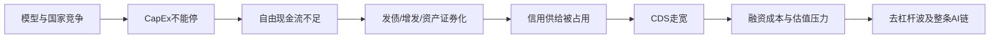

## 金老师（Herman Jin / ShanghaoJin）投资框架与观点演进

> **结论时点：2026-08-04。** 本文依据本地 X 归档中 `ShanghaoJin` 的主动帖与必要回复整理。文中的“金老师认为”指可由原帖直接支持的观点；“本文判断”是对多条原帖的综合推理，不等同于其原话。本文是人物观点研究，不构成投资建议。

## 一、核心结论

金老师的投资框架不是简单的“宏观择时 + AI 选股”，而是三层嵌套：

1. **宏观决定风险预算。** 政治、选举、财政、关税和战争不是独立新闻，而是影响增长、通胀、产业政策与尾部风险的顶层变量。只有当事件穿透到真实供给、财政支出或金融条件时，他才认为其足以主导市场。
2. **流动性决定资产能否被定价。** 2024 年的核心观测是联储净资产负债表、TGA、RRP、美元和长端利率；2026 年框架升级为信用供给与 CDS。前者解释“市场上有多少水”，后者回答“谁愿意承担 AI 军备竞赛的信用风险”。
3. **AI 决定中长期盈利分配。** 他长期坚信 token 需求指数增长、半导体供给线性增长，因而 AI 是工业革命级别的生产力重构。但截至 2026 年 8 月，他已从“需求真实即可持续看多”转向追问“模型收入能否覆盖 CapEx、融资由谁承接、信用利差是否失控、系统能否持续降低单位 token 成本”。

最重要的演进是：**他没有转为空 AI，而是把 AI 多头从产业逻辑升级为资产负债表逻辑。** 半导体盈利可以继续增长，但如果 hyperscaler 必须持续发债和兑现股权“财富”，估值、信用与市场流动性会先承压。这就是他所谓“低 PE 泡沫”：盈利未必错，价格和持仓结构仍可能出问题。[2026-06-02](https://x.com/ShanghaoJin/status/2061747648764530968) [2026-06-06](https://x.com/ShanghaoJin/status/2063174851251286517)

7 月下旬至 8 月初又增加了一层**单位经济性约束**：AI 扩张不仅需要有人支付 CapEx，还需要 GPU、CPU、光互连和存储共同推动 `$/token` 下降。存储若只靠缺货持续涨价，即使自身盈利改善，也可能压低整个系统的 CapEx 和估值；真正可持续的护城河来自生产力提升与 token 通缩。[2026-08-01](https://x.com/ShanghaoJin/status/2083493864653070613)

## 二、研究范围与证据质量

### 2.1 数据范围

- 本地索引：`knowledge/databases/x.sqlite`
- 原始归档：`sources/social/x/ShanghaoJin/`
- 当前规范化归档共 7,448 条记录，其中目标作者 3,833 条：原创 779 条、引用帖 1,266 条、回复 1,478 条、转发 310 条；目标作者可用时间范围为 2024-03-04 至 2026-08-04。
- 2024 年与 2026 年资料较密；**2025 年 1-8 月存在明显采集稀疏**，因此 DeepSeek 发布初期、2025 年 4 月关税冲击等阶段可能存在漏帖。
- 主动帖用于确定正式观点；回复只在解释立场变化、具体公司或上下文时使用。引用帖中的他人文字不作为金老师观点。

### 2.2 阅读方法

本文先对全库做主题与时间分布检查，再按宏观事件、流动性工具和 AI 产业链角色定向召回，并对关键原帖补读上下文。重点不是统计词频，而是识别：

- 同一观点何时首次出现、何时强化、何时被修正；
- 产业判断与交易判断是否相同；
- 观点变化由基本面、估值、资金结构还是新证据触发；
- 哪些结论有明确反证条件。

## 三、宏观：政治、选举、关税与地缘的统一框架

### 3.1 底层世界观：债务依赖与政策约束

金老师认为全球经济长期依赖债务扩张，各国央行都受制于债务、汇率和资产价格，只是约束程度不同。美国并非没有问题，但在主要经济体中仍是“不负责任中最负责任的”，所以其长期配置仍以美元资产为锚。[2024-03-29](https://x.com/ShanghaoJin/status/1773614813450584559)

他对中国的顶层判断更悲观：地产、地方债和城投形成持续抽水机制，政策在债务通缩与汇率调整之间两难；这也是他长期看空人民币、怀疑短期刺激反弹持续性的基础。[2024-03-13](https://x.com/ShanghaoJin/status/1767744544982860047) [2024-04-27](https://x.com/ShanghaoJin/status/1784193624173117479) 2024 年 9 月中国资产反弹时，他直接称其为“死猫跳”。[2024-09-19](https://x.com/ShanghaoJin/status/1836889147979747739)

**本文判断：** 他并非用单一经济数据预测市场，而是先判断政策制定者的约束集，再判断其可用工具与行动时点。政治激励因此是宏观模型的一部分，而不是噪声。

### 3.2 美国选举与特朗普：政策方向可预判，执行路径不可线性外推

2024 年 3 月他已预期特朗普回归，并在 4 月提醒准备应对对华 60% 关税。[2024-03-29](https://x.com/ShanghaoJin/status/1773843804761841672) [2024-04-27](https://x.com/ShanghaoJin/status/1784091810949980597) 选后，他把行情分为“Trump trade”与“policy trade”两段：胜选先提高风险偏好，随后市场才会计入关税、财政和国债供给等真实政策成本。[2024-11-12](https://x.com/ShanghaoJin/status/1856257355815760293)

到 2025 年 3 月，他判断 4 月 2 日关税方案只是“开端的结束，而非结束的开端”，即政策落地不会立刻消除不确定性。[2025-03-27](https://x.com/ShanghaoJin/status/1905073863077331374) 2026 年复盘时，他承认 2025 年 4 月因过度相信关税威胁而错过低位买入，形成了一个新的交易经验：特朗普惯于制造极端威胁后宣布胜利，**政治尾部风险必须防，但不能把口头极值直接当作最终政策路径。**[2026-03-10](https://x.com/ShanghaoJin/status/2031183090748633318)

他的政治立场与投资判断并不完全同向。他多次批评特朗普的关税、贪腐和政治表演，同时支持其对伊朗、委内瑞拉等强硬行动。这意味着不能把他的政治表达机械翻译为资产方向。[2026-01-10](https://x.com/ShanghaoJin/status/2009790474438189231) [2026-02-28](https://x.com/ShanghaoJin/status/2027888112710586852)

### 3.3 地缘风险：关键不在“打不打”，而在是否穿透供给和信用

2024 年 4 月伊朗袭击以色列时，他认为行动主要是表演性的：伊朗长期受制裁，对新增石油供给影响有限，也不敢真正封锁海峡；当时半导体下跌更应归因于利率，而非战争。[2024-04-13](https://x.com/ShanghaoJin/status/1779148266250412455) [2024-04-14](https://x.com/ShanghaoJin/status/1779382121360216209) [2024-04-19](https://x.com/ShanghaoJin/status/1781467652290200059)

2026 年 3 月的判断显著升级。他认为市场低估了波斯湾航运受扰、油价长期上升和冲突失控的尾部风险，公司业绩与 CTA 仓位不再是第一变量；他甚至暂停常规行业分析，因为“波斯湾走多少油轮”决定市场。[2026-03-20](https://x.com/ShanghaoJin/status/2034966246278742295) 他估算油价每持续上涨 10%，PCE 增约 0.2 个百分点、核心 PCE 增约 0.04 个百分点、GDP 降约 0.1 个百分点，并认为若油价维持 150 美元，股市可能显著下修。[2026-03-18](https://x.com/ShanghaoJin/status/2034087239492505832) [2026-03-18](https://x.com/ShanghaoJin/status/2034093224080687415)

这不是简单反转，而是**条件变化**：

- 2024：导弹互射但不改变海峡物流与供给，地缘只是叙事；
- 2026：航运、油价、通胀与 CDS 可能形成真实传导，地缘上升为宏观主变量；
- 即使如此，他仍认为当前油价冲击与 2021-2023 年不同：当时有财政刺激、劳动力短缺和工资压力作“干柴”，油价只是催化剂；2026 年缺少同等结构性通胀基础，更需担心后续需求下降。[2026-05-16](https://x.com/ShanghaoJin/status/2055495368213930489)

### 3.4 产业地缘：半导体主权高于静态效率

他从 2024 年起持续支持 Intel 的战略价值，理由不是其当期产品领先，而是 AI 已成为国家级牌局，美国不能让最先进制造只集中在台湾。[2024-03-24](https://x.com/ShanghaoJin/status/1771878236542357535) High-NA EUV 设备优先分配给 Intel、再挤给 TSMC，也被他视为美国政策扶持和产能主权的体现。[2024-06-05](https://x.com/ShanghaoJin/status/1798375315980632077)

**风险提示：** 他的地缘表达带有强烈价值判断，战争结果与政策路径预测并非其稳定优势。更有研究价值的是他对“事件是否进入供给、通胀、财政和信用渠道”的区分。

## 四、流动性：从 TGA/RRP 到 CDS 的框架演进

### 4.1 2024 年：总流动性比降息更重要

2024 年 4 月，他明确提出资产价格应看联储净资产负债表，而不是只看政策利率。其近似框架为：

$$
\text{市场净流动性} \approx \text{Fed Assets} - \text{TGA} - \text{RRP}
$$

TGA 上升代表财政部把商业银行资金收回联储，效果类似抽水；TGA 支出则向市场注水。RRP 上升把货币基金资金锁在联储，RRP 下降则释放资金。2023 年末至 2024 年初即使 QT 延续，RRP 大幅回流仍使净流动性扩张，解释了风险资产牛市。[2024-04-15](https://x.com/ShanghaoJin/status/1779828575052726779)

他同时强调两点：

- **TGA 是弹药，不是自动触发器。** 财政部出于选举激励可能释放 TGA，但通胀与政治观感决定时点；市场下跌后再使用，政策收益更大。[2024-04-26](https://x.com/ShanghaoJin/status/1783861929322385819) [2024-04-28](https://x.com/ShanghaoJin/status/1784628890209780139)
- **RRP 枯竭后，原有被动流动性顺风结束。** 若联储继续 QT、TGA 不释放，市场“没有钱，怎么涨上去怎么跌下来”。[2024-04-26](https://x.com/ShanghaoJin/status/1783861929322385819)

### 4.2 长端利率与美元：风险资产的价格约束

他认为降息不等于长端利率下降。财政赤字、长债供给和期限溢价可以让短端下降、长端仍高；2024 年后他反复把长期利率比作压在风险资产上的巨石。[2024-04-25](https://x.com/ShanghaoJin/status/1783488598312132683) [2024-11-14](https://x.com/ShanghaoJin/status/1856858032401256916)

最危险的组合是美元走强与熊陡：美元回流造成全球去杠杆，长端利率上升又压低估值，两者共同打击风险资产。[2024-04-11](https://x.com/ShanghaoJin/status/1778439017299874054) [2024-04-14](https://x.com/ShanghaoJin/status/1779438066798862733) 他曾判断 2024 年 7 月首降、全年三次，方向上抓到降息周期但时点错误，实际首次降息发生在 9 月；这也说明其框架更适合识别压力方向，未必适合精确押注会议时点。

2026 年 8 月 3 日，他把这一判断具体化为曲线交易：供应冲击无法靠连续加息解决，前端已经过度定价加息和经济过热；与此同时长端受供给增加与反 QE 政策约束，向上动量更强，因此他称 steepener 是当时最清晰的交易。[供应冲击](https://x.com/ShanghaoJin/status/2084305905747968346) [长端供给](https://x.com/ShanghaoJin/status/2084317983183339917) [曲线判断](https://x.com/ShanghaoJin/status/2084318138150359382)

**本文判断：** 这延续了“降息不等于长端下降”，但把宏观表达从单边看空久期推进为相对价值：短端过度计价紧缩、长端仍受财政与供给约束，曲线陡峭化比押注连续加息更符合其框架。

### 4.3 CDS 其实一直在框架里，只是 2026 年成为主角

早在 2024 年 4 月，他就把 CDS 与净流动性并列：当时 CDS 未上升，信用违约指数低，股市通常滞后，因此环境“更像 2007 而不是 2009”。[2024-04-05](https://x.com/ShanghaoJin/status/1776264480818880603) 这说明其近期强调 CDS 并非临时发明，而是信用指标从背景变量变成了约束变量。

2026 年的变化来自 AI 资本开支规模：hyperscaler 的市值是“财富”，但购买芯片、建设数据中心需要现金。若模型收入暂时追不上 CapEx，企业只有两条路：削减投入并在 AI 竞赛中落后，或继续融资。金老师认为竞争迫使它们选择后者，因此会出现：

他把这一逻辑概括为“财富不等于钱”：半导体订单和盈利可以继续几何增长，但 CapEx 承担者必须兑现股权财富、消耗信用，因而 hyperscaler 估值承压、CDS 拉开。[2026-06-06](https://x.com/ShanghaoJin/status/2063174851251286517) [2026-06-10](https://x.com/ShanghaoJin/status/2064848017853944033)

### 4.4 为什么近期 CDS 走宽特别重要

截至 2026 年 7 月，他认为大厂 CDS 的整体走宽才是“冰雨落地”，战争、导弹和联储口头恐吓反而只是表层扰动。[2026-07-13](https://x.com/ShanghaoJin/status/2076474457196261806) 他的核心担忧有四层：

1. **融资需求规模过大。** AI 军备竞赛需要万亿美元级现金，而不是市值。
2. **信用风险承受方不足。** 银行体系的风险承接能力受监管和内部机制约束，简单放松监管也未必创造足够信用供给。[2026-07-16](https://x.com/ShanghaoJin/status/2077595151715991574)
3. **单一大厂信用事件可系统传染。** 他称若任一大厂 CDS 上到 300-500bp，AI 链“统统死，没有幸免”，说明他把 CDS 当作系统风险阈值而非单票信号。[2026-07-14](https://x.com/ShanghaoJin/status/2076910559451308526)
4. **盈利好不能抵消资金供需。** 市场可以同时上修半导体盈利、下修其估值；信用紧缩时，持仓去杠杆会无差别卖出。

他已用 AMZN CDS 对冲股票敞口，并由此改变 ORCL 观点。[2026-07-08](https://x.com/ShanghaoJin/status/2074674839768781125) 这不是认定 Amazon 会违约，而是用信用保护表达“融资风险被低估”。

### 4.5 流动性框架的历史演进

| 阶段 | 核心变量 | 主要问题 | 投资含义 |
| --- | --- | --- | --- |
| 2024 H1 | Fed 资产、TGA、RRP | 市场还有没有基础货币顺风 | RRP 回流支持牛市，枯竭后防调整 |
| 2024 H2-2025 | 美元、长端利率、财政供给 | 降息能否真正降低资产折现率 | 不把降息机械等同于风险资产上涨 |
| 2025 H2 | AI CapEx 与模型收入 | 军备竞赛是否会停 | Scaling Law 未失效前投入停不下来 |
| 2026 H1 | 融资、信用供给、CDS | 谁把“财富”变成建设现金 | 规避需要持续融资的 CapEx 承担者 |
| 2026-07 | 大厂 CDS 与去杠杆 | 信用压力是否系统化 | 保留盈利多头，但必须降杠杆和对冲 |
| 2026-08 | 前端定价、长端供给、曲线斜率 | 供应冲击是否会被误判为持续加息 | 更偏好 steepener，而非单押前端继续收紧 |

## 五、AI 总框架：从技术革命到信用约束

### 5.1 不变的长期信念

金老师认为 AI 与互联网的本质区别是，AI 第一次把半导体性能直接变成可售卖的生产力 token：

$$
\text{互联网：半导体} \rightarrow \text{设备} \rightarrow \text{软件} \rightarrow \text{生产力}
$$

$$
\text{AI：半导体} \rightarrow \text{模型 token} \approx \text{生产力}
$$

需求侧 token 指数增长，供给侧晶圆、封装、光、电等只能线性扩张，于是全产业链会轮流出现瓶颈。[2026-05-05](https://x.com/ShanghaoJin/status/2051670358902841711) 他将 AI CapEx 类比铁路建设：历史上的铁路投资可持续 10-15 年、占 GDP 4%-6%，只要生产率和 ROE 最终提高，不能因中间存在泡沫就否定基础设施周期。[2025-12-20](https://x.com/ShanghaoJin/status/2002170468103827757)

截至 8 月初，这个长期信念新增一个必要条件：**规模扩张必须伴随单位 token 成本下降。** GPU、CPU 和光互连通过代际迭代降低成本，才使更多模型、Agent 和企业工作负载可被经济地部署；任何关键环节若长期只提价而不增加单位生产力，都会削弱 Scaling Law 的商业可持续性。[2026-08-01](https://x.com/ShanghaoJin/status/2083493864653070613) [2026-08-03](https://x.com/ShanghaoJin/status/2084290226982449163)

### 5.2 发生变化的约束

- **2024：** 主要看 GPU 需求、供应链和市场流动性；技术需求是否真实是核心争论。
- **2025：** Scaling Law、token 需求和缺货成为主线；他认为模型竞赛类似美苏争霸，任何阵营都不能停止投入。[2025-11-20](https://x.com/ShanghaoJin/status/1991357042121142446)
- **2026 Q1：** 仍把供算力半导体视为调整后的首选，要求未来收入增速超过 CapEx 增速。[2026-03-10](https://x.com/ShanghaoJin/status/2031203046227849434)
- **2026 Q2：** 明确提出“低 PE 泡沫”和成本墙。模型效果提升呈对数收益，线性能力提升需要指数级投入；模型收入短期可能无法覆盖 CapEx，简单模型与开源模型会侵蚀前沿模型收入预期。[2026-06-11](https://x.com/ShanghaoJin/status/2064903527445791155)
- **2026 Q3：** CDS 走宽成为 AI 链总风险指标；7 月动量去杠杆说明产业长期正确不等于所有环节股价都安全。8 月又增加 `$/token` 约束：上游缺货只有在继续提升单位生产力时才构成可持续护城河，单纯涨价可能反噬总 CapEx。

## 六、AI 产业链角色观点

### 6.1 大模型公司：能力、成本、入口与工程化缺一不可

#### OpenAI

2024 年 3 月，他认为 OpenAI 已团灭大量小型 AI 项目，模块化或链上 AI 缺乏价值。[2024-03-11](https://x.com/ShanghaoJin/status/1767078930249294297) 2025 年仍是 OpenAI 多头，认为融资与循环交易担忧类似 DeepSeek 冲击 NVDA 的 FUD；OpenAI 拥有用户入口，最差也可能被大厂收购。[2025-11-06](https://x.com/ShanghaoJin/status/1986550491871170782) [2025-12-18](https://x.com/ShanghaoJin/status/2001526264948216212)

但他的多头逻辑不是“OpenAI 必然垄断”。早在 2024 年 11 月，他就认为除 OpenAI 略领先外，头部模型差距不大，Google 有设备和流量入口；到 2025 年末，他明确把 Google 与 OpenAI 比作长期美苏竞争，不会迅速分胜负。[2024-11-11](https://x.com/ShanghaoJin/status/1855819700225364352) [2025-11-24](https://x.com/ShanghaoJin/status/1993089466106626150)

#### Anthropic

2026 年 6 月，他一方面肯定 Claude 在大型 coding 任务上的工程效果，认为模型工程化会成为优质软件的核心；另一方面质疑高成本模型通过快速烧 token 制造 ARR、以及模型效果和成本的可持续性。[2026-06-11](https://x.com/ShanghaoJin/status/2065214738779541791) [2026-06-16](https://x.com/ShanghaoJin/status/2066850137071337649) 因此 Anthropic 在他框架中同时是：

- 前沿模型与 coding 工程化的正面样本；
- “模型收入能否 justify CapEx”的压力测试；
- 可能压制 OpenAI 相关 backlog 与 ORCL 估值的竞争变量。[2026-06-23](https://x.com/ShanghaoJin/status/2069560595796705577)

7 月下旬，他进一步判断开源模型部署会使 Anthropic 与 OpenAI 的 ARR 增速下降，但这不等于 token 总需求消失；收入可能迁移到部署开源模型的云厂。[2026-07-26](https://x.com/ShanghaoJin/status/2081250197292920994) 8 月 2 日，他在回复中称 OAI 与 Anthropic 都在明显降速，并强调消费端 vibe coding 花费有限，真正的大额支付仍来自企业。[模型收入回复](https://x.com/ShanghaoJin/status/2083768522904318179) [企业付费回复](https://x.com/ShanghaoJin/status/2083773840661107040)

**证据边界：** 上述“明显降速”来自短回复和其行业信息，本文未取得两家公司披露独立验证。研究价值在于它明确了其需求函数：模型公司份额可以变化，但企业是否愿意持续为生产力 token 付费才是 CapEx 的最终验证。

#### Google / Gemini

他长期持有 Google，核心理由从流量入口逐渐扩展到模型成本、TPU 和全栈能力。2025 年 10 月已强调 Google 模型成本优势；Gemini 进步证明 Scaling Law 未失效，并迫使竞争对手继续抢 NVDA 产能。[2025-10-29](https://x.com/ShanghaoJin/status/1983628285893603628) [2025-11-25](https://x.com/ShanghaoJin/status/1993288166422593904)

但 Google 的优势不等于 TPU 通吃。他认为 TPU 的经济性依赖 Google 获得 TSMC 线程和内部规模，外部竞争者无法轻易复制，且使用竞争对手的闭环方案存在战略风险。[2025-11-28](https://x.com/ShanghaoJin/status/1994541487741440143)

#### DeepSeek、GLM 与中国模型

2025 年 9 月，他认为 DeepSeek 只是优秀地逆向 OpenAI，尚未找到训练路径；国产训练芯片、先进晶圆与 TSMC 差距巨大。[2025-09-07](https://x.com/ShanghaoJin/status/1964530605112381778) [2025-09-17](https://x.com/ShanghaoJin/status/1968278175538123060)

2026 年 6 月出现实质修正：他承认模型商品化后，中国模型可凭工程与口碑追赶；GLM/DeepSeek 在本地 coding 场景可以用较低成本提供接近 Claude 的效果，构成前沿闭源模型收入的真实挑战。[2026-06-19](https://x.com/ShanghaoJin/status/2068016118279929912) [2026-06-23](https://x.com/ShanghaoJin/status/2069474609632854377) 7 月，他反对中国限制模型海外使用，认为开源社区贡献正是 GLM/DeepSeek 挑战 Claude/GPT 的基础。[2026-07-07](https://x.com/ShanghaoJin/status/2074531476448882900)

**演进结论：** 他没有改判中国先进训练算力短板，但从“训练能力落后，所以模型威胁有限”修正为“开源 + 本地部署 + 工程化可在应用端形成成本替代”。

### 6.2 Hyperscaler 与 NeoCloud：战略上必须投，股票上未必值得买

2025 年末他认为只要 Scaling Law 未失效，Google、Microsoft、Meta、Amazon 等就不可能停止 CapEx；竞争已经是公司与国家层面的军备竞赛。[2025-11-20](https://x.com/ShanghaoJin/status/1991357042121142446) 2026 年 1 月，面对 Meta 提高 CapEx，他判断其他大厂也必须 all in，否则会永久落后。[2026-01-29](https://x.com/ShanghaoJin/status/2016852618036052057)

但 2026 年 6 月后，他把“必须投”与“值得持有”分开：

- hyperscaler 必须承担重资产建设、融资和模型 ROI 不确定性；
- 半导体供应商收到的是现金，CapEx 承担者付出的是现金与信用；
- 因此产业投入利好卖铲人，却可能压制云厂估值和 CDS。

ORCL 是最清楚的观点转变。2025 年末至 2026 年 5 月，他看好 OpenAI 映射、订单与 CapEx，认为 ORCL/CRWV 可能从被质疑转向稀缺。[2025-11-16](https://x.com/ShanghaoJin/status/1989863803807568095) [2026-05-07](https://x.com/ShanghaoJin/status/2052444997979607288) 到 6 月 10 日，他明确认错离场：ORCL 需要不断融资，投入现金与收到现金的比例不如高毛利半导体，已不是 AI 最好的“雪道”；同理规避 NeoCloud。[2026-06-10](https://x.com/ShanghaoJin/status/2064845453334806643) [2026-06-11](https://x.com/ShanghaoJin/status/2064884668374372533)

### 6.3 GPU、CPU、ASIC 与系统芯片

#### NVIDIA

NVIDIA 是其长期确定性最高的底层标的之一。2024 年 8 月 Blackwell 延期时，他判断主要是封装问题和一至两个季度延迟，不改变周期，并在去杠杆中主张抄底。[2024-08-03](https://x.com/ShanghaoJin/status/1819873615887864013) [2024-08-12](https://x.com/ShanghaoJin/status/1823135059794350100) 其护城河不只在 GPU，而在 CUDA、系统集成、产品迭代和 TSMC 线程分配。[2024-09-12](https://x.com/ShanghaoJin/status/1834056227640562106)

2025 年末他认为 Gemini 越强，其他模型公司越需要 NVDA：竞争者无法及时获得 TPU/ASIC，只能抢 B300；ASIC 总量增长不必然侵蚀 NVIDIA 需求。[2025-11-25](https://x.com/ShanghaoJin/status/1993288166422593904) [2025-11-28](https://x.com/ShanghaoJin/status/1994556277004046697)

#### AMD

AMD 在其 2026 年组合中是重要的预期差标的。他的逻辑不是 AMD 已全面追上 NVIDIA，而是 AI 总需求足够大、替代供给稀缺，且估值与市场预期较低。到 2026 年 7 月去杠杆期，他仍称 AMD 为最大仓位之一。[2026-07-04](https://x.com/ShanghaoJin/status/2073293820889071994)

#### ASIC、TPU、AVGO、MRVL

他承认定制 ASIC 与 TPU 的成本/性能价值，但认为其需求高度绑定大客户、TSMC 线程和总包商议价。AVGO 受益 Google TPU，却面临 TPU 自研和 MTK 等竞争，总包商利润率未必随系统规模同步扩张；真正不可替代的关键供货商可能风险收益更好。[2026-06-04](https://x.com/ShanghaoJin/status/2062385852618313788)

MRVL 一度被视为非 Google 阵营复刻 TPU、对接 OpenAI 的关键资产，但 2026 年 6 月他认为市场尚未把产能约束算清，激进定价不宜追；7 月去杠杆中跌幅也验证了高预期风险。[2025-12-03](https://x.com/ShanghaoJin/status/1996008318121431441) [2026-06-04](https://x.com/ShanghaoJin/status/2062347433351512192)

#### Intel 与 CPU

Intel 同时承载三种逻辑：美国半导体主权、晶圆厂估值修复、CPU 缺货。2025 年末他认为短期周期看 CPU 涨价和 fab 估值，真正技术翻身要等 2027 年 14A；先进封装可服务 TPU/ASIC，但尚不能证明可生产 NVIDIA 级 GPU。[2025-12-10](https://x.com/ShanghaoJin/status/1998590912428126721) 这是一种“资产与周期先修复、技术兑现后验证”的分层看多，而非无条件相信叙事。

### 6.4 晶圆厂：2026 年最鲜明的新增主线

到 2026 年 6 月，他认为半导体大周期的核心从“签了谁的订单”转为“有没有现成产能”。闲置线程可从汽车、消费电子切向 CSP，产品单价与毛利提升，推动晶圆厂全面重估。[2026-06-03](https://x.com/ShanghaoJin/status/2062164994570248404) [2026-06-17](https://x.com/ShanghaoJin/status/2067282347368808616)

层次如下：

- **TSMC：** 全产业链的线程分配中枢，GPU、ASIC、TPU 的真实上限取决于其先进制程与封装资源。[2025-11-28](https://x.com/ShanghaoJin/status/1994541487741440143)
- **Intel：** 低估的 fab 资产 + CPU 周期 + 美国政策期权，但先进制程兑现较晚。
- **GFS、ON、TXN、Infineon：** 传统产能因全链缺货、800V 和 CSP 需求重新变得稀缺。[2026-06-03](https://x.com/ShanghaoJin/status/2062164994570248404)
- **XFAB：** 他看好的不是尚小的 CPO 概念，而是传统 CMOS 产能从低利润汽车切向 800V/CSP，且估值约 1.5 倍 PB。[2026-06-07](https://x.com/ShanghaoJin/status/2063553468154167619)
- **InP fab：** 光互连最难快速扩张的隐性瓶颈，已有 PDK、良率经验和产能的厂商价值远高于纸面扩产计划。[2026-05-29](https://x.com/ShanghaoJin/status/2060196766134534473)

### 6.5 半导体设备：需求确定，但兑现速度慢于存量产能

他认为 ASML、LRCX、AMAT 的扩产需求已被拉满。2026 年 4 月观察到 DUV 需求爆表，中国存储厂加价争取设备；这说明缺货正在向上游设备扩散。[2026-04-02](https://x.com/ShanghaoJin/status/2039733059596280130)

但设备不是其最偏好的短期环节：新设备下单、交付、安装和爬坡需要时间，最快形成业绩的是拥有现成 fab、可直接切线程的公司。[2026-06-18](https://x.com/ShanghaoJin/status/2067421818466795848) 因而设备是长期扩产受益者，fab 是近期供给稀缺受益者。

### 6.6 先进封装、HBM 与存储

先进封装是 GPU 供给的重要瓶颈。他曾估算 NVIDIA 卡与 TSMC AP 产能限制到 2026 年末仍会造成显著缺口，电力约束则可能更晚出现。[2025-12-18](https://x.com/ShanghaoJin/status/2001800200772554858)

对存储，他始终区分**盈利看多**与**估值看空**：

- 2025 年末认可缺货、涨价和盈利改善，但认为交易拥挤、已超买；[2025-11-22](https://x.com/ShanghaoJin/status/1992066604205797709)
- 2026 年初认为存储与光模块按 2028 年盈利估值，需经历 70% 级别调整才能恢复健康；[2026-02-04](https://x.com/ShanghaoJin/status/2018971110524809223)
- 2026 年 7 月强调存储仍是商品，盈利增长来自涨价，却又用成长股 PE 证明盈利稳定，在逻辑上自相矛盾。[2026-07-10](https://x.com/ShanghaoJin/status/2075624737036988672)

因此“bullish earnings, bearish valuation”是理解其存储观点的钥匙。短期反弹可买最敏感的存储，但不能把交易等同于长期估值认可。[2026-07-15](https://x.com/ShanghaoJin/status/2077522300094882237)

8 月初，他进一步把存储从“估值过高的商品”定义为 AI 系统中的成本约束：存储是少数可能抬高 `$/token` 的环节，若其 CapEx 份额继续上升，GPU 与光互连带来的 token 通缩会被抵消。[2026-08-01](https://x.com/ShanghaoJin/status/2083493864653070613) 他还称 NVIDIA 再次削减 HBM 配置，判断内存进一步涨价最终会迫使客户降低 CapEx。[2026-08-02](https://x.com/ShanghaoJin/status/2083743608843522087)

这使其存储观点从“盈利多、估值空”升级为“**单环节盈利可能与全系统健康冲突**”。该 HBM 信息尚未由本文用公司公告核验，但其框架含义明确：存储盈利不能脱离客户总预算和单位 token 成本单独外推。

### 6.7 光互连、CPO 与网络

他对光互连长期看多，因为算力从单卡扩到机架、再扩到万卡集群后，瓶颈依次转向 NVLink、热管理、光通信、变电和交换机 Fabric。[2026-05-23](https://x.com/ShanghaoJin/status/2058131730629099712)

但其选股标准非常强调产能和唯一性：

- 2024 年已警惕缺乏唯一性、可被云厂转单的 AEC 小公司，不愿用主仓赌订单小作文；[2024-12-04](https://x.com/ShanghaoJin/status/1864255386083316023)
- 2025 年末认为光模块明确缺货、盈利上升，但中国买方研究拥挤、估值已反映，GPU/CPU 预期差更好；[2025-12-23](https://x.com/ShanghaoJin/status/2003451046426034424) [2025-12-31](https://x.com/ShanghaoJin/status/2006185815010152549)
- 2026 年调整后，认为若腰斩，光模块优先于存储；[2026-03-03](https://x.com/ShanghaoJin/status/2028853678720131078)
- 2026 年 5-6 月进一步转向全栈光产业链和 InP 产能，关注 NOK、LITE、COHR、GLW、MRVL，并认为 NOK 收购 Infinera 的 InP fab 本身就可能值回成本。[2026-05-24](https://x.com/ShanghaoJin/status/2058587134928490841) [2026-06-08](https://x.com/ShanghaoJin/status/2063875169060639215)

CPO 在他看来是长期方向，但不能把所有传统 fab 或光公司都粗暴贴上 CPO 标签；必须看业务占比、量产路径、PDK、良率和真实产能。

### 6.8 电力、配电、功率半导体与 800V

2025 年末他反对“马上缺电”的笼统叙事，认为近期真正瓶颈仍是 GPU 与先进封装，电力问题更可能在 2028 年后显现。[2025-11-06](https://x.com/ShanghaoJin/status/1986569724248142037) [2025-12-18](https://x.com/ShanghaoJin/status/2001800200772554858)

到 2026 年 6 月，随着 CSP 向 800V 架构迭代，他开始强调功率半导体会复制此前 CPU 的缺货，传统 CMOS、功率器件和配电资产成为下一层瓶颈。[2026-06-06](https://x.com/ShanghaoJin/status/2063170277765423261) 这并非推翻“不立即缺电”，而是把电力链拆成：发电总量、数据中心接入、变电配电、800V 功率器件等不同节奏。

### 6.9 软件、Agent 与应用

他的早期判断偏向“AI 吃软件”：程序员、PPT、设计、营销等轻资产工作会被模型压缩，传统按席位收费的软件价值下降。[2025-10-24](https://x.com/ShanghaoJin/status/1981748131579724030) [2026-05-08](https://x.com/ShanghaoJin/status/2052711156406755774)

但 2026 年 5-6 月出现第二次重要修正：

- AI 会取代一部分软件，也会增强另一部分软件，不能无脑 `short IGV / long semi`；[2026-05-17](https://x.com/ShanghaoJin/status/2055808277142028342)
- 泛化 Agent 创业缺乏壁垒，VC 追逐非头部 Agent/软件可能损失惨重；[2026-05-05](https://x.com/ShanghaoJin/status/2051678799776092548)
- 真正有价值的软件不是简单卖席位，而是把模型、工程和算力封装进垂直工作流，让高价值用户持续烧 token、完成复杂任务。[2026-06-16](https://x.com/ShanghaoJin/status/2066850137071337649)

因此他的最新软件框架是：**模型会商品化，工程化与工作流才形成应用壁垒；软件价值从席位数转向可验证的生产力与 token 消耗。**

## 七、产业链偏好矩阵（截至 2026-08-04）

| 角色 | 产业判断 | 估值/资金判断 | 代表关注 | 主要反证 |
| --- | --- | --- | --- | --- |
| 前沿模型 | 长期需求强，头部竞争持续 | 收入短期难追 CapEx，成本墙出现 | OAI、Anthropic、Gemini | 模型效果失智、ARR 降速、开源替代 |
| 中国开源模型 | 训练端仍受算力限制，应用端明显进步 | 低成本本地部署冲击闭源收入 | DeepSeek、GLM、BABA | 限制开源、工程生态停滞 |
| Hyperscaler | 战略上不能停投 | 融资、估值和 CDS 承压 | GOOG、MSFT、META、AMZN | 模型收入加速覆盖 CapEx |
| NeoCloud/CapEx 承担者 | 订单与需求真实 | 最需持续融资，风险收益较差 | ORCL、CRWV | 低成本长期资金锁定、现金回收改善 |
| GPU | 最通用且生态最强 | NV 预期差曾优于配件；仍受系统去杠杆 | NVDA、AMD | 模型 ROI 破坏总 CapEx |
| ASIC/总包商 | 有成本优势，规模增长 | 客户集中、线程和议价制约利润 | AVGO、MRVL | 外部 ASIC 快速开放并提高毛利 |
| 晶圆厂 | 现成产能最稀缺，可切线程提毛利 | 偏好低 PB 与产能重估 | TSMC、INTC、GFS、XFAB | 扩产快于需求、爬坡失败 |
| 半导体设备 | 长期订单饱满 | 业绩兑现慢于存量 fab | ASML、LRCX、AMAT | CapEx 延后、出口限制 |
| 先进封装 | 近期硬瓶颈 | 受益确定但需看估值 | TSMC AP 等 | 产能快速释放 |
| 存储/HBM | 缺货与盈利强，但涨价抬高 `$/token` | 商品周期却被成长估值，谨慎 | MU、WDC、SNDK、韩系 | 份额上升仍不压 CapEx，迭代重新带来 token 通缩 |
| 光互连/InP | 万卡集群必需，长期看多 | 2025 末拥挤，调整后再看产能 | NOK、LITE、COHR、GLW | CPO 延后、产能超预期 |
| 功率/800V | 2026 新瓶颈 | 传统 fab 有重估空间 | XFAB、ON、IFNNY、TXN | 架构迁移慢、汽车需求拖累 |
| 垂直 AI 软件 | 工程化可创造真实壁垒 | 泛 Agent 与席位软件分化 | coding/垂直工作流 | 模型厂直接吞并应用层 |

## 八、投资落地：长期赛道与公司优先级

金老师没有给出一只可以脱离价格、估值和信用环境永久持有的“唯一最佳股票”。要把其观点转化为投资结论，必须区分三个层次：**长期产业确信度、长期持有属性和当前风险收益比**。三者对应的答案并不相同。

### 8.1 最值得长期相信的产业方向

第一主线是 **AI 算力与半导体生产力革命**。其核心并非押注某一家模型公司胜出，而是 token 需求指数增长、晶圆和封装等物理供给线性增长。模型阵营可以更替，算力、晶圆、先进封装、光互连和供电的总需求仍会扩张。因此，他更偏好能够直接收到 CapEx 现金、拥有稀缺产能并持续降低单位 token 成本的供应商，而不是必须持续融资建设数据中心的出资者。[2026-05-05](https://x.com/ShanghaoJin/status/2051670358902841711) [2026-06-06](https://x.com/ShanghaoJin/status/2063174851251286517)

按产业确信度与供给稀缺性，可归纳为：

1. **GPU 与算力半导体：** 最核心、最通用的长期主线，代表为 NVIDIA、AMD。
2. **拥有现成产能的晶圆厂：** 2026 年最鲜明的新增主线，代表为 TSMC、Intel、GFS、XFAB；相比新建设备，存量 fab 可更快切换线程并兑现利润。[2026-06-17](https://x.com/ShanghaoJin/status/2067282347368808616)
3. **先进封装：** GPU 和系统供给的近期硬瓶颈，TSMC 的先进封装资源具有产业中枢地位。
4. **光互连与 InP fab：** 万卡集群扩张后的长期瓶颈，重点看 NOK、LITE、COHR、GLW 等有真实产品和产能的公司。[2026-05-29](https://x.com/ShanghaoJin/status/2060196766134534473)
5. **功率半导体与 800V：** 2026 年开始显性化的新瓶颈，传统 CMOS 和功率 fab 可从汽车切向高毛利 CSP 应用。
6. **半导体设备：** ASML、LRCX、AMAT 长期受益扩产，但订单到业绩的兑现速度慢于拥有现成产能的 fab。[2026-06-18](https://x.com/ShanghaoJin/status/2067421818466795848)
7. **垂直 AI 软件：** 只看好能把模型、工程和行业工作流结合、让客户持续创造生产力并消耗 token 的产品，不看好缺乏壁垒的泛 Agent 或传统席位软件。

### 8.2 公司层面的不同答案

#### 最符合长期持有定义：Google

若必须选一家最像长期不动仓位的公司，答案更接近 Google。他曾表示持有 Google 十多年、一股未卖。其长期逻辑包括搜索与广告现金流、设备和用户入口、Gemini、TPU 成本优势、云业务以及全栈分发能力。[2025-11-16](https://x.com/ShanghaoJin/status/1989898654292050416) Google 的特殊性在于既是 AI 竞争者和 CapEx 承担者，又拥有足够强的存量现金流、模型和入口，不能与纯融资型算力公司等同。

#### AI 底层确定性最高：NVIDIA

如果问题是 AI 链哪家公司长期确定性最高，答案更接近 NVIDIA。其护城河不是单颗 GPU，而是 CUDA、通用性、机架和系统集成、产品迭代，以及 TSMC 制程和封装资源。即使 Gemini 领先，其他模型公司也更需要抢 NVIDIA 供给；ASIC 总量增长不必然削弱 NVIDIA 需求。[2024-09-12](https://x.com/ShanghaoJin/status/1834056227640562106) [2025-11-28](https://x.com/ShanghaoJin/status/1994556277004046697)

#### 当前重要预期差：AMD

AMD 更接近特定价格与预期下的重点配置，而不是竞争壁垒强于 NVIDIA。其逻辑是 AI 总需求足以容纳第二供应商，替代供给稀缺，且市场预期和估值相对较低。到 2026 年 7 月去杠杆期间，他仍称 AMD 为最大仓位之一。[2026-07-04](https://x.com/ShanghaoJin/status/2073293820889071994)

#### 高赔率政策与资产期权：Intel

Intel 同时包含美国半导体主权、CPU 缺货、fab 估值修复、先进封装和 14A 技术兑现等多重期权。其潜在赔率较高，但执行、良率和先进制程验证风险明显高于 Google、NVIDIA，因此属于“资产与周期先修复、技术后验证”，不是无条件长期复利标的。[2025-12-10](https://x.com/ShanghaoJin/status/1998590912428126721)

#### 长期瓶颈方向：NOK、LITE、COHR

光互连中，他最重视已有 InP fab、PDK、良率经验和可扩产能力的公司。NOK、LITE、COHR 比只有纸面扩产计划的二三线公司更符合其“真实产能”标准；其中 Nokia 收购 Infinera 后获得的 InP fab 被他认为具有很高独立价值。[2026-05-24](https://x.com/ShanghaoJin/status/2058587134928490841)

#### 低估产能重估：XFAB 等传统 fab

XFAB 代表其 2026 年新增的“低估实体产能”偏好。他看好的核心不是尚小的 CPO 业务，而是传统 CMOS 产能可从低利润汽车切向 800V/CSP，叠加低 PB 和加工价格上升。[2026-06-07](https://x.com/ShanghaoJin/status/2063553468154167619) 这类公司潜在弹性高，但公司执行、客户切换和产能爬坡仍需验证。

### 8.3 不宜当作长期核心仓位的方向

- **ORCL、NeoCloud 和重融资数据中心：** 产业需求可能真实，但持续 CapEx 需要发债、增发或资产证券化。金老师已明确修正 ORCL 观点，认为投入现金与收到现金的比例不如高毛利半导体，并回避需要不断“兑现财富”的公司。[2026-06-10](https://x.com/ShanghaoJin/status/2064845453334806643)
- **存储：** 可以看多缺货、涨价和盈利，但商品周期不应机械享受成长股估值；持续提价还会抬高 `$/token`、挤压客户 CapEx。他的态度是 `bullish earnings, bearish valuation`，更适合作为周期或反弹交易，而非无条件长期复利。[2026-07-10](https://x.com/ShanghaoJin/status/2075624737036988672) [2026-08-01](https://x.com/ShanghaoJin/status/2083493864653070613)
- **估值充分的光模块和配件股：** 长期方向正确不等于任何价格都值得买。2025 年末他认为光模块预期已满；只有充分调整后，风险收益比才可能重新优于存储。[2025-12-31](https://x.com/ShanghaoJin/status/2006185815010152549) [2026-03-03](https://x.com/ShanghaoJin/status/2028853678720131078)
- **泛 AI Agent 与传统席位软件：** 缺乏工作流、数据和工程壁垒的应用容易被模型厂、平台或开源模型吞并。

### 8.4 综合优先级

| 维度 | 优先方向或公司 | 准确含义 |
| --- | --- | --- |
| 长期产业主线 | AI 算力与半导体生产力革命 | 最高层级的长期确信，不等于所有 AI 股票都值得买 |
| 最像永久持仓 | Google | 入口、模型、TPU、云与现金流的全栈组合 |
| AI 底层确定性 | NVIDIA | 通用算力、CUDA、系统能力和供应链资源 |
| 当前重要预期差 | AMD | 需求外溢、第二供给和相对估值，不代表护城河最强 |
| 2026 新增主线 | 现成 fab 产能 | TSMC、Intel、GFS、XFAB 等产能重估 |
| 长期物理瓶颈 | 光互连与 InP | NOK、LITE、COHR 等真实产能持有者 |
| 高赔率政策期权 | Intel | 美国制造主权、CPU 周期和先进制程期权 |
| 长期扩产受益 | ASML、LRCX、AMAT | 需求确定，但兑现慢于存量 fab |
| 周期交易 | 存储 | 盈利多头、估值谨慎 |
| 当前回避 | ORCL、NeoCloud | 融资和 CDS 风险高于卖铲人 |

最简洁的投资归纳是：**长期买 AI，但产业链上优先选择有稀缺物理产能、能够收到现金、无需依赖外部信用持续扩张的公司；公司层面 Google 最像长期持仓，NVIDIA 最像底层确定性，AMD 最像当前预期差。**

## 九、观点演进总时间线

### 2024：流动性择时，AI 从 GPU 扩到系统

- 3-4 月：债务依赖、竞争性放水；用 TGA/RRP 解释风险资产牛市。
- 4 月：长端利率与美元上升触发风险不对称，清减 BTC；伊以冲突仍是表演性噪声。
- 6-9 月：关注 High-NA EUV、TSMC 线程、Blackwell 封装与 NVIDIA 系统壁垒。
- 9 月：提出 AI 价值层级“软件 > 芯片 > 电力”，但瓶颈越底层越难突破。[2024-09-15](https://x.com/ShanghaoJin/status/1835229014585446784)
- 11-12 月：预期 2025 主线从半导体向软件扩散，同时强调 Trump 政策与长期利率压力；对小型光互连供应商保持谨慎。

### 2025：token 需求与全链缺货

- 1-8 月：归档稀疏，结论置信度较低。
- 9 月：质疑 DeepSeek 训练能力与国产先进算力。
- 10-11 月：Google 模型成本优势、OpenAI 入口、Scaling Law 与 CapEx 不能停成为主线。
- 11-12 月：从 GPU 延伸到 CPU、存储、先进封装、ASIC；认为“所有半导体都会轮到”，但存储和光模块已拥挤。
- 年末：预计 2026 Q1 后可能进入“末日泡沫”，产业需求与市场泡沫可同时成立。[2025-11-15](https://x.com/ShanghaoJin/status/1989580856672096504)

### 2026 Q1：战争风险与抄底框架

- 伊朗冲突穿透油运和通胀，宏观风险从叙事升级为真实供给冲击。
- AI 调整时优先买供算力半导体，要求收入增速最终超过 CapEx；光模块若腰斩优先级较高。

### 2026 Q2-Q3：低 PE 泡沫与 CDS

- 5 月：从“轻资产软件”转向“token 工厂”，新增 fab、800V、InP 产能主线。
- 6 月初：承认市场普涨收益包含资金结构红利，提出低 PE 泡沫。
- 6 月中：模型成本墙、开源替代和收入/CapEx 缺口进入框架；卖出 ORCL，回避融资型 CapEx 承担者。
- 6 月末：认可中国模型在工程化与本地 coding 的成本挑战。
- 7 月：大厂 CDS 整体走宽，AI 链去杠杆；坚持长期 AI 和部分半导体仓位，但强调不加杠杆、用信用对冲。
- 7 月下旬：将模型公司 ARR 与 token 总需求分开，认为开源模型可能把收入迁移到云厂，但资本市场要看到 FCF 才会认可。
- 8 月初：把 token 通缩纳入产业护城河，认为存储涨价可能反噬 AI CapEx；宏观上偏好曲线陡峭化而非追逐已充分定价的加息。

## 十、稳定能力、判断失误与内在矛盾

### 10.1 较稳定的能力

- **能区分产业基本面与市场定价。** 存储“盈利多、估值空”、ORCL“业绩可好、雪道不佳”是典型。
- **会沿瓶颈迁移。** GPU/封装 → 光互连/InP → fab/设备 → 800V/功率，逻辑始终围绕供给弹性。
- **重视资金供需而非只做行业研究。** 从 TGA/RRP 到 CTA、gamma、CDS，持续追踪边际买家和风险承接者。
- **愿意公开修正。** 承认错过 2025 年关税底、修正中国开源模型看法、卖出 ORCL。
- **区分观点与执行。** 他认为不同人的判断“良率”差异有限，收益差异更多来自纪律；长期仓位与交易仓位应使用不同的持有和退出规则。[2026-08-04](https://x.com/ShanghaoJin/status/2084443154452033957)

### 10.2 明确失误或尚未验证

- 2024 年预测 7 月首次降息，实际为 9 月；方向对、时点错。
- 2024 年 4 月预期标普月度调整 10%-15%，实际回调更浅，短期过度悲观。
- 2025 年初 DeepSeek 相关原帖因归档缺口无法完整还原，只能依赖 9 月回述。
- 2026 年 CDS 系统风险仍在演进中；“任一大厂 300-500bp 则全链崩溃”是情景判断，尚非已发生事实。
- 2026 年 8 月关于 NVIDIA 削减 HBM、OAI/Anthropic 收入降速等说法来自其行业渠道或短回复，尚未由本文用公司披露独立验证。
- 许多具体供需数字来自其行业渠道或估算，本文未用公司公告逐项外部核验。

### 10.3 需要正确理解的表面矛盾

- **长期 AI 死多头 vs 2026 年看空市场：** 前者是生产力趋势，后者是信用和估值周期。
- **CapEx 不能停 vs 回避 CapEx 公司：** 需求必然不代表出资者回报最好，卖铲人可能攫取现金流。
- **光、存储缺货 vs 警告暴跌：** 供需判断与估值判断分离；存储涨价还可能提高 `$/token`，使单环节盈利与全系统 CapEx 冲突。
- **中国训练端落后 vs 开源模型构成挑战：** 训练前沿、推理成本、工程化和本地部署是不同维度。
- **2024 淡化伊朗风险 vs 2026 高度警惕：** 判断阈值是海峡、油运、通胀和信用是否真实受损。

## 十一、后续跟踪指标

若要持续跟踪金老师框架，应优先监测以下变量，而不是逐条追随交易表达：

1. **大厂 CDS：** AMZN、ORCL、MSFT、META、GOOG 等是否持续同步走宽；是否接近其警戒情景。
2. **信用供给：** hyperscaler 发债规模、期限、票息、认购倍数，数据中心债券和资产证券化由谁承接。
3. **模型收入/CapEx：** ARR、API 与企业收入增速能否快于资本开支及折旧增长。
4. **Token 经济性：** `$/token` 是否持续下降；存储/HBM 在系统 CapEx 中的份额是否上升；降价来自技术迭代还是利润让渡。
5. **模型成本墙：** 单位有效任务成本、长程 Agent 成功率、前沿模型相对开源模型的生产力溢价。
6. **供应瓶颈迁移：** TSMC 先进封装、HBM、InP、光模块、交换机、800V 功率器件、DUV/EUV 交期。
7. **fab 重估兑现：** 闲置线程向 CSP 切换的速度、开工率、ASP 和毛利率，而非只看签单新闻。
8. **市场持仓结构：** PB 流量、HF 现金、CTA、gamma、杠杆 ETF 与拥挤赛道去杠杆是否结束。
9. **传统流动性与曲线：** TGA、RRP、QT、美元、长端供给和曲线斜率仍然有效，但在当前阶段需与信用指标合并观察。

## 十二、最终归纳

金老师截至 2026 年 8 月 4 日的完整框架可压缩为一句话：

> **AI 的物理需求和生产力革命大概率是真的，但资本市场必须先找到足够的现金与信用，并持续降低单位 token 成本，才能把指数增长的 token 欲望转化为线性建设的晶圆、封装、光、电和数据中心；当信用承接不足或关键环节只提价不增效时，产业越繁荣，融资与系统成本压力反而越大。**

因此，他当前不是在选择“AI 真还是假”，而是在产业链中重新划分三类角色：

- **收现金者：** 有真实产能、供给稀缺、能迅速兑现盈利的半导体、fab、光与关键器件；
- **付现金者：** hyperscaler、NeoCloud 和需要持续融资的 CapEx 承担者；
- **承接风险者：** 银行、债券投资者、养老金、数据中心证券化产品和最终的公共信用。

2024 年，他主要盯第一层货币水位；2026 年，他开始盯第三层信用承接。理解这次迁移，才真正理解其近期强调 CDS 走宽、同时又不放弃 AI 长期多头的原因。

8 月初的更新再补上第四个问题：**每一美元 CapEx 最终能买到多少可销售 token。** 这把存储、GPU、光互连和模型收入放进同一单位经济框架，也解释了他为何可以同时看多半导体总需求、看多部分稀缺产能，又反对存储无限涨价。

在投资执行上，他并不认为框架本身足以直接产生收益。观点都有错误率，长期持有、周期交易和尾部对冲需要不同纪律；研究者若只复制方向、不复制风险预算与退出规则，得到的并不是同一笔交易。[2026-08-04](https://x.com/ShanghaoJin/status/2084444008395469294)

## 来源说明

- 所有 X 证据链接均指向目标作者原帖；日期按归档中的 UTC 时间。
- 本文只引用部分高信息密度原帖，完整证据保存在本地 SQLite 与原始归档中。
- 归档中的媒体图片、外部图表和被引用账号内容未做全面事实核验；它们只用于恢复发帖语境。
- 2025 年上半年归档较稀疏，涉及该期的“未表达”不能解释为“没有观点”。
- 截至本次更新，目标作者回复的直接父帖恢复率约 84.7%，引用帖恢复率约 95.2%；缺失上下文的短回复不用于支撑高置信度结论。
